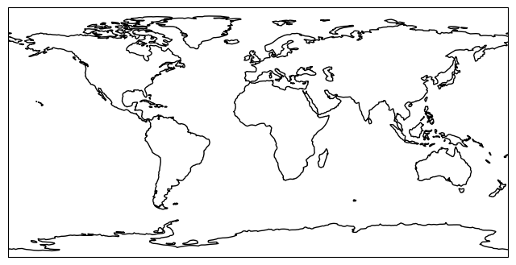

.. currentmodule:: geomappy
.. note:: This tutorial was generated from an IPython notebook that can be
          downloaded `here <../../../source/notebooks/basemap.ipynb>`_.

.. _basemap:

Creating a standalone basemap
=============================

The basemap functionality of ``geomappy`` is a convenience function
build on top of ``cartopy``, inspired on the old Basemap package.

.. code:: python

    import geomappy as mp
    import matplotlib.pyplot as plt
    import cartopy.crs as ccrs

Creating the most straightforward global map based on the PlateCarree
projection

.. code:: python

    ax = mp.basemap()
    ax.coastlines()
    plt.show()

Adding gridlines every 30 degrees

.. code:: python

    ax = mp.basemap()
    ax.coastlines()
    mp.add_gridlines(ax, 30)
    plt.show()

.. image:: basemap_files/basemap_6_0.png

Adding labels

.. code:: python

    ax = mp.basemap()
    ax.coastlines()
    mp.add_gridlines(ax, 30)
    mp.add_ticks(ax, 30)
    plt.show()

.. image:: basemap_files/basemap_8_0.png

Changing font size

.. code:: python

    ax = mp.basemap()
    ax.coastlines()
    mp.add_gridlines(ax, 30)
    mp.add_ticks(ax, 30, fontsize=8)
    plt.show()

.. image:: basemap_files/basemap_10_0.png

Different projections can be either passed as projection or epsg code

.. code:: python

    ax = mp.basemap(epsg=3035)
    ax.coastlines()
    mp.add_gridlines(ax, 15)
    
    # differentiate between top and other labels
    g = mp.add_ticks(ax, 60, fontsize=8)
    g.top_labels = True
    
    mp.add_ticks(ax, 15, fontsize=8)
    g.right_labels = True
    
    plt.show()

.. code:: python

    ax = mp.basemap(projection=ccrs.Mercator())
    ax.coastlines()
    mp.add_gridlines(ax, 30)
    mp.add_ticks(ax, 30, fontsize=8)
    plt.show()

