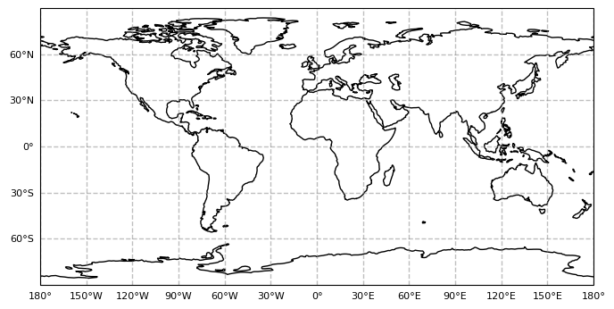
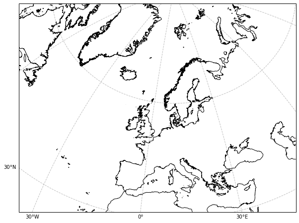

.. currentmodule:: geomappy
.. note:: This tutorial was generated from an IPython notebook that can be
          downloaded `here <../../../source/notebooks/basemap.ipynb>`_.

.. _basemap:

Creating a standalone basemap
=============================

The basemap functionality of ``geomappy`` is a convenience function
build on top of ``cartopy``, inspired on the old Basemap package.

.. code:: python

    import geomappy as mp
    import matplotlib.pyplot as plt
    import cartopy.crs as ccrs

Creating the most straightforward global map based on the PlateCarree
projection

.. code:: python

    mp.basemap()
    plt.show()

.. image:: basemap_files/basemap_4_0.png

it supports the coloration of the ocean and land

.. code:: python

    mp.basemap(ocean='darkgrey', land='lightgrey')
    plt.show()

Or an earth-image background

.. code:: python

    mp.basemap(earth_image=True)
    plt.show()

The first (and only) non-keyword argument is the extent that is required
in the plot, in a [xmin, ymin, xmax, ymax] order.

.. code:: python

    mp.basemap([0, -90, 180, 90])
    plt.show()

Other projections can be inserted either as an EPSG code:

.. code:: python

    mp.basemap(epsg=3857)
    plt.show()

.. image:: basemap_files/basemap_12_0.png

Or directly with a Cartopy projection

.. code:: python

    mp.basemap(projection=ccrs.Mercator())
    plt.show()

Resolution of the coastline can be adjusted:

.. code:: python

    mp.basemap(epsg=3035, resolution="10m")
    plt.show()

Longitude and latitude lines can be densified by specifying the
``xticks`` and ``yticks`` arguments. By inserting a list lat-lon values
can be used, while a single integer is read in the sense of
one-every-x-degrees.

.. code:: python

    mp.basemap(epsg=3035, xticks=5, yticks=5)
    plt.show()

Labels are automatically placed on the bottom and left of the map, but
this can be changed by changing the ``xlabel_location`` and
``ylabel_location`` parameters.

.. code:: python

    mp.basemap(epsg=5643, resolution="10m", xticks=2, yticks=2, xlabel_location='both',
               ylabel_location='both')
    plt.show()

Fontsizes can be adjusted easily:

.. code:: python

    mp.basemap(epsg=3035, resolution="10m", xticks=5, yticks=5, fontsize=5)
    plt.show()

This was only a subset of the available parameters. For further
information see: :func:``geomappy.basemap``
