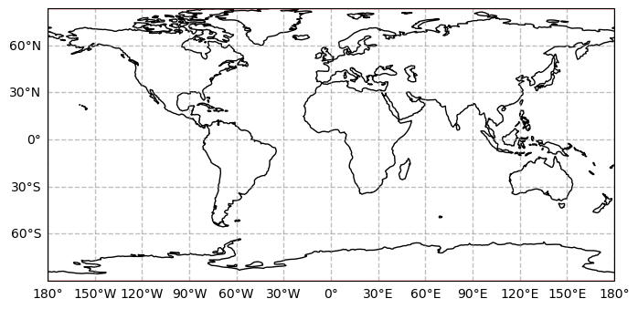
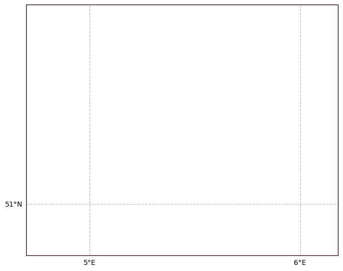
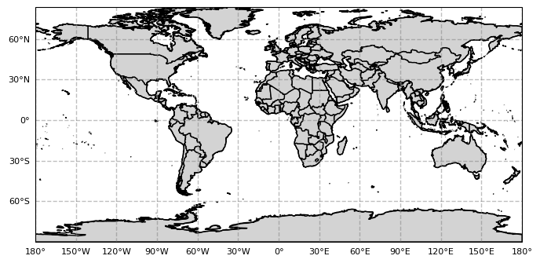

.. currentmodule:: geomappy
.. note:: This tutorial was generated from an IPython notebook that can be
          downloaded `here <../../../source/notebooks/geopandas_integration.ipynb>`_.

.. _geopandas_integration:

Integration of Geomappy into GeoPandas
======================================

.. code:: python

    import geopandas as gpd
    import matplotlib.pyplot as plt
    import geomappy as mp
    import numpy as np
    import os
    import pyproj
    import cartopy.crs as ccrs
    
    os.chdir("../../../")

Loading data on river plastic mobilisation when flood events happen
(Roebroek et al., 2021).

.. code:: python

    df1 = gpd.read_file("data/countries/plastic_mobilisation.shp")
    df1.columns

.. parsed-literal::

    Index(['featurecla', 'scalerank', 'LABELRANK', 'SOVEREIGNT', 'SOV_A3',
           'ADM0_DIF', 'LEVEL', 'TYPE', 'ADMIN', 'ADM0_A3',
           ...
           'NAME_ZH', 'e_1', 'e_10', 'e_20', 'e_50', 'e_100', 'e_200', 'e_500',
           'jump', 'geometry'],
          dtype='object', length=103)

Loading data on riverbank plastic observations in the Netherlands (Van
Emmerik et al., 2020)

.. code:: python

    df2 = gpd.read_file("data/processed_data_SDN/df_locations.geojson")
    df2.columns

.. parsed-literal::

    Index(['Gebiedscode', 'river', 'x_maas', 'x_waal', 'geometry'], dtype='object')

Outline on a world map
----------------------

The first file covers the world, while the second file covers the
Netherlands. Both have different projections. To see this at work,
geomappy integrates two functions to explore the data: ``plot_world``
and ``plot_file``.

.. code:: python

    df1.plot_world()
    df2.plot_world()
    plt.show()

.. code:: python

    df1.plot_file()
    df2.plot_file(xticks=1, yticks=1, resolution='10m')
    plt.show()

Note that the second file does not intersect with the coastline, so an
empty map appears.

Plotting the data
-----------------

The geomappy plotting functionality (``plot_shapes``) is directly
integrated into geopandas by loading geomappy. This results in the same
figure as seen before:

.. code:: python

    df1.plot_shapes()
    plt.show()

.. code:: python

    df2.plot_shapes()
    plt.show()

Again all plotting functionaly of ``plot_shapes`` is available. This is
shown here by reproducing the same map as in the tutorial on choropleth
continues shapes tutorial

.. code:: python

    df1.plot_shapes(values='e_10', basemap=True, cmap="Reds", bins=[0,100,1000,10000,100000,1000000, 10000000, 100000000], bin_labels = [0, "E2", "E3", "E4", "E5", "E6", "E7", "E8"], figsize=(10,10), pad_fraction=1.2, legend_kwargs=dict(label="Plastic mobilisation", label_font=dict(rotation=270, labelpad=20)))
    plt.show()

Plotting on different projections
---------------------------------

Different plotting projections are available by passing a caropty
Projection object to the ``projection`` parameter.

.. code:: python

    df1.plot_shapes(projection=ccrs.Mercator())
    plt.show()

.. code:: python

    ax = mp.basemap(projection=ccrs.LambertConformal())
    df1.plot_shapes(ax=ax)
    plt.show()

.. code:: python

    df1.plot_shapes(projection=ccrs.LambertConformal(), basemap=True)
    plt.show()

