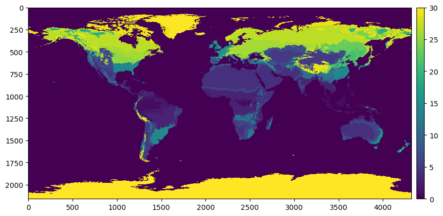

.. currentmodule:: geomappy
.. note:: This tutorial was generated from an IPython notebook that can be
          downloaded `here <../../../source/notebooks/plotting_classified_raster.ipynb>`_.

.. _plotting_classified_raster:

Plotting discrete choropleth rasters
====================================

.. code:: python

    import rioxarray as rxr
    import matplotlib.pyplot as plt
    import geomappy as mp
    import numpy as np
    import os
    os.chdir("../../../")

Loading a global raster indicating climate zones (from Beck et al, 2019)

.. code:: python

    r = rxr.open_rasterio("data/climate_downsampled_10_display.tif")
    a = r.values[0]

Plotting the raster shows that the climate zones are classified 1 to 30,
instead of being labelled with their standard A-E formulation

.. code:: python

    mp.plot_raster(a, figsize=(10, 10))
    plt.show()

To map these numbers to their correct labels they are loaded from a text
file:

.. code:: python

    colors = [(1, 1, 1)]
    bins = [0]
    labels = ["Water"]
    with open("data/koppen_legend.txt") as f:
        for line in f:
            line = line.strip()
            try:
                int(line[0])
                rgb = [int(c) / 255 for c in line[line.find('[') + 1:-1].split()]
                colors.append(rgb)
                labels.append(line.split()[1])
                bins.append(int(line[:line.find(':')]))
            except:
                pass

The resulting lists ``colors``, ``labels`` and ``bins`` provide the
information needed for plotting.

.. code:: python

    colors

.. parsed-literal::

    [(1, 1, 1),
     [0.0, 0.0, 1.0],
     [0.0, 0.47058823529411764, 1.0],
     [0.27450980392156865, 0.6666666666666666, 0.9803921568627451],
     [1.0, 0.0, 0.0],
     [1.0, 0.5882352941176471, 0.5882352941176471],
     [0.9607843137254902, 0.6470588235294118, 0.0],
     [1.0, 0.8627450980392157, 0.39215686274509803],
     [1.0, 1.0, 0.0],
     [0.7843137254901961, 0.7843137254901961, 0.0],
     [0.5882352941176471, 0.5882352941176471, 0.0],
     [0.5882352941176471, 1.0, 0.5882352941176471],
     [0.39215686274509803, 0.7843137254901961, 0.39215686274509803],
     [0.19607843137254902, 0.5882352941176471, 0.19607843137254902],
     [0.7843137254901961, 1.0, 0.3137254901960784],
     [0.39215686274509803, 1.0, 0.3137254901960784],
     [0.19607843137254902, 0.7843137254901961, 0.0],
     [1.0, 0.0, 1.0],
     [0.7843137254901961, 0.0, 0.7843137254901961],
     [0.5882352941176471, 0.19607843137254902, 0.5882352941176471],
     [0.5882352941176471, 0.39215686274509803, 0.5882352941176471],
     [0.6666666666666666, 0.6862745098039216, 1.0],
     [0.35294117647058826, 0.47058823529411764, 0.8627450980392157],
     [0.29411764705882354, 0.3137254901960784, 0.7058823529411765],
     [0.19607843137254902, 0.0, 0.5294117647058824],
     [0.0, 1.0, 1.0],
     [0.21568627450980393, 0.7843137254901961, 1.0],
     [0.0, 0.49019607843137253, 0.49019607843137253],
     [0.0, 0.27450980392156865, 0.37254901960784315],
     [0.6980392156862745, 0.6980392156862745, 0.6980392156862745],
     [0.4, 0.4, 0.4]]

.. code:: python

    print(*labels)

.. parsed-literal::

    Water Af Am Aw BWh BWk BSh BSk Csa Csb Csc Cwa Cwb Cwc Cfa Cfb Cfc Dsa Dsb Dsc Dsd Dwa Dwb Dwc Dwd Dfa Dfb Dfc Dfd ET EF

.. code:: python

    print(*bins)

.. parsed-literal::

    0 1 2 3 4 5 6 7 8 9 10 11 12 13 14 15 16 17 18 19 20 21 22 23 24 25 26 27 28 29 30

They are used as parameters in the ``plot_classified_raster`` function

.. code:: python

    mp.plot_classified_raster(a, levels=bins, labels=labels, colors=colors, figsize=(20, 20), suppress_warnings=True)
    plt.show()

Also a legend can be used

.. code:: python

    mp.plot_classified_raster(a, levels=bins, labels=labels, colors=colors, figsize=(20, 20), suppress_warnings=True, legend='legend')
    plt.show()

Again this can be easily enhanced with a basemap

.. code:: python

    ax = mp.basemap(figsize=(20, 20))
    ax.coastlines()
    mp.add_gridlines(ax, 30)
    mp.add_ticks(ax, 30)
    bounds = r.rio.bounds()
    extent = bounds[0], bounds[2], bounds[1], bounds[3]
    mp.plot_classified_raster(a, levels=bins, labels=labels, colors=colors, suppress_warnings=True, legend='colorbar', 
                              ax=ax, extent=extent)
    plt.show()

