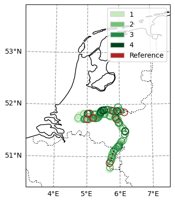
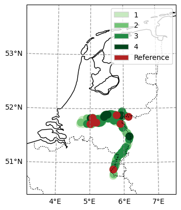

.. currentmodule:: geomappy
.. note:: This tutorial was generated from an IPython notebook that can be
          downloaded `here <../../../source/notebooks/plotting_classified_shapes.ipynb>`_.

.. _plotting_classified_shapes:

Plotting discrete choropleth shapes
===================================

.. code:: python

    import cartopy.feature as cf
    import cartopy.crs as ccrs
    import geopandas as gpd
    import pandas as pd
    
    import os
    
    from matplotlib import pyplot as plt
    
    import geomappy as mp
    import geomappy.plot_utils

.. code:: python

    os.chdir("../../../")

Loading data on riverbank plastic observations in the Netherlands (Van
Emmerik et al., 2020)

.. code:: python

    df = pd.read_csv("data/processed_data_SDN/df_hm_included.csv", index_col=0)
    df_locations = gpd.read_file("data/processed_data_SDN/df_locations.geojson")

.. code:: python

    df.columns, df_locations.columns

.. parsed-literal::

    (Index(['Gebiedscode', 'meting', 'date', 'doy', 'dop', 'plastic_6_packringen',
            'plastic_tassen', 'plastic_kleine_plastic_tasjes',
            'plastic_drankflessen_groterdan_halveliter',
            'plastic_drankflessen_kleinerdan_halveliter',
            ...
            'U_2d_mean', 'U_7d_mean', 'U_14d_mean', 'U_1m_mean', 'U_6m_mean',
            'h_2d_max_above_current', 'h_7d_max_above_current',
            'h_14d_max_above_current', 'h_1m_max_above_current',
            'h_6m_max_above_current'],
           dtype='object', length=161),
     Index(['Gebiedscode', 'river', 'x_maas', 'x_waal', 'geometry'], dtype='object'))

.. code:: python

    temp_df = df_locations.merge(df.groupby("Gebiedscode")['granulaat_korrels'].count(),
                                 left_on='Gebiedscode',
                                 right_index=True)
    temp_df.loc[temp_df.Gebiedscode.str.contains("REFE"), 'granulaat_korrels'] = 5
    temp_df = temp_df.sort_values('granulaat_korrels', ascending=True)

This example requires a little more setup, but the important part
happens in the call to ``plot_classified_shapes``. Here discrete values
(occurences of observations) are mapped to colors (generated with an
incorporated discrete color function) and labels.

.. code:: python

    class ProjectCustomExtent(ccrs.Projection):
        """
        Creating a custom extent for a given epsg code, if the hardcoded values do not suffice
        """
    
        def __init__(self, epsg, extent, *args, **kwargs):
            super(ccrs.Projection, self).__init__(f"EPSG:{epsg}")
            xmin, xmax, ymin, ymax = extent
            self.xmin = xmin
            self.xmax = xmax
            self.ymin = ymin
            self.ymax = ymax
    
        @property
        def boundary(self):
            coords = ((self.x_limits[0], self.y_limits[0]),
                      (self.x_limits[0], self.y_limits[1]),
                      (self.x_limits[1], self.y_limits[1]),
                      (self.x_limits[1], self.y_limits[0]))
    
            return ccrs.sgeom.LineString(coords)
    
        @property
        def bounds(self):
            xlim = self.x_limits
            ylim = self.y_limits
            return xlim[0], xlim[1], ylim[0], ylim[1]
    
        @property
        def threshold(self):
            return 1e5
    
        @property
        def x_limits(self):
            return self.xmin, self.xmax
    
        @property
        def y_limits(self):
            return self.ymin, self.ymax

.. code:: python

    f, ax = plt.subplots(subplot_kw={'projection': ProjectCustomExtent(epsg=28992, extent=[-1000000, 500000, -100000, 800000])})
    ax.set_extent((3.17, 7.5, 50.4, 53.9), crs=ccrs.PlateCarree())
    ax.coastlines(resolution='10m')
    geomappy.plot_utils.add_ticks(ax, 1)
    geomappy.plot_utils.add_gridlines(ax, 1, alpha=0.75)
    ax.add_feature(
            cf.NaturalEarthFeature('cultural', 'admin_0_boundary_lines_land', '10m', facecolor='none', edgecolor='k'),
            label='Stereo', lw=1, linestyle=":")
    ax.add_feature(cf.NaturalEarthFeature('physical', 'lakes', '10m', facecolor='none', edgecolor='black'))
    
    ax, legend = mp.plot_classified_shapes(
        df=temp_df,
        values='granulaat_korrels',
        s=1,
        legend='legend',
        ax=ax,
        colors=mp.colors.colors_discrete("Greens", 5)[1:].tolist() + ["Firebrick"],
        linewidth=10,
        labels=["1", "2", "3", "4", "Reference"],
        transform=ccrs.PlateCarree(),
    )

.. parsed-literal::

    /usr/local/Caskroom/mambaforge/base/envs/geomappy/lib/python3.12/site-packages/shapely/creation.py:730: RuntimeWarning: invalid value encountered in create_collection
      return lib.create_collection(geometries, np.intc(typ), out=out, **kwargs)

.. parsed-literal::

    /usr/local/Caskroom/mambaforge/base/envs/geomappy/lib/python3.12/site-packages/shapely/creation.py:730: RuntimeWarning: invalid value encountered in create_collection
      return lib.create_collection(geometries, np.intc(typ), out=out, **kwargs)

.. parsed-literal::

    /usr/local/Caskroom/mambaforge/base/envs/geomappy/lib/python3.12/site-packages/shapely/creation.py:730: RuntimeWarning: invalid value encountered in create_collection
      return lib.create_collection(geometries, np.intc(typ), out=out, **kwargs)

.. parsed-literal::

    /usr/local/Caskroom/mambaforge/base/envs/geomappy/lib/python3.12/site-packages/shapely/creation.py:730: RuntimeWarning: invalid value encountered in create_collection
      return lib.create_collection(geometries, np.intc(typ), out=out, **kwargs)
    /usr/local/Caskroom/mambaforge/base/envs/geomappy/lib/python3.12/site-packages/shapely/creation.py:730: RuntimeWarning: invalid value encountered in create_collection
      return lib.create_collection(geometries, np.intc(typ), out=out, **kwargs)
    /usr/local/Caskroom/mambaforge/base/envs/geomappy/lib/python3.12/site-packages/shapely/creation.py:730: RuntimeWarning: invalid value encountered in create_collection
      return lib.create_collection(geometries, np.intc(typ), out=out, **kwargs)

.. parsed-literal::

    /usr/local/Caskroom/mambaforge/base/envs/geomappy/lib/python3.12/site-packages/shapely/creation.py:730: RuntimeWarning: invalid value encountered in create_collection
      return lib.create_collection(geometries, np.intc(typ), out=out, **kwargs)
    /usr/local/Caskroom/mambaforge/base/envs/geomappy/lib/python3.12/site-packages/shapely/creation.py:730: RuntimeWarning: invalid value encountered in create_collection
      return lib.create_collection(geometries, np.intc(typ), out=out, **kwargs)
    /usr/local/Caskroom/mambaforge/base/envs/geomappy/lib/python3.12/site-packages/shapely/creation.py:730: RuntimeWarning: invalid value encountered in create_collection
      return lib.create_collection(geometries, np.intc(typ), out=out, **kwargs)

.. code:: python

    f, ax = plt.subplots(subplot_kw={'projection': ProjectCustomExtent(epsg=28992, extent=[-1000000, 500000, -100000, 800000])})
    ax.set_extent((3.17, 7.5, 50.4, 53.9), crs=ccrs.PlateCarree())
    ax.coastlines(resolution='10m')
    geomappy.plot_utils.add_ticks(ax, 1)
    geomappy.plot_utils.add_gridlines(ax, 1, alpha=0.75)
    ax.add_feature(
            cf.NaturalEarthFeature('cultural', 'admin_0_boundary_lines_land', '10m', facecolor='none', edgecolor='k'),
            label='Stereo', lw=1, linestyle=":")
    ax.add_feature(cf.NaturalEarthFeature('physical', 'lakes', '10m', facecolor='none', edgecolor='black'))
    
    col, legend = mp.plot_classified_shapes(
        df=temp_df,
        values='granulaat_korrels',
        s=100,
        legend='legend',
        ax=ax,
        colors=mp.colors.colors_discrete("Greens", 5)[1:].tolist() + ["Firebrick"],
        linewidth=1,
        labels=["1", "2", "3", "4", "Reference"],
        transform=ccrs.PlateCarree()
    )

.. parsed-literal::

    /usr/local/Caskroom/mambaforge/base/envs/geomappy/lib/python3.12/site-packages/shapely/creation.py:730: RuntimeWarning: invalid value encountered in create_collection
      return lib.create_collection(geometries, np.intc(typ), out=out, **kwargs)
    /usr/local/Caskroom/mambaforge/base/envs/geomappy/lib/python3.12/site-packages/shapely/creation.py:730: RuntimeWarning: invalid value encountered in create_collection
      return lib.create_collection(geometries, np.intc(typ), out=out, **kwargs)
    /usr/local/Caskroom/mambaforge/base/envs/geomappy/lib/python3.12/site-packages/shapely/creation.py:730: RuntimeWarning: invalid value encountered in create_collection
      return lib.create_collection(geometries, np.intc(typ), out=out, **kwargs)

.. parsed-literal::

    /usr/local/Caskroom/mambaforge/base/envs/geomappy/lib/python3.12/site-packages/shapely/creation.py:730: RuntimeWarning: invalid value encountered in create_collection
      return lib.create_collection(geometries, np.intc(typ), out=out, **kwargs)
    /usr/local/Caskroom/mambaforge/base/envs/geomappy/lib/python3.12/site-packages/shapely/creation.py:730: RuntimeWarning: invalid value encountered in create_collection
      return lib.create_collection(geometries, np.intc(typ), out=out, **kwargs)
    /usr/local/Caskroom/mambaforge/base/envs/geomappy/lib/python3.12/site-packages/shapely/creation.py:730: RuntimeWarning: invalid value encountered in create_collection
      return lib.create_collection(geometries, np.intc(typ), out=out, **kwargs)

.. parsed-literal::

    /usr/local/Caskroom/mambaforge/base/envs/geomappy/lib/python3.12/site-packages/shapely/creation.py:730: RuntimeWarning: invalid value encountered in create_collection
      return lib.create_collection(geometries, np.intc(typ), out=out, **kwargs)
    /usr/local/Caskroom/mambaforge/base/envs/geomappy/lib/python3.12/site-packages/shapely/creation.py:730: RuntimeWarning: invalid value encountered in create_collection
      return lib.create_collection(geometries, np.intc(typ), out=out, **kwargs)
    /usr/local/Caskroom/mambaforge/base/envs/geomappy/lib/python3.12/site-packages/shapely/creation.py:730: RuntimeWarning: invalid value encountered in create_collection
      return lib.create_collection(geometries, np.intc(typ), out=out, **kwargs)

