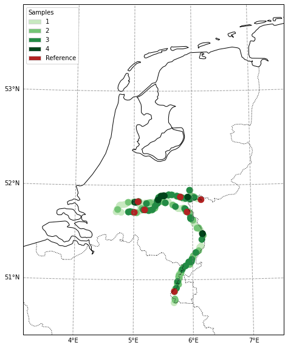

.. currentmodule:: geomappy
.. note:: This tutorial was generated from an IPython notebook that can be
          downloaded `here <../../../source/notebooks/plotting_classified_shapes.ipynb>`_.

.. _plotting_classified_shapes:

Plotting discrete choropleth shapes
===================================

.. code:: python

    import geopandas as gpd
    import matplotlib.pyplot as plt
    import geomappy as mp
    import numpy as np
    import pandas as pd
    import os
    from geomappy.basemap import ProjectCustomExtent
    import cartopy.feature as cf
    
    os.chdir("../../../")

Loading data on riverbank plastic observations in the Netherlands (Van
Emmerik et al., 2020)

.. code:: python

    df = pd.read_csv("data/processed_data_SDN/df_hm_included.csv", index_col=0)
    df_locations = gpd.read_file("data/processed_data_SDN/df_locations.geojson")

.. code:: python

    df.columns, df_locations.columns

.. parsed-literal::

    (Index(['Gebiedscode', 'meting', 'date', 'doy', 'dop', 'plastic_6_packringen',
            'plastic_tassen', 'plastic_kleine_plastic_tasjes',
            'plastic_drankflessen_groterdan_halveliter',
            'plastic_drankflessen_kleinerdan_halveliter',
            ...
            'U_2d_mean', 'U_7d_mean', 'U_14d_mean', 'U_1m_mean', 'U_6m_mean',
            'h_2d_max_above_current', 'h_7d_max_above_current',
            'h_14d_max_above_current', 'h_1m_max_above_current',
            'h_6m_max_above_current'],
           dtype='object', length=161),
     Index(['Gebiedscode', 'river', 'x_maas', 'x_waal', 'geometry'], dtype='object'))

.. code:: python

    temp_df = df_locations.merge(df.groupby("Gebiedscode")['granulaat_korrels'].count(),
                                 left_on='Gebiedscode',
                                 right_index=True)
    temp_df.loc[temp_df.Gebiedscode.str.contains("REFE"), 'granulaat_korrels'] = 5
    temp_df = temp_df.sort_values('granulaat_korrels', ascending=True)

This example requires a little more setup, but the important part
happens in the call to ``plot_classified_shapes``. Here discrete values
(occurences of observations) are mapped to colors (generated with an
incorporated discrete color function) and labels.

.. code:: python

    ax = mp.basemap((3.17, 50.4, 7.5, 53.9),
                    projection=ProjectCustomExtent(epsg=28992, extent=[-1000000, 500000, -100000, 800000]),
                    resolution='10m', xticks=1, yticks=1, grid_alpha=0.75)
    ax.add_feature(
            cf.NaturalEarthFeature('cultural', 'admin_0_boundary_lines_land', '10m', facecolor='none', edgecolor='k'),
            label='Stereo', lw=1, linestyle=":")
    ax.add_feature(cf.NaturalEarthFeature('physical', 'lakes', '10m', facecolor='none', edgecolor='black'))
    
    ax, legend = mp.plot_classified_shapes(df=temp_df, values='granulaat_korrels', s=100, ax=ax,
                              colors=mp.colors.cmap_discrete("Greens", 5, return_type='list')[1:].tolist()+["Firebrick"],
                              legend_kwargs={'loc': 2, 'title':"Samples", 'align_left':True},
                              linewidth=1,
                              labels=["1", "2", "3", "4", "Reference"])

.. parsed-literal::

    /home/caspar/Packages/geomappy/geomappy/plotting.py:492: VisibleDeprecationWarning: Creating an ndarray from ragged nested sequences (which is a list-or-tuple of lists-or-tuples-or ndarrays with different lengths or shapes) is deprecated. If you meant to do this, you must specify 'dtype=object' when creating the ndarray.
      colors = np.array(colors)

