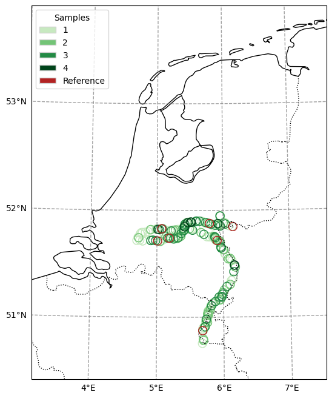
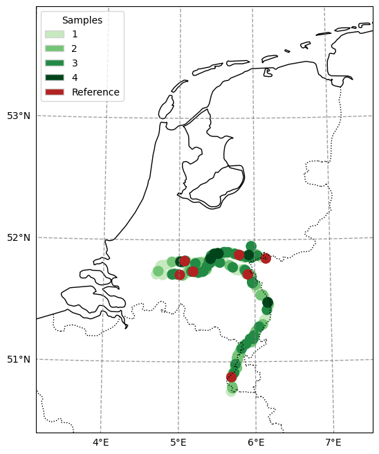

.. currentmodule:: geomappy
.. note:: This tutorial was generated from an IPython notebook that can be
          downloaded `here <../../../source/notebooks/plotting_classified_shapes.ipynb>`_.

.. _plotting_classified_shapes:

Plotting discrete choropleth shapes
===================================

.. code:: python

    import geopandas as gpd
    import matplotlib.pyplot as plt
    import geomappy as mp
    import numpy as np
    import pandas as pd
    import os
    from geomappy.basemap import ProjectCustomExtent
    import cartopy.feature as cf
    import cartopy.crs as ccrs

.. code:: python

    os.chdir("../../../")

Loading data on riverbank plastic observations in the Netherlands (Van
Emmerik et al., 2020)

.. code:: python

    df = pd.read_csv("data/processed_data_SDN/df_hm_included.csv", index_col=0)
    df_locations = gpd.read_file("data/processed_data_SDN/df_locations.geojson")

.. code:: python

    df.columns, df_locations.columns

.. parsed-literal::

    (Index(['Gebiedscode', 'meting', 'date', 'doy', 'dop', 'plastic_6_packringen',
            'plastic_tassen', 'plastic_kleine_plastic_tasjes',
            'plastic_drankflessen_groterdan_halveliter',
            'plastic_drankflessen_kleinerdan_halveliter',
            ...
            'U_2d_mean', 'U_7d_mean', 'U_14d_mean', 'U_1m_mean', 'U_6m_mean',
            'h_2d_max_above_current', 'h_7d_max_above_current',
            'h_14d_max_above_current', 'h_1m_max_above_current',
            'h_6m_max_above_current'],
           dtype='object', length=161),
     Index(['Gebiedscode', 'river', 'x_maas', 'x_waal', 'geometry'], dtype='object'))

.. code:: python

    temp_df = df_locations.merge(df.groupby("Gebiedscode")['granulaat_korrels'].count(),
                                 left_on='Gebiedscode',
                                 right_index=True)
    temp_df.loc[temp_df.Gebiedscode.str.contains("REFE"), 'granulaat_korrels'] = 5
    temp_df = temp_df.sort_values('granulaat_korrels', ascending=True)

This example requires a little more setup, but the important part
happens in the call to ``plot_classified_shapes``. Here discrete values
(occurences of observations) are mapped to colors (generated with an
incorporated discrete color function) and labels.

.. code:: python

    ProjectCustomExtent(epsg=28992, extent=[-1000000, 500000, -100000, 800000])

.. raw:: html

    <?xml version="1.0" encoding="utf-8" standalone="no"?>
    <!DOCTYPE svg PUBLIC "-//W3C//DTD SVG 1.1//EN"
      "http://www.w3.org/Graphics/SVG/1.1/DTD/svg11.dtd">
    <svg xmlns:xlink="http://www.w3.org/1999/xlink" width="291.6pt" height="180.72pt" viewBox="0 0 291.6 180.72" xmlns="http://www.w3.org/2000/svg" version="1.1">
     <metadata>
      <rdf:RDF xmlns:dc="http://purl.org/dc/elements/1.1/" xmlns:cc="http://creativecommons.org/ns#" xmlns:rdf="http://www.w3.org/1999/02/22-rdf-syntax-ns#">
       <cc:Work>
        <dc:type rdf:resource="http://purl.org/dc/dcmitype/StillImage"/>
        <dc:date>2023-06-22T18:02:37.854424</dc:date>
        <dc:format>image/svg+xml</dc:format>
        <dc:creator>
         <cc:Agent>
          <dc:title>Matplotlib v3.7.1, https://matplotlib.org/</dc:title>
         </cc:Agent>
        </dc:creator>
       </cc:Work>
      </rdf:RDF>
     </metadata>
     <defs>
      
     </defs>
     <g id="figure_1">
      <g id="patch_1">
       <path d="M 0 180.72 
    L 291.6 180.72 
    L 291.6 0 
    L 0 0 
    z
    " style="fill: #ffffff"/>
      </g>
      <g id="axes_1">
       <g id="patch_2">
        <path d="M 7.2 173.52 
    L 7.2 7.2 
    L 284.4 7.2 
    L 284.4 173.52 
    L 7.2 173.52 
    " style="fill: #ffffff"/>
       </g>
       <g id="PathCollection_1">
        <path d="M 35.887685 7.2 
    L 35.809856 7.26121 
    L 35.931955 7.513951 
    L 35.828996 7.669934 
    L 35.61215 7.706059 
    L 35.396377 7.60349 
    L 35.456192 7.835728 
    L 35.496903 7.915395 
    L 35.466567 8.053652 
    L 35.303945 7.992075 
    L 35.15137 7.993058 
    L 34.866355 8.080477 
    L 34.838825 8.205553 
    L 34.980358 8.298806 
    L 35.01288 8.431907 
    L 34.958015 8.824435 
    L 34.855427 8.80706 
    L 34.595529 8.889637 
    L 34.727777 9.032617 
    L 34.833343 9.253377 
    L 34.820583 9.436041 
    L 34.600236 9.469554 
    L 34.381954 9.405981 
    L 34.22421 9.284082 
    L 34.160588 9.055209 
    L 34.22724 8.663512 
    L 34.350616 8.439643 
    L 34.745953 7.923687 
    L 34.856629 7.703901 
    L 34.976785 7.349019 
    L 35.114096 7.203247 
    L 35.119354 7.2 
    " clip-path="url(#p9c9c4ba1d4)" style="fill: none; stroke: #000000"/>
        <path d="M 36.511354 7.2 
    L 36.534009 7.223056 
    L 36.810453 7.30409 
    L 37.002955 7.450379 
    L 37.168816 7.628747 
    L 37.36409 7.518614 
    L 37.570438 7.324648 
    L 37.769919 7.255024 
    L 37.748755 7.2 
    " clip-path="url(#p9c9c4ba1d4)" style="fill: none; stroke: #000000"/>
        <path d="M 45.106323 7.2 
    L 45.202031 7.23287 
    L 45.272409 7.336974 
    L 45.289781 7.73708 
    L 45.332702 7.838031 
    L 45.551408 7.843919 
    L 45.68188 7.826288 
    L 45.718318 7.771934 
    L 45.763293 7.948089 
    L 45.747777 8.115133 
    L 45.687934 8.253207 
    L 45.600802 8.338323 
    L 45.572067 8.476829 
    L 45.803759 8.656418 
    L 45.772508 8.807297 
    L 45.511205 8.920817 
    L 45.52827 9.12041 
    L 45.994796 9.762059 
    L 46.097358 10.024806 
    L 46.12984 10.353875 
    L 46.047716 10.752141 
    L 46.121782 10.767409 
    L 46.206919 10.403291 
    L 46.316463 10.101796 
    L 46.392159 9.82255 
    L 46.381001 9.509927 
    L 46.67108 9.451925 
    L 46.991857 9.236844 
    L 47.280063 8.870612 
    L 47.470839 8.358008 
    L 47.715534 8.057563 
    L 48.125969 8.090929 
    L 48.810319 8.407624 
    L 48.898878 8.397307 
    L 48.977486 8.342003 
    L 49.048407 8.319494 
    L 49.160355 8.465959 
    L 49.340357 8.633948 
    L 49.516519 8.741837 
    L 49.743667 8.985395 
    L 49.91562 9.064839 
    L 50.500074 9.182797 
    L 50.773628 9.157157 
    L 51.056856 9.008038 
    L 51.334469 9.327292 
    L 52.088318 9.326141 
    L 52.388117 9.560978 
    L 52.419745 9.765504 
    L 52.40806 10.006026 
    L 52.443276 10.218117 
    L 52.751855 10.420999 
    L 52.862706 10.58198 
    L 53.035225 11.010802 
    L 53.219125 10.915077 
    L 53.411183 10.910147 
    L 53.795737 11.004891 
    L 53.822909 10.867009 
    L 53.670006 10.745082 
    L 53.468233 10.636626 
    L 53.304834 10.486803 
    L 53.271075 10.245925 
    L 53.227016 10.075061 
    L 53.070086 9.921286 
    L 52.865512 9.812924 
    L 52.682816 9.776637 
    L 52.712837 9.625578 
    L 52.812402 9.54411 
    L 52.997954 9.330411 
    L 53.119136 9.273805 
    L 53.35543 9.454481 
    L 53.507502 9.525761 
    L 53.598116 9.44074 
    L 53.75148 9.380983 
    L 54.557191 9.703596 
    L 54.419254 9.422605 
    L 54.237501 9.206693 
    L 54.029763 9.059361 
    L 53.811606 8.980245 
    L 53.566604 8.950658 
    L 53.49242 8.879347 
    L 53.491497 8.706718 
    L 53.597375 8.511489 
    L 53.733777 8.595112 
    L 53.962253 8.877902 
    L 54.228434 8.779465 
    L 54.177574 8.572143 
    L 53.956046 8.361115 
    L 53.713592 8.24109 
    L 52.53696 8.008142 
    L 52.485176 7.93087 
    L 52.510472 7.71363 
    L 52.593006 7.571321 
    L 52.739215 7.461446 
    L 52.9003 7.397427 
    L 53.262839 7.363156 
    L 53.628595 7.2 
    " clip-path="url(#p9c9c4ba1d4)" style="fill: none; stroke: #000000"/>
        <path d="M 86.471544 7.2 
    L 86.189031 7.570545 
    L 85.991225 7.829038 
    L 86.118773 7.948146 
    L 86.139704 8.135273 
    L 86.12222 8.318809 
    L 86.136998 8.424119 
    L 86.282205 8.464323 
    L 86.388545 8.376645 
    L 86.471784 8.2572 
    L 86.621745 8.152634 
    L 86.95241 7.767987 
    L 87.088989 7.653583 
    L 87.537116 7.517951 
    L 87.990993 7.27586 
    L 88.258171 7.2 
    " clip-path="url(#p9c9c4ba1d4)" style="fill: none; stroke: #000000"/>
        <path d="M 88.267563 7.2 
    L 88.856429 7.536178 
    L 90.368598 7.599313 
    L 90.572705 7.993016 
    L 90.71133 8.180182 
    L 90.689921 8.567845 
    L 90.86054 9.627599 
    L 91.096831 9.956261 
    L 91.052294 11.060893 
    L 91.404563 11.763965 
    L 91.289701 12.05907 
    L 91.292942 12.251579 
    L 90.819349 12.925943 
    L 90.849424 13.276357 
    L 90.613041 13.748238 
    L 90.349224 14.016203 
    L 90.484994 14.266443 
    L 90.294193 14.339135 
    L 90.101809 14.602733 
    L 89.932886 14.609898 
    L 89.813885 14.44117 
    L 89.558213 13.621591 
    L 89.411545 13.178211 
    L 89.542681 12.721706 
    L 89.87036 12.412861 
    L 89.977154 12.115751 
    L 89.977495 10.986292 
    L 89.826238 10.6059 
    L 88.833181 9.452472 
    L 88.479278 9.378353 
    L 88.319005 10.085328 
    L 88.185989 10.189455 
    L 88.470372 10.330967 
    L 88.637667 10.532289 
    L 89.189134 10.773035 
    L 88.624755 10.906058 
    L 88.9535 11.164792 
    L 88.823266 11.638411 
    L 88.868625 11.824 
    L 88.987013 11.986092 
    L 88.328649 13.49443 
    L 87.675359 13.973809 
    L 88.186542 13.867556 
    L 88.787354 13.627062 
    L 89.314951 13.561866 
    L 89.604776 13.98827 
    L 89.602248 14.783306 
    L 89.364043 15.348213 
    L 88.517315 16.114632 
    L 88.272404 16.076593 
    L 88.034376 16.528311 
    L 87.83236 16.524046 
    L 87.696803 16.183279 
    L 86.496196 15.987333 
    L 85.458093 16.157379 
    L 85.347648 16.391598 
    L 85.156749 17.556251 
    L 84.670731 18.662936 
    L 84.40935 18.901162 
    L 83.866481 19.078217 
    L 82.86052 19.720825 
    L 82.688964 19.772335 
    L 82.029691 19.66758 
    L 81.865728 19.353374 
    L 82.223494 19.268342 
    L 81.209738 18.74115 
    L 81.132426 18.343785 
    L 80.240777 17.946588 
    L 80.143468 18.072781 
    L 81.209948 19.532782 
    L 81.636445 19.732343 
    L 81.812539 20.108122 
    L 81.727376 20.352179 
    L 81.040862 20.802395 
    L 80.507346 20.419167 
    L 80.365973 20.253032 
    L 80.189211 20.257286 
    L 79.409564 19.751957 
    L 78.789853 19.562677 
    L 78.764452 19.716023 
    L 78.892514 19.839419 
    L 78.4584 20.587636 
    L 78.225513 21.543747 
    L 78.238591 21.91382 
    L 78.444572 22.322617 
    L 78.81341 22.599805 
    L 79.685227 22.867381 
    L 79.660241 23.019924 
    L 79.471108 23.360092 
    L 79.400221 23.718784 
    L 79.4697 24.051098 
    L 79.702394 24.310487 
    L 79.40914 24.550231 
    L 79.202254 25.622969 
    L 79.151143 27.143353 
    L 79.301874 27.502455 
    L 79.581387 27.767574 
    L 79.710006 28.299095 
    L 80.620456 29.233494 
    L 80.643148 29.828417 
    L 80.258419 30.394259 
    L 79.674509 31.316637 
    L 79.616618 31.097107 
    L 79.409548 31.027819 
    L 78.927369 31.195434 
    L 79.647276 31.69851 
    L 79.710548 32.401288 
    L 79.553107 32.595357 
    L 79.735004 32.728528 
    L 80.231654 32.840006 
    L 80.430423 33.020799 
    L 80.235563 33.366331 
    L 80.080214 33.351567 
    L 79.458339 32.734885 
    L 79.137573 32.812292 
    L 78.33607 33.253926 
    L 78.320441 33.656455 
    L 78.875507 34.568543 
    L 79.404082 34.868346 
    L 79.54039 34.965175 
    L 79.370215 35.363103 
    L 79.280422 36.405184 
    L 79.525867 37.08007 
    L 79.380044 37.434309 
    L 79.505763 37.702014 
    L 79.741937 38.737501 
    L 79.730093 38.734756 
    L 79.682071 38.766195 
    L 79.589992 39.601079 
    L 79.192062 40.684681 
    L 79.303217 41.025642 
    L 79.738037 41.855268 
    L 79.487423 41.977746 
    L 79.226284 42.416536 
    L 79.068186 42.53755 
    L 78.494067 43.441545 
    L 78.562084 43.608078 
    L 77.776882 44.194783 
    L 77.592763 44.467962 
    L 77.142908 45.390699 
    L 77.090004 45.942743 
    L 76.79312 46.412891 
    L 76.045327 47.354478 
    L 75.882778 48.031723 
    L 75.899778 48.949889 
    L 75.726187 49.814208 
    L 75.505322 50.14341 
    L 74.278354 51.506127 
    L 74.051146 51.589037 
    L 73.442638 52.303942 
    L 73.274299 52.600616 
    L 73.103386 53.598998 
    L 73.04237 53.430696 
    L 72.853099 53.256652 
    L 71.87427 53.070675 
    L 72.008368 52.716558 
    L 71.888288 52.740122 
    L 71.544353 52.925816 
    L 71.523341 53.052597 
    L 71.846764 53.341106 
    L 72.00101 53.87225 
    L 71.886635 54.07215 
    L 72.26225 54.224307 
    L 72.381562 54.634629 
    L 72.94555 54.027601 
    L 72.645201 54.545162 
    L 72.81798 55.054359 
    L 73.354954 55.807601 
    L 72.653956 56.835105 
    L 72.411852 56.962272 
    L 72.155466 56.767883 
    L 72.306923 56.58762 
    L 72.458889 56.263597 
    L 72.233377 56.248726 
    L 71.856246 56.545073 
    L 71.311143 56.45947 
    L 71.331947 56.33351 
    L 71.588074 56.375776 
    L 71.312899 56.179684 
    L 71.074809 56.291003 
    L 70.455629 56.317761 
    L 69.874366 56.5429 
    L 69.661071 56.47836 
    L 69.186097 55.91345 
    L 68.306236 55.475877 
    L 67.167778 55.362344 
    L 67.193821 55.209122 
    L 67.608016 55.010171 
    L 67.77787 54.776524 
    L 67.854355 54.463996 
    L 67.420849 54.827586 
    L 67.157011 54.890117 
    L 66.93097 54.736589 
    L 66.809875 55.014236 
    L 66.748571 55.290992 
    L 66.900396 55.217148 
    L 67.031048 55.181439 
    L 66.811622 56.003109 
    L 65.662415 56.51427 
    L 65.277565 56.88642 
    L 65.088485 56.722654 
    L 65.418398 56.383772 
    L 65.761982 56.180991 
    L 65.799001 55.980199 
    L 65.585505 54.751838 
    L 65.231775 54.307313 
    L 65.038324 53.397419 
    L 65.021693 54.281311 
    L 65.145162 54.858507 
    L 64.89317 55.536368 
    L 65.204475 55.584873 
    L 65.18054 55.723981 
    L 64.953779 55.853747 
    L 64.260153 56.42382 
    L 63.970307 56.440174 
    L 63.12174 56.382342 
    L 63.235893 56.166812 
    L 63.672632 55.748941 
    L 63.266759 55.525669 
    L 63.08945 55.51694 
    L 63.153053 55.783917 
    L 63.196568 55.952704 
    L 63.070109 55.907639 
    L 62.829283 55.745348 
    L 62.561059 55.875052 
    L 62.379021 56.096566 
    L 61.877172 56.126321 
    L 61.424122 55.928902 
    L 58.97929 55.761284 
    L 58.033687 56.074171 
    L 57.480493 56.137666 
    L 57.330146 56.320651 
    L 57.127519 56.227675 
    L 57.058791 55.865877 
    L 56.559185 56.027368 
    L 56.359218 56.267876 
    L 56.345746 56.608875 
    L 56.495848 56.478062 
    L 56.911909 56.587598 
    L 57.347385 56.95154 
    L 57.229184 57.186454 
    L 56.78036 57.405199 
    L 56.551662 58.147999 
    L 55.927637 58.337336 
    L 55.275045 58.142585 
    L 54.989425 58.227202 
    L 54.70492 58.790518 
    L 53.383154 58.274428 
    L 53.375655 57.888342 
    L 53.249073 57.776075 
    L 53.190629 57.869588 
    L 53.023455 58.517551 
    L 52.587704 58.936327 
    L 52.350849 59.027577 
    L 52.083309 58.995935 
    L 52.531886 59.495443 
    L 52.357367 59.675204 
    L 50.557418 60.146071 
    L 50.743651 60.468256 
    L 50.514054 60.551126 
    L 47.862105 60.501049 
    L 47.551805 60.363365 
    L 47.71685 60.137061 
    L 47.948209 59.996949 
    L 47.926748 59.794285 
    L 48.304724 59.755549 
    L 48.693122 59.509817 
    L 48.375093 59.305827 
    L 48.609462 58.689459 
    L 48.360952 58.871752 
    L 47.974052 58.621953 
    L 47.454318 58.541825 
    L 47.390805 58.291688 
    L 45.607629 58.345322 
    L 45.995542 58.58275 
    L 46.507391 58.760662 
    L 46.774958 59.057667 
    L 46.424704 59.651704 
    L 47.041968 59.769707 
    L 46.853602 60.197821 
    L 46.669723 60.274012 
    L 47.108135 60.357676 
    L 46.766828 60.83883 
    L 46.80683 61.069072 
    L 46.72121 61.217129 
    L 45.663054 61.91301 
    L 44.989199 62.0251 
    L 44.779571 62.223724 
    L 44.744963 61.980638 
    L 44.413049 61.657038 
    L 44.251623 61.677247 
    L 44.409108 61.859312 
    L 44.427301 62.106975 
    L 44.323842 62.317448 
    L 44.112736 62.395748 
    L 44.101913 61.967003 
    L 43.861966 61.765482 
    L 43.283498 61.646374 
    L 43.258941 61.772713 
    L 43.371275 61.874234 
    L 43.745855 62.024021 
    L 43.969909 61.906335 
    L 43.948631 62.184095 
    L 43.643484 62.304928 
    L 43.297799 62.870251 
    L 43.243858 63.651531 
    L 43.111487 63.475903 
    L 42.861532 62.857481 
    L 42.65769 62.798098 
    L 42.004637 62.848973 
    L 40.526554 62.400223 
    L 40.864517 62.754034 
    L 41.325701 62.845482 
    L 41.201481 63.038015 
    L 41.105432 63.103182 
    L 41.338662 63.28011 
    L 41.066769 63.512269 
    L 41.030571 63.938982 
    L 40.297985 63.597729 
    L 40.21326 63.490986 
    L 39.351058 63.320547 
    L 39.114724 63.154445 
    L 38.687406 63.675213 
    L 38.520622 63.887409 
    L 37.964259 63.979068 
    L 37.867775 64.18377 
    L 37.68743 63.942682 
    L 37.594315 63.790205 
    L 37.247236 63.477007 
    L 36.88642 63.534233 
    L 36.008103 63.455328 
    L 35.609013 63.147188 
    L 35.628694 63.338349 
    L 35.717864 63.455971 
    L 35.377241 63.811263 
    L 34.962631 63.88014 
    L 34.544059 63.741069 
    L 34.514237 64.07769 
    L 34.331045 64.048181 
    L 33.853043 64.405244 
    L 33.640696 64.263155 
    L 33.476428 64.311232 
    L 33.470531 63.865019 
    L 33.079645 64.014456 
    L 32.936366 64.200773 
    L 32.716071 64.228658 
    L 32.352455 64.361121 
    L 31.943466 64.285606 
    L 32.109361 64.214898 
    L 32.373167 64.009606 
    L 32.496844 63.822758 
    L 32.124712 63.949919 
    L 32.088703 63.872035 
    L 32.432737 63.466701 
    L 32.976822 63.200324 
    L 32.948754 63.146448 
    L 32.912819 63.029088 
    L 32.785409 63.114644 
    L 32.257227 63.384191 
    L 31.799062 63.679142 
    L 31.689464 63.440789 
    L 31.924915 62.6221 
    L 31.520818 62.383868 
    L 31.336749 62.429157 
    L 31.394677 62.693036 
    L 30.997781 62.792222 
    L 29.99404 62.875934 
    L 29.876502 63.128357 
    L 29.568951 63.059033 
    L 29.12066 63.272403 
    L 28.90564 63.222229 
    L 28.932505 63.017097 
    L 28.668774 62.621118 
    L 28.546407 62.779541 
    L 27.724968 63.263259 
    L 27.868863 63.437271 
    L 26.917156 63.670198 
    L 27.001607 63.451365 
    L 26.878991 63.469326 
    L 26.445298 63.726952 
    L 26.391641 63.558906 
    L 26.273365 63.690491 
    L 26.376272 63.083899 
    L 26.279214 62.811911 
    L 26.838845 62.668937 
    L 27.646806 62.202905 
    L 28.420691 62.095783 
    L 28.682623 61.959835 
    L 29.644468 61.307248 
    L 30.441473 61.07634 
    L 29.872002 60.895519 
    L 27.176358 61.623156 
    L 26.374252 61.518324 
    L 27.378906 61.023932 
    L 27.532094 60.857535 
    L 28.062785 60.786395 
    L 29.792523 60.272465 
    L 30.017235 60.042519 
    L 30.440031 60.074969 
    L 30.959349 59.926101 
    L 31.849595 59.822157 
    L 32.103377 59.306477 
    L 32.198122 59.132672 
    L 32.037045 59.003005 
    L 31.585215 59.121589 
    L 31.192937 58.696871 
    L 31.214016 58.26268 
    L 30.898641 57.983587 
    L 30.902922 58.863447 
    L 30.438098 58.965908 
    L 29.736228 59.35914 
    L 29.450865 59.388721 
    L 28.608656 59.303509 
    L 28.136155 59.394769 
    L 26.499301 59.284781 
    L 25.67934 59.564288 
    L 25.57589 59.772099 
    L 25.495243 59.808229 
    L 24.647707 59.896802 
    L 24.152578 60.021087 
    L 23.804802 59.812482 
    L 22.89638 59.828681 
    L 22.628304 60.004936 
    L 22.575914 59.835805 
    L 22.736611 59.679354 
    L 22.837258 59.458133 
    L 22.924415 59.417581 
    L 24.053437 59.287114 
    L 24.098648 58.903945 
    L 24.029245 58.736428 
    L 23.659448 58.609898 
    L 23.873343 58.394207 
    L 24.158784 58.397325 
    L 24.660931 58.550478 
    L 24.962536 58.49308 
    L 25.708039 57.896049 
    L 25.193468 57.785502 
    L 25.486858 57.466094 
    L 26.424862 57.123746 
    L 26.773632 57.112197 
    L 26.714398 57.196853 
    L 26.512847 57.489633 
    L 26.976518 57.431061 
    L 27.162846 57.258971 
    L 27.261396 56.926951 
    L 27.613386 57.160318 
    L 28.097265 57.248466 
    L 28.031674 57.071853 
    L 27.805841 56.898196 
    L 27.832279 56.773819 
    L 28.025489 56.698653 
    L 29.094066 55.988599 
    L 29.418694 56.084714 
    L 29.852704 56.043696 
    L 31.132705 55.57947 
    L 30.199791 55.508432 
    L 28.507922 55.828315 
    L 28.269636 56.051486 
    L 27.64981 55.985963 
    L 27.695296 56.153211 
    L 27.122195 56.320339 
    L 27.29919 55.911207 
    L 26.999706 55.934219 
    L 26.810815 56.09621 
    L 26.180238 56.118736 
    L 25.220321 56.503288 
    L 24.969042 56.29056 
    L 24.287489 56.698198 
    L 23.58145 56.857986 
    L 23.712936 56.607262 
    L 22.648096 55.786509 
    L 23.160434 55.739678 
    L 23.380227 55.278055 
    L 23.277675 54.716851 
    L 22.824193 54.365139 
    L 22.656514 54.443135 
    L 22.068463 54.936919 
    L 21.899504 54.980908 
    L 21.211675 55.341173 
    L 21.199379 55.066719 
    L 21.478212 54.509594 
    L 21.457956 54.223039 
    L 20.870322 54.038159 
    L 20.997984 53.70225 
    L 20.951488 53.678169 
    L 20.99419 53.608225 
    L 21.098127 53.420659 
    L 21.056811 53.404627 
    L 20.927048 53.382842 
    L 20.957612 53.244638 
    L 21.381962 53.281439 
    L 22.906053 53.01622 
    L 22.898334 52.80324 
    L 22.744938 52.656623 
    L 22.603386 52.179635 
    L 22.374544 52.095687 
    L 22.402055 51.970624 
    L 23.070126 51.81548 
    L 23.037881 51.498787 
    L 24.937958 51.065445 
    L 26.177016 51.067777 
    L 26.74828 50.877451 
    L 27.258774 50.267171 
    L 27.17912 50.629941 
    L 27.262332 50.813239 
    L 27.604616 50.917779 
    L 27.604646 50.722258 
    L 28.124513 49.584874 
    L 28.460314 49.897961 
    L 28.846432 50.001166 
    L 29.799147 50.074088 
    L 29.727568 49.977094 
    L 29.594921 49.741405 
    L 30.086996 49.556744 
    L 27.583692 49.166349 
    L 27.657588 49.61641 
    L 27.452522 49.909136 
    L 27.356985 49.404422 
    L 27.044297 49.194862 
    L 26.672938 49.087942 
    L 24.908359 49.147765 
    L 24.570495 49.270591 
    L 24.13617 48.773738 
    L 23.921678 48.909552 
    L 23.536585 48.473104 
    L 23.164493 48.506814 
    L 23.13677 48.632693 
    L 23.358136 48.71247 
    L 23.539561 48.86535 
    L 23.512082 48.990415 
    L 22.372165 48.463957 
    L 22.353292 48.602154 
    L 22.491408 48.765554 
    L 22.219959 48.715038 
    L 21.400031 48.827576 
    L 21.124385 48.647199 
    L 21.148554 48.037127 
    L 21.128354 47.607925 
    L 21.528767 47.407018 
    L 21.556753 47.28118 
    L 21.464047 47.089646 
    L 21.648201 46.941585 
    L 22.198897 46.833468 
    L 22.046446 47.087891 
    L 22.412443 47.471062 
    L 22.553243 47.424565 
    L 22.823714 46.825166 
    L 22.673318 46.661594 
    L 22.856819 46.376034 
    L 23.206063 46.375587 
    L 23.456461 46.373919 
    L 23.632558 46.257466 
    L 24.161421 45.817538 
    L 25.533275 45.722488 
    L 25.69298 45.93067 
    L 25.372145 46.794374 
    L 26.212062 46.845482 
    L 26.622963 46.712356 
    L 27.031171 46.419932 
    L 27.233594 46.01737 
    L 27.023446 45.563322 
    L 27.582694 45.75425 
    L 27.478605 45.949752 
    L 27.566529 46.981214 
    L 28.102423 47.321579 
    L 29.016117 47.622771 
    L 29.213913 47.558308 
    L 29.706134 47.228614 
    L 29.844046 47.325199 
    L 29.745607 47.370501 
    L 29.651773 47.428833 
    L 29.829652 47.595934 
    L 30.755338 47.663668 
    L 30.43755 47.326738 
    L 30.047286 47.236789 
    L 29.515195 46.833914 
    L 29.298183 46.932175 
    L 29.169501 46.509321 
    L 29.180774 46.316232 
    L 29.398363 46.602247 
    L 29.736896 46.579897 
    L 29.451154 46.217396 
    L 29.575713 46.239741 
    L 29.917078 46.186109 
    L 29.851281 45.817278 
    L 30.101827 44.837474 
    L 29.941437 44.58702 
    L 29.00407 44.080954 
    L 28.832357 43.784668 
    L 29.058748 43.633559 
    L 29.312528 43.602013 
    L 30.159772 43.724329 
    L 31.706612 43.309389 
    L 32.188615 42.989896 
    L 32.81368 43.219426 
    L 32.997468 43.371816 
    L 33.004055 43.086655 
    L 32.700199 42.839157 
    L 32.488503 42.81932 
    L 32.58169 42.731463 
    L 32.628662 42.521938 
    L 32.605714 42.265765 
    L 32.77889 42.050251 
    L 32.87605 41.668029 
    L 33.242463 41.376316 
    L 33.297173 41.452418 
    L 33.646607 41.317065 
    L 34.122416 41.561817 
    L 35.191021 41.832306 
    L 35.402197 42.010581 
    L 35.860991 41.782902 
    L 37.913147 42.206148 
    L 38.587879 42.167796 
    L 38.994185 41.93661 
    L 40.850254 41.653444 
    L 40.906497 41.89669 
    L 41.382379 41.992988 
    L 41.67367 41.844048 
    L 41.922183 41.518165 
    L 42.074108 41.468949 
    L 44.73199 41.564517 
    L 44.508575 41.515858 
    L 43.380505 40.866153 
    L 42.350018 40.751954 
    L 42.243024 40.496051 
    L 42.45553 40.248718 
    L 42.506387 39.825464 
    L 42.51873 39.609052 
    L 42.344976 39.494183 
    L 42.789496 39.019783 
    L 42.020602 39.176263 
    L 41.678762 39.387856 
    L 41.598944 39.643024 
    L 41.045578 40.322552 
    L 39.652787 41.579873 
    L 39.39332 41.657445 
    L 38.194589 41.601506 
    L 37.801142 41.896037 
    L 37.493202 41.835955 
    L 37.246742 41.635471 
    L 38.03473 41.206794 
    L 38.087956 40.930718 
    L 37.647399 41.094238 
    L 36.687521 41.194669 
    L 35.799211 40.98146 
    L 35.583137 40.827995 
    L 35.456582 40.494501 
    L 35.047894 40.347 
    L 34.916758 40.141429 
    L 35.046263 39.840848 
    L 34.936215 39.697316 
    L 34.483455 39.616763 
    L 34.454322 39.755177 
    L 34.641933 39.922834 
    L 34.713713 40.228703 
    L 33.689621 40.472517 
    L 32.825044 40.542619 
    L 32.461198 41.036973 
    L 32.283451 40.883864 
    L 31.902772 41.058569 
    L 29.630746 40.894849 
    L 29.657891 40.768885 
    L 29.904167 40.712517 
    L 30.510239 40.446549 
    L 31.181788 40.413898 
    L 34.167747 38.460841 
    L 34.15936 38.248232 
    L 34.813378 38.049732 
    L 35.331224 38.181857 
    L 35.860778 38.076128 
    L 36.226376 37.239192 
    L 36.166045 37.069158 
    L 36.472114 36.921609 
    L 36.893294 36.45659 
    L 37.264123 35.722133 
    L 38.179053 35.143831 
    L 38.398001 34.780043 
    L 38.183339 34.658073 
    L 37.211683 34.508875 
    L 36.914698 34.326334 
    L 37.516747 33.894024 
    L 38.241656 33.015819 
    L 39.477478 31.673364 
    L 40.571285 30.615355 
    L 40.824232 30.844567 
    L 41.527959 31.675784 
    L 42.349296 31.506155 
    L 42.604192 31.73852 
    L 42.704453 31.421386 
    L 42.567541 31.203648 
    L 42.068626 30.923049 
    L 42.09967 30.771322 
    L 42.841468 30.779329 
    L 43.01617 30.894787 
    L 43.325115 31.279663 
    L 43.555298 31.35643 
    L 43.580722 31.231059 
    L 43.132888 30.838661 
    L 43.163926 30.686083 
    L 43.571029 30.930249 
    L 43.895368 30.765866 
    L 43.985505 30.809881 
    L 43.881326 30.990574 
    L 44.209332 31.445877 
    L 44.380043 31.523272 
    L 44.270461 30.780808 
    L 44.725691 30.324126 
    L 45.193112 30.101553 
    L 45.064042 30.079852 
    L 44.707175 30.134947 
    L 43.358411 29.730209 
    L 43.599573 29.63926 
    L 44.448606 29.507439 
    L 44.108176 29.438492 
    L 44.133929 29.311468 
    L 44.268439 29.232249 
    L 44.779335 29.155305 
    L 44.807338 29.016721 
    L 43.616311 28.675575 
    L 43.15444 28.779021 
    L 39.146376 28.289694 
    L 38.228732 28.514889 
    L 37.723261 28.407024 
    L 37.390708 28.015204 
    L 37.201764 27.589824 
    L 37.507948 27.287842 
    L 37.469103 27.034396 
    L 37.264185 26.996294 
    L 36.729104 27.999415 
    L 36.534673 27.990967 
    L 36.422446 27.555751 
    L 36.745394 27.186069 
    L 36.839937 26.250678 
    L 37.154035 26.154529 
    L 37.396759 26.271272 
    L 37.609442 25.996057 
    L 37.221888 25.413192 
    L 37.386517 25.289676 
    L 37.894947 25.121747 
    L 37.24136 24.998135 
    L 37.031911 25.085429 
    L 37.140035 25.3597 
    L 37.089192 25.713884 
    L 36.918702 25.988487 
    L 36.666714 26.032309 
    L 36.498379 25.759824 
    L 36.762893 24.762308 
    L 36.627277 24.77566 
    L 35.925735 25.414919 
    L 35.284943 26.069452 
    L 34.457975 26.163572 
    L 34.113634 25.629531 
    L 33.558043 25.63899 
    L 33.468092 25.393803 
    L 33.834904 24.72682 
    L 34.327621 24.731381 
    L 35.110737 24.373355 
    L 35.137766 24.247368 
    L 34.717983 24.157199 
    L 34.750388 24.00652 
    L 35.031824 23.935205 
    L 35.061534 23.79687 
    L 34.735002 23.786117 
    L 34.420252 23.935454 
    L 34.396766 24.080304 
    L 34.213983 24.149466 
    L 34.034198 24.09 
    L 34.014373 23.847902 
    L 34.118591 23.679977 
    L 34.539297 23.382995 
    L 34.263647 23.456239 
    L 34.027184 23.57407 
    L 33.732901 23.373422 
    L 33.568846 23.474929 
    L 33.475514 23.901135 
    L 33.440148 24.088244 
    L 32.925388 24.1809 
    L 32.294908 24.008442 
    L 32.086274 23.698274 
    L 31.995921 23.337975 
    L 31.840344 23.243619 
    L 31.050576 23.130085 
    L 30.921852 22.897387 
    L 30.695557 22.989086 
    L 30.471658 22.943244 
    L 30.827639 22.449688 
    L 31.032434 22.366206 
    L 31.292511 22.387115 
    L 31.920695 22.600669 
    L 32.178252 22.291372 
    L 31.942599 22.140666 
    L 31.856213 21.788011 
    L 32.61049 22.187429 
    L 32.76192 21.98594 
    L 32.51794 21.958586 
    L 31.670652 21.473074 
    L 31.499371 20.995582 
    L 31.43438 20.487032 
    L 31.342331 20.358946 
    L 30.825943 20.363307 
    L 30.733219 20.224628 
    L 31.062575 20.045393 
    L 31.911818 20.353017 
    L 31.906696 20.257018 
    L 31.913219 19.918617 
    L 32.446835 20.041679 
    L 33.00805 20.398041 
    L 33.118114 20.747949 
    L 33.244302 20.72027 
    L 33.61477 20.447458 
    L 32.863758 19.512883 
    L 33.345262 19.508535 
    L 34.262387 19.806325 
    L 34.625472 19.786775 
    L 35.261013 19.63464 
    L 36.142628 20.180254 
    L 37.071705 20.444639 
    L 37.098613 20.31863 
    L 36.913364 20.164509 
    L 36.059394 20.057286 
    L 35.579189 19.74376 
    L 34.733527 18.928508 
    L 34.758429 17.987535 
    L 35.37397 16.525613 
    L 36.627997 16.495775 
    L 36.849898 16.398788 
    L 37.17969 16.697071 
    L 39.490892 16.768021 
    L 39.522493 16.61891 
    L 39.348256 16.54667 
    L 38.919187 16.201536 
    L 38.992463 16.173213 
    L 39.223665 15.976986 
    L 39.207204 15.800436 
    L 39.373206 15.644578 
    L 39.860367 15.389812 
    L 39.764728 15.36093 
    L 39.570331 15.183661 
    L 39.782814 15.011811 
    L 39.933088 14.682118 
    L 39.849316 14.681566 
    L 39.658493 14.768476 
    L 39.344261 14.567367 
    L 37.640551 14.192722 
    L 36.319652 14.607624 
    L 35.638778 14.620411 
    L 35.335102 14.116498 
    L 35.50837 14.031766 
    L 35.705324 13.484067 
    L 35.93724 13.379282 
    L 35.995503 12.682487 
    L 36.692596 12.73109 
    L 37.186615 13.197205 
    L 37.132429 13.681847 
    L 37.247051 13.820291 
    L 37.362969 13.778054 
    L 37.435776 13.010522 
    L 37.281773 12.697267 
    L 37.122401 12.635286 
    L 37.137082 12.929725 
    L 37.010811 12.850751 
    L 36.961089 12.685747 
    L 36.868309 11.827963 
    L 36.636602 11.730347 
    L 36.657345 10.680622 
    L 37.154225 10.447055 
    L 37.026484 10.220253 
    L 37.666326 9.691713 
    L 37.437303 9.530953 
    L 37.105201 9.570142 
    L 37.000872 9.826795 
    L 36.872842 9.82141 
    L 36.842804 9.959712 
    L 36.924106 9.977365 
    L 36.487188 10.334158 
    L 36.136735 10.332018 
    L 35.891959 10.017375 
    L 35.766434 9.436333 
    L 35.995174 9.495791 
    L 36.807545 9.373593 
    L 36.401807 8.799834 
    L 36.385618 8.544517 
    L 36.452151 8.610766 
    L 36.670729 8.764455 
    L 36.263941 7.93846 
    L 36.53791 8.122452 
    L 36.779795 7.906164 
    L 36.203859 7.2 
    L 36.203859 7.2 
    " clip-path="url(#p9c9c4ba1d4)" style="fill: none; stroke: #000000"/>
        <path d="M 140.34749 7.2 
    L 140.732399 7.693012 
    L 140.770082 8.137092 
    L 140.735013 8.903546 
    L 140.813218 8.984248 
    L 140.763483 9.170702 
    L 141.413499 12.457284 
    L 141.947487 13.198402 
    L 142.549114 13.539536 
    L 142.53502 13.692291 
    L 142.292784 13.669906 
    L 142.286143 13.762738 
    L 142.432925 14.709049 
    L 142.031356 15.05411 
    L 142.161982 15.189111 
    L 142.329254 15.11281 
    L 142.406974 15.080416 
    L 142.433683 15.13507 
    L 142.615521 15.367305 
    L 142.69622 15.265292 
    L 142.852239 14.698802 
    L 143.220793 15.185376 
    L 143.443932 15.293242 
    L 143.939603 15.407202 
    L 144.483181 15.848313 
    L 146.865668 16.830878 
    L 149.715869 19.135236 
    L 149.830549 19.619005 
    L 149.8165 19.989495 
    L 149.926731 20.174359 
    L 150.454231 20.684466 
    L 150.773317 21.530286 
    L 151.126818 23.320192 
    L 151.409415 23.788531 
    L 152.003051 24.060573 
    L 152.472937 24.592992 
    L 152.534257 25.231533 
    L 152.826524 25.595798 
    L 154.255814 26.303682 
    L 154.658435 26.736189 
    L 153.546186 27.243656 
    L 153.141134 27.647368 
    L 152.778238 28.435736 
    L 152.999954 29.030372 
    L 153.40818 31.034132 
    L 156.471726 36.563514 
    L 156.614749 37.255859 
    L 156.339772 37.982268 
    L 156.060367 38.179244 
    L 156.454406 37.222296 
    L 156.025984 36.95063 
    L 155.269912 36.404048 
    L 155.025403 36.443706 
    L 154.267843 36.751976 
    L 153.700068 36.595358 
    L 153.263148 36.251862 
    L 152.21983 34.645977 
    L 151.818468 34.294298 
    L 151.280332 34.16346 
    L 149.479575 34.542897 
    L 148.235102 34.505294 
    L 147.92705 34.132509 
    L 147.230033 33.990913 
    L 146.963678 34.051692 
    L 146.08711 34.542258 
    L 146.194648 34.591792 
    L 146.477466 34.857159 
    L 146.687313 34.547899 
    L 147.037579 34.416919 
    L 147.685998 34.523469 
    L 148.44083 35.214118 
    L 148.640763 35.155804 
    L 149.000481 34.913044 
    L 151.213586 34.683342 
    L 151.541269 34.857221 
    L 152.507701 36.722655 
    L 153.030004 37.047916 
    L 153.570754 37.698483 
    L 154.162644 37.882978 
    L 154.679326 38.645123 
    L 156.006808 39.819535 
    L 156.446087 40.004525 
    L 156.65124 40.407394 
    L 156.746203 40.894571 
    L 156.855151 40.941088 
    L 157.191034 41.220578 
    L 157.088111 41.354217 
    L 157.290063 41.531631 
    L 157.574931 42.164922 
    L 157.607963 42.447688 
    L 158.535682 46.080951 
    L 158.479235 46.960027 
    L 158.063301 48.152998 
    L 157.461015 48.350541 
    L 156.037798 49.474171 
    L 155.858932 49.594688 
    L 154.497876 51.227862 
    L 153.994946 51.446629 
    L 153.80496 51.72047 
    L 153.807532 51.971726 
    L 154.182727 52.028199 
    L 154.995837 52.000018 
    L 155.765567 52.617741 
    L 156.610502 54.048419 
    L 156.842847 53.900437 
    L 157.108758 53.880682 
    L 157.795529 54.096876 
    L 158.28571 54.730267 
    L 158.251873 54.264653 
    L 159.061409 53.291657 
    L 159.35797 52.254588 
    L 159.775621 51.427112 
    L 160.23482 51.009293 
    L 160.865518 50.762194 
    L 161.54086 50.676216 
    L 162.14031 50.740831 
    L 162.057545 50.58187 
    L 162.315703 50.505632 
    L 163.11463 50.80408 
    L 164.170701 50.871431 
    L 164.655899 51.03113 
    L 165.203674 51.343735 
    L 165.78202 51.52701 
    L 166.362053 51.301564 
    L 166.093719 51.134271 
    L 165.786689 50.972065 
    L 169.559266 52.127938 
    L 171.022291 52.988183 
    L 174.324303 55.960733 
    L 174.593554 56.482404 
    L 175.067099 59.441151 
    L 175.018599 60.58673 
    L 175.205848 61.745802 
    L 175.036706 61.935076 
    L 173.998335 64.823682 
    L 173.272926 65.900001 
    L 173.11326 67.747055 
    L 172.569378 69.356993 
    L 172.461052 69.749371 
    L 171.443757 70.117814 
    L 171.217292 70.352056 
    L 171.037734 70.194037 
    L 170.711311 70.820031 
    L 170.379177 71.277998 
    L 169.135474 72.481621 
    L 168.337398 71.318438 
    L 167.969912 71.175087 
    L 167.370217 70.630013 
    L 167.027947 70.539694 
    L 167.01976 70.680062 
    L 167.699509 71.342319 
    L 168.40288 71.587048 
    L 168.453346 71.682957 
    L 168.376773 72.101934 
    L 167.972558 72.033646 
    L 167.545174 72.116415 
    L 167.38863 72.064626 
    L 167.04826 71.807635 
    L 166.765303 71.811245 
    L 165.811648 72.014873 
    L 166.136819 72.192629 
    L 168.243012 72.450598 
    L 168.504718 72.31204 
    L 168.438596 72.693053 
    L 167.376932 73.667649 
    L 167.724744 73.899733 
    L 168.185305 73.99558 
    L 168.488238 73.648939 
    L 168.484485 74.082932 
    L 168.315064 74.398588 
    L 167.549621 75.033948 
    L 166.446596 75.590371 
    L 165.310141 75.619568 
    L 165.19725 75.507172 
    L 165.019285 75.07643 
    L 164.542108 74.202415 
    L 164.483274 74.589584 
    L 164.279228 74.800212 
    L 163.794908 75.002009 
    L 163.268935 75.502878 
    L 163.069779 76.095978 
    L 162.918205 76.122607 
    L 162.567995 76.344764 
    L 162.412551 76.332496 
    L 162.017503 76.156635 
    L 161.701016 76.171784 
    L 160.802015 76.514254 
    L 161.433294 76.792973 
    L 161.558999 77.126401 
    L 161.94299 76.790983 
    L 163.169267 76.523121 
    L 163.782775 76.21631 
    L 163.981709 76.606666 
    L 163.894607 77.315759 
    L 163.979051 77.571633 
    L 163.784985 77.846544 
    L 163.707453 78.431277 
    L 163.394889 78.66029 
    L 163.859953 78.736598 
    L 163.902137 78.832246 
    L 163.516519 79.399806 
    L 162.825139 79.951671 
    L 162.066377 80.363839 
    L 161.47863 80.510389 
    L 159.943412 80.256531 
    L 159.84035 80.296786 
    L 159.384238 80.566383 
    L 159.043277 80.594253 
    L 158.860198 80.750754 
    L 158.595713 80.540255 
    L 158.315307 80.538333 
    L 157.41163 80.711567 
    L 157.004484 81.476737 
    L 156.421404 81.725448 
    L 157.36198 81.583252 
    L 157.549773 81.2394 
    L 158.401655 81.064217 
    L 160.611538 81.645117 
    L 160.755502 82.145004 
    L 160.619865 82.249529 
    L 160.351384 82.267477 
    L 159.697782 82.129467 
    L 159.267101 82.493849 
    L 158.545622 82.712973 
    L 158.920238 83.173126 
    L 160.023857 83.245252 
    L 160.541596 83.419543 
    L 160.414441 82.883814 
    L 160.490953 82.689121 
    L 160.760836 82.716503 
    L 160.88513 83.365212 
    L 161.177461 83.868574 
    L 163.893462 84.350609 
    L 165.512904 83.95178 
    L 169.684022 83.799893 
    L 169.987475 84.005756 
    L 169.713406 84.91948 
    L 169.547287 85.078062 
    L 169.015757 85.119366 
    L 169.104491 85.913738 
    L 169.286404 86.470136 
    L 169.355287 87.290187 
    L 169.205403 88.068971 
    L 168.906928 88.708862 
    L 168.53139 89.113951 
    L 167.651431 89.363332 
    L 167.134498 89.622514 
    L 166.69923 89.629601 
    L 166.077866 90.080101 
    L 164.972592 90.106167 
    L 164.163632 90.703734 
    L 163.299338 91.865818 
    L 163.392306 93.202065 
    L 162.931421 93.355261 
    L 161.115018 92.62838 
    L 160.588067 92.76624 
    L 159.235555 93.928536 
    L 158.697864 94.132683 
    L 155.277833 94.722492 
    L 154.945693 95.191306 
    L 154.480854 95.451957 
    L 153.949807 96.107207 
    L 153.211409 96.023357 
    L 152.49074 95.721986 
    L 151.918062 95.617052 
    L 151.706557 95.376825 
    L 151.471557 95.278364 
    L 150.706472 95.101588 
    L 147.869794 93.935874 
    L 147.504373 94.095915 
    L 147.04442 93.867271 
    L 145.335513 94.336418 
    L 143.10782 94.157371 
    L 140.808044 94.645163 
    L 140.605169 94.465931 
    L 140.479406 94.504082 
    L 140.392388 94.676583 
    L 140.369538 95.276357 
    L 140.110931 95.395708 
    L 139.821518 95.273704 
    L 138.613594 94.281125 
    L 138.704643 94.077999 
    L 139.289128 93.710472 
    L 138.72418 93.295461 
    L 138.466484 93.338762 
    L 138.619072 93.076251 
    L 138.369609 92.908405 
    L 137.563089 92.758293 
    L 137.311798 92.807719 
    L 136.741501 94.010179 
    L 136.392911 94.02223 
    L 136.156004 93.701043 
    L 136.309908 93.354017 
    L 136.68326 92.752325 
    L 136.448237 92.605388 
    L 135.443162 92.641802 
    L 135.929 93.199043 
    L 135.859209 93.814188 
    L 135.674175 93.958266 
    L 135.276553 93.820896 
    L 134.997697 93.531763 
    L 134.928163 93.333761 
    L 133.668749 92.480818 
    L 133.236779 91.840563 
    L 131.671068 90.755167 
    L 131.659076 90.882758 
    L 132.165207 91.174994 
    L 133.442595 93.111063 
    L 133.381042 93.351848 
    L 133.078615 93.429159 
    L 132.041302 93.472626 
    L 132.205783 93.641892 
    L 132.19391 93.769493 
    L 131.245664 93.914665 
    L 131.029641 94.02137 
    L 130.610642 93.903542 
    L 130.054675 94.72078 
    L 128.381254 94.126597 
    L 128.086225 94.183781 
    L 127.318242 94.432812 
    L 126.217566 94.182784 
    L 125.682011 94.355109 
    L 125.069139 94.815785 
    L 125.027077 94.670105 
    L 124.994745 94.342683 
    L 124.509209 94.153125 
    L 124.063668 94.107994 
    L 123.883803 93.67959 
    L 123.754627 93.772546 
    L 123.229854 94.460921 
    L 123.716184 94.338773 
    L 123.871721 94.229124 
    L 124.236084 94.928845 
    L 124.947671 95.258269 
    L 124.820462 95.597448 
    L 125.071821 95.775925 
    L 124.562222 96.290557 
    L 124.558556 96.598374 
    L 124.305649 96.688245 
    L 123.024294 96.532799 
    L 122.092453 95.967854 
    L 119.706876 95.443639 
    L 119.288499 95.114414 
    L 118.500482 95.237575 
    L 118.326683 95.418673 
    L 117.997793 96.268286 
    L 118.09646 96.478641 
    L 118.413905 96.621408 
    L 118.418979 96.884896 
    L 118.031578 97.462819 
    L 117.950849 97.45415 
    L 118.023497 96.678134 
    L 117.776515 96.13573 
    L 115.279136 93.740863 
    L 112.848402 92.607181 
    L 111.84263 92.721952 
    L 111.346789 92.977202 
    L 111.035458 92.977621 
    L 110.402704 92.81075 
    L 109.638134 93.255094 
    L 108.869508 93.051921 
    L 107.690979 93.457091 
    L 107.310968 93.971621 
    L 106.316401 94.276533 
    L 105.814124 94.129105 
    L 105.535726 93.614958 
    L 105.28931 92.897646 
    L 105.167492 92.906499 
    L 105.142972 93.09946 
    L 105.28337 93.304843 
    L 105.451133 94.314109 
    L 104.948191 94.76494 
    L 104.495681 95.48694 
    L 104.282723 96.028584 
    L 104.246029 96.431229 
    L 104.371387 97.31392 
    L 103.77643 97.337678 
    L 103.529928 97.478998 
    L 103.404548 97.762675 
    L 103.45408 98.111703 
    L 103.667193 98.249269 
    L 104.252381 98.292713 
    L 104.235485 98.431709 
    L 103.921153 98.84956 
    L 103.733621 98.992253 
    L 103.582254 99.493261 
    L 103.412262 99.583999 
    L 103.027929 99.288586 
    L 102.877068 99.733856 
    L 102.112677 100.090888 
    L 101.678349 101.309633 
    L 101.715935 101.833907 
    L 100.958653 101.999429 
    L 100.446729 101.886616 
    L 100.020658 101.686247 
    L 99.800247 101.878336 
    L 99.366335 101.370694 
    L 98.727549 100.328751 
    L 97.830475 99.346107 
    L 97.347221 99.509028 
    L 97.131427 99.574286 
    L 96.816785 99.784043 
    L 96.550926 99.63638 
    L 96.405948 99.358828 
    L 96.482064 99.172478 
    L 96.205089 99.053691 
    L 95.941434 98.803755 
    L 95.845255 98.474054 
    L 96.075105 98.113212 
    L 95.450631 98.031766 
    L 95.238428 97.75191 
    L 95.070291 97.005723 
    L 95.420271 96.479783 
    L 95.599216 96.206309 
    L 95.192027 96.272188 
    L 95.064095 96.136093 
    L 94.861333 96.482499 
    L 94.544549 96.635334 
    L 94.717299 96.7884 
    L 94.667807 97.213352 
    L 94.355903 97.388811 
    L 93.7301 97.250144 
    L 93.908829 97.595373 
    L 94.667403 97.573703 
    L 94.931194 97.83427 
    L 94.46027 97.90175 
    L 94.441855 98.041458 
    L 94.555377 98.025956 
    L 94.8073 98.089553 
    L 94.689939 98.228941 
    L 95.055451 98.276939 
    L 95.038767 98.404181 
    L 94.782802 98.535551 
    L 94.784541 98.951155 
    L 94.509023 98.896332 
    L 94.11004 98.1525 
    L 93.032865 97.712524 
    L 92.423278 97.69707 
    L 90.856014 98.298541 
    L 88.637459 98.21726 
    L 88.490317 98.246097 
    L 88.296472 97.635758 
    L 88.052751 97.759579 
    L 87.503939 97.799471 
    L 87.334282 97.946989 
    L 87.379177 98.376806 
    L 87.010226 98.68802 
    L 86.947919 98.940268 
    L 86.986961 99.174449 
    L 86.588323 99.769502 
    L 85.953391 99.576416 
    L 85.689769 99.646159 
    L 85.157027 100.008407 
    L 84.574084 100.115002 
    L 84.372401 100.271186 
    L 83.690282 101.140558 
    L 83.56741 100.863665 
    L 83.594176 100.129982 
    L 83.447766 99.954799 
    L 83.178141 99.990853 
    L 83.133344 100.406635 
    L 82.916789 100.732555 
    L 83.152109 101.063795 
    L 82.951063 101.063864 
    L 82.635056 101.22715 
    L 82.506364 101.683483 
    L 81.928963 101.883682 
    L 82.186693 101.946203 
    L 82.420639 102.106133 
    L 82.633607 102.127338 
    L 82.736843 102.744058 
    L 82.055298 103.609546 
    L 81.671908 103.532385 
    L 81.407016 103.595972 
    L 80.949968 104.001469 
    L 80.667179 104.560988 
    L 80.436775 104.368997 
    L 80.020425 103.613819 
    L 79.997411 102.826699 
    L 79.538491 101.871464 
    L 79.308569 101.645173 
    L 78.57348 101.15177 
    L 78.055974 100.97594 
    L 77.451929 100.517035 
    L 76.814999 100.562025 
    L 76.533316 100.733769 
    L 76.336211 101.63376 
    L 75.86102 101.857877 
    L 75.295943 101.951088 
    L 74.655909 101.923955 
    L 74.189105 101.656086 
    L 74.145596 101.015065 
    L 74.444392 100.918681 
    L 74.410552 100.627346 
    L 74.388537 100.624848 
    L 74.449505 99.922451 
    L 74.796715 99.469091 
    L 75.317701 99.328153 
    L 77.24951 98.629743 
    L 77.53656 98.665828 
    L 78.12901 99.285289 
    L 78.423337 99.159224 
    L 78.928134 98.444782 
    L 79.394652 98.513624 
    L 79.919701 98.313415 
    L 81.647389 96.957517 
    L 82.423184 96.558589 
    L 82.486842 96.06579 
    L 82.459642 95.642952 
    L 82.821104 95.575632 
    L 82.917993 95.59894 
    L 83.938455 95.128417 
    L 84.101029 94.870248 
    L 84.665222 93.073268 
    L 84.955202 92.903606 
    L 85.326124 92.88525 
    L 85.625444 92.701494 
    L 85.707597 93.069962 
    L 85.681096 93.588272 
    L 85.776142 93.546654 
    L 85.87253 93.461149 
    L 86.08777 93.639055 
    L 86.818625 93.877631 
    L 86.713919 93.584985 
    L 85.933769 92.902856 
    L 86.05043 92.204953 
    L 86.364196 92.317139 
    L 87.73219 92.316268 
    L 88.433965 91.389166 
    L 88.472051 90.86079 
    L 88.615613 90.78083 
    L 88.787339 90.858091 
    L 90.003166 89.960125 
    L 90.153531 89.614158 
    L 90.435478 89.369291 
    L 91.03221 89.036304 
    L 91.48097 88.372927 
    L 91.665336 86.562488 
    L 92.037692 85.577052 
    L 92.260407 84.925059 
    L 92.279617 84.338407 
    L 92.360018 84.219003 
    L 93.642505 84.440643 
    L 94.004857 84.73923 
    L 94.741854 84.922002 
    L 95.227901 84.761024 
    L 96.62971 83.515569 
    L 96.21883 81.898444 
    L 96.744882 81.968206 
    L 96.86683 81.541024 
    L 96.68004 81.1085 
    L 97.709613 80.845981 
    L 100.085422 80.931287 
    L 100.836537 80.799582 
    L 102.052947 80.898924 
    L 102.722175 80.741877 
    L 104.328381 81.385903 
    L 105.365588 81.478837 
    L 106.926777 82.049971 
    L 107.500587 82.608435 
    L 108.977144 82.719755 
    L 110.407227 82.529558 
    L 111.763029 82.658621 
    L 112.155026 82.450125 
    L 112.234519 82.601088 
    L 112.024403 82.872919 
    L 112.1845 83.033221 
    L 112.51424 82.491676 
    L 112.525479 81.981661 
    L 112.507142 81.782946 
    L 112.609359 80.624464 
    L 112.4934 80.3655 
    L 112.872938 80.42542 
    L 113.308887 79.586392 
    L 113.412653 79.405126 
    L 113.24282 79.178867 
    L 113.554638 78.918618 
    L 113.95399 79.048797 
    L 114.478029 78.641319 
    L 115.725188 77.422242 
    L 116.226122 77.266116 
    L 116.813887 77.192822 
    L 117.102566 76.95435 
    L 118.558557 75.069337 
    L 118.819125 74.947947 
    L 119.21671 74.150234 
    L 120.760892 72.813736 
    L 121.326065 72.682537 
    L 121.678354 72.290566 
    L 121.670207 72.054564 
    L 121.503145 71.852897 
    L 121.406987 72.226866 
    L 121.155407 72.416376 
    L 120.348728 72.541475 
    L 119.758253 73.233285 
    L 118.810594 73.771763 
    L 118.673067 73.958953 
    L 117.055023 75.415991 
    L 116.435384 75.488221 
    L 115.666373 75.903315 
    L 115.104507 76.035257 
    L 113.858523 75.901119 
    L 113.664591 75.521036 
    L 113.534747 75.598014 
    L 113.067162 76.101641 
    L 111.463562 76.976949 
    L 111.14299 77.421171 
    L 110.873649 77.473819 
    L 110.984087 77.928287 
    L 110.841997 78.354661 
    L 110.584969 78.591044 
    L 110.161661 78.433716 
    L 109.213465 78.705712 
    L 106.053008 78.025718 
    L 105.835928 77.862114 
    L 105.334215 76.956916 
    L 104.490985 76.201263 
    L 104.241455 76.284936 
    L 103.972322 76.104115 
    L 103.639289 75.5061 
    L 103.743612 75.456714 
    L 103.524839 74.288127 
    L 103.316598 73.873806 
    L 103.01439 73.533678 
    L 102.765679 72.98214 
    L 102.602944 72.913186 
    L 101.022364 72.958548 
    L 100.709943 73.159071 
    L 100.670521 73.3493 
    L 100.918934 73.961567 
    L 100.389188 73.892895 
    L 100.38331 73.946254 
    L 100.233737 74.058737 
    L 100.112775 73.789284 
    L 99.888979 73.743195 
    L 99.681093 73.954553 
    L 98.911539 73.699715 
    L 98.296629 74.007774 
    L 98.052323 73.868857 
    L 97.975365 74.079477 
    L 97.813035 74.050342 
    L 96.833365 73.44512 
    L 96.825304 73.292566 
    L 97.092201 73.142093 
    L 97.050684 72.329258 
    L 97.559994 72.187419 
    L 97.828468 71.85172 
    L 97.887155 72.016056 
    L 97.808003 72.005529 
    L 97.87012 72.207549 
    L 97.945453 72.3064 
    L 98.356152 72.227195 
    L 99.011038 72.271382 
    L 99.638294 72.196454 
    L 99.989117 71.638473 
    L 99.941482 71.447859 
    L 99.653116 71.673981 
    L 99.506036 71.672447 
    L 99.011503 71.549019 
    L 98.373758 71.073841 
    L 98.17403 71.175937 
    L 97.153702 71.193866 
    L 96.893518 71.050664 
    L 96.329381 70.329828 
    L 96.217488 69.932139 
    L 96.964042 70.07505 
    L 97.109169 69.910044 
    L 96.649305 69.805049 
    L 96.47373 69.634108 
    L 96.433727 69.335008 
    L 96.614433 69.02338 
    L 96.568585 68.686253 
    L 96.479117 68.738496 
    L 96.145473 69.155525 
    L 95.936558 69.139068 
    L 95.752559 68.861832 
    L 95.502503 68.870151 
    L 95.438289 69.006171 
    L 95.67487 69.433686 
    L 95.208397 69.609785 
    L 94.722258 69.562861 
    L 93.409078 69.290739 
    L 92.856991 69.362427 
    L 92.398818 69.604455 
    L 92.30209 70.105979 
    L 92.138891 70.222988 
    L 92.087888 70.373427 
    L 91.774096 70.919181 
    L 91.415983 70.744525 
    L 91.163991 70.940453 
    L 89.836309 70.770846 
    L 89.486659 71.016095 
    L 89.22423 71.314355 
    L 88.96859 71.386395 
    L 88.71289 71.602456 
    L 87.74609 71.056833 
    L 87.471 70.790789 
    L 87.618342 70.592476 
    L 87.490829 70.167953 
    L 86.887835 69.918641 
    L 86.684293 69.603284 
    L 86.784722 69.474584 
    L 87.739047 69.756153 
    L 87.722271 69.682515 
    L 87.694416 69.452123 
    L 87.882495 69.474187 
    L 88.37531 69.692643 
    L 88.553819 69.675041 
    L 89.015366 69.486868 
    L 89.64715 69.447341 
    L 90.120484 69.265453 
    L 90.275111 69.38144 
    L 90.29312 69.254339 
    L 89.98227 68.841596 
    L 89.981619 68.335562 
    L 90.249357 67.949878 
    L 90.750214 67.897993 
    L 90.771722 67.745968 
    L 90.221039 67.927212 
    L 89.329138 67.966217 
    L 89.536395 67.994982 
    L 89.676836 68.10147 
    L 89.709184 68.295082 
    L 89.593909 68.587151 
    L 89.750398 68.773866 
    L 89.672364 68.996667 
    L 89.454546 69.173269 
    L 88.159907 69.234403 
    L 86.428188 68.739127 
    L 86.191599 68.793611 
    L 86.269061 69.143321 
    L 86.095624 69.298619 
    L 85.916089 69.264717 
    L 85.995011 68.920054 
    L 85.204415 68.233914 
    L 85.475798 68.268785 
    L 85.816417 68.176331 
    L 86.202725 67.839408 
    L 86.873088 67.753281 
    L 87.17024 67.388649 
    L 87.134434 65.967258 
    L 86.984397 65.779151 
    L 86.877651 65.90604 
    L 86.680096 65.677004 
    L 86.19276 65.534307 
    L 85.990121 65.348439 
    L 85.790325 65.457287 
    L 84.820324 65.460616 
    L 84.915573 65.399235 
    L 85.010694 65.359887 
    L 85.258363 64.421755 
    L 85.967233 64.399245 
    L 86.580933 63.998378 
    L 86.977355 63.997113 
    L 87.520723 63.878885 
    L 87.968503 63.587911 
    L 88.083094 63.066105 
    L 88.262486 63.092162 
    L 88.280808 62.965935 
    L 88.149208 62.812843 
    L 88.188591 62.678652 
    L 88.556592 62.57943 
    L 89.033897 62.714612 
    L 89.652813 63.175059 
    L 89.894628 63.210603 
    L 90.279546 63.112283 
    L 90.233368 62.820883 
    L 91.317162 63.173571 
    L 91.438977 62.484094 
    L 91.869665 62.471347 
    L 92.351073 62.135111 
    L 92.998008 61.445762 
    L 93.171251 61.467513 
    L 93.541293 61.853895 
    L 93.597413 61.246737 
    L 94.10995 61.077638 
    L 95.809258 61.315066 
    L 96.085511 60.979548 
    L 96.746223 60.777766 
    L 97.867369 60.061485 
    L 98.367071 60.04176 
    L 100.027883 58.954155 
    L 101.356729 57.341681 
    L 101.584501 56.902199 
    L 101.975889 55.599364 
    L 102.307976 54.727731 
    L 102.363099 54.23757 
    L 102.564035 54.066861 
    L 102.943983 54.293425 
    L 103.171732 54.240291 
    L 103.874755 53.847195 
    L 103.894516 53.694996 
    L 103.555984 53.654359 
    L 102.538325 53.814788 
    L 102.36786 53.632503 
    L 101.803222 52.43956 
    L 101.910855 51.937702 
    L 102.494261 51.101055 
    L 102.786638 50.922997 
    L 102.972441 50.549831 
    L 103.112353 50.517456 
    L 103.858192 49.99931 
    L 103.524838 49.996322 
    L 103.072951 50.160367 
    L 102.279361 48.876251 
    L 102.075105 48.146836 
    L 102.131966 47.985157 
    L 102.518145 47.817243 
    L 102.609945 46.529746 
    L 103.416017 46.097361 
    L 103.330198 46.04628 
    L 103.268339 45.922207 
    L 102.952031 46.140998 
    L 102.831558 46.092896 
    L 102.762808 45.855327 
    L 102.411445 46.055762 
    L 102.071648 46.037603 
    L 101.384623 45.827245 
    L 100.233386 46.084339 
    L 99.965769 46.200457 
    L 99.110972 46.073927 
    L 98.575331 46.346079 
    L 98.105555 46.855694 
    L 98.123969 46.945454 
    L 97.910996 47.039779 
    L 97.760131 47.256115 
    L 97.719269 47.51895 
    L 97.84012 47.759182 
    L 97.463086 47.991749 
    L 97.316208 47.951128 
    L 97.172789 47.718695 
    L 96.323076 47.383761 
    L 96.141842 47.523661 
    L 95.856262 47.55744 
    L 95.17449 47.388033 
    L 94.586311 47.716045 
    L 94.412921 47.565249 
    L 94.593541 47.305218 
    L 94.652684 47.083081 
    L 94.876569 46.777446 
    L 97.073541 44.94016 
    L 97.548053 44.913725 
    L 97.806878 44.818279 
    L 98.90724 44.180572 
    L 99.207803 43.795832 
    L 100.086438 43.378108 
    L 100.326886 42.765651 
    L 100.625549 41.614145 
    L 100.719498 41.811464 
    L 100.751324 41.9487 
    L 101.750749 40.879124 
    L 101.982256 40.814625 
    L 103.176207 39.641419 
    L 103.941377 39.59586 
    L 104.216777 39.75922 
    L 104.672268 39.577306 
    L 104.969193 39.53851 
    L 105.436119 39.239321 
    L 106.848014 38.85457 
    L 107.26473 38.908362 
    L 107.188899 38.518017 
    L 106.815843 37.843079 
    L 107.266327 38.000274 
    L 107.597415 38.370199 
    L 107.854183 38.271257 
    L 108.107997 38.392569 
    L 108.667811 39.13366 
    L 110.573744 39.218516 
    L 113.04678 38.351616 
    L 113.560015 38.395701 
    L 114.229655 38.917924 
    L 114.436422 39.316229 
    L 116.044757 40.767719 
    L 116.245779 41.148669 
    L 116.294697 41.073404 
    L 116.383914 40.319031 
    L 115.398665 38.089065 
    L 115.422729 37.770189 
    L 115.579518 37.582059 
    L 115.817141 37.485481 
    L 116.609213 37.400701 
    L 117.090921 37.097151 
    L 117.365941 37.150676 
    L 117.610426 37.533149 
    L 118.297627 39.837673 
    L 118.567732 40.141629 
    L 118.905242 40.34523 
    L 119.303118 40.332837 
    L 119.47809 40.112436 
    L 120.232129 40.259438 
    L 120.590653 40.097724 
    L 120.607831 39.644066 
    L 120.838534 39.404483 
    L 121.043444 39.46313 
    L 121.280778 39.301821 
    L 121.106654 39.270331 
    L 120.32959 39.417498 
    L 120.209643 39.707581 
    L 119.856193 39.763391 
    L 119.452926 39.671574 
    L 118.951145 39.413746 
    L 118.518603 39.022678 
    L 117.936746 38.067752 
    L 116.856869 34.511029 
    L 117.102865 33.924642 
    L 118.060832 32.686837 
    L 119.045311 31.655734 
    L 119.750162 31.170488 
    L 118.710268 31.035696 
    L 118.289312 30.784442 
    L 118.010515 30.25928 
    L 118.004364 29.562751 
    L 118.325839 28.035181 
    L 118.251158 27.452116 
    L 118.485951 27.119303 
    L 118.78548 26.979855 
    L 120.146005 26.684926 
    L 120.377512 26.873914 
    L 120.706139 26.508481 
    L 120.797594 26.475164 
    L 120.688167 26.229514 
    L 121.157558 25.848175 
    L 121.248778 25.522733 
    L 120.801551 25.714188 
    L 120.375694 25.65128 
    L 120.229867 25.024752 
    L 121.055361 24.152275 
    L 121.460278 24.036963 
    L 121.623355 23.848936 
    L 121.916571 23.334823 
    L 121.530401 22.410742 
    L 121.379066 21.843662 
    L 121.647268 21.771671 
    L 121.948678 21.539659 
    L 122.170724 21.200527 
    L 122.125273 20.796012 
    L 122.044024 21.098161 
    L 121.84496 21.323418 
    L 120.636813 22.112044 
    L 120.508299 22.406928 
    L 120.265802 22.522991 
    L 119.720379 22.499576 
    L 119.573559 22.348876 
    L 119.41169 21.696416 
    L 119.546348 21.499487 
    L 119.401906 21.041589 
    L 119.277353 20.935646 
    L 119.106828 20.996528 
    L 119.055618 21.566467 
    L 118.818707 22.210664 
    L 118.152688 23.031794 
    L 118.005629 23.216116 
    L 117.655241 23.356658 
    L 117.56489 24.098468 
    L 117.114498 23.336476 
    L 116.763383 23.234133 
    L 116.53412 22.97067 
    L 116.744603 22.019466 
    L 116.597309 21.700822 
    L 117.011242 21.622521 
    L 117.18425 21.039337 
    L 117.310614 19.931747 
    L 117.108652 20.018852 
    L 116.984342 20.220102 
    L 116.806847 20.720761 
    L 116.86383 21.133233 
    L 116.672763 21.205548 
    L 116.204688 21.163837 
    L 115.941887 21.242467 
    L 115.713384 20.947471 
    L 114.97616 18.847683 
    L 115.094385 18.507285 
    L 115.015183 17.949725 
    L 114.747525 17.774509 
    L 114.446521 16.869652 
    L 114.19825 16.582463 
    L 112.95501 14.044407 
    L 113.16129 13.872668 
    L 113.503829 13.194612 
    L 114.020412 11.636046 
    L 114.982709 10.027626 
    L 115.392523 9.885263 
    L 115.797419 9.39205 
    L 115.947399 9.01584 
    L 115.881882 8.655076 
    L 116.588873 7.2 
    L 116.588873 7.2 
    " clip-path="url(#p9c9c4ba1d4)" style="fill: none; stroke: #000000"/>
        <path d="M 111.175646 7.2 
    L 111.419434 7.520091 
    L 111.291756 7.599958 
    L 110.639771 7.79752 
    L 109.619752 8.382092 
    L 109.047856 8.383429 
    L 108.682806 8.30865 
    L 108.703082 8.156394 
    L 108.659905 8.12778 
    L 108.620949 8.111581 
    L 108.587801 8.077525 
    L 108.565937 8.021263 
    L 108.607103 7.965784 
    L 108.649928 7.897823 
    L 108.657879 7.87856 
    L 108.661236 7.669852 
    L 108.744304 7.409954 
    L 108.745595 7.2 
    " clip-path="url(#p9c9c4ba1d4)" style="fill: none; stroke: #000000"/>
        <path d="M 108.368628 7.2 
    L 108.235085 7.410527 
    L 108.147927 7.754542 
    L 108.21879 8.091758 
    L 107.74592 8.109676 
    L 107.196585 7.634221 
    L 107.010229 7.200001 
    L 107.010229 7.2 
    " clip-path="url(#p9c9c4ba1d4)" style="fill: none; stroke: #000000"/>
        <path d="M 105.187883 7.2 
    L 105.188508 7.314801 
    L 105.053627 7.533515 
    L 104.960864 7.773271 
    L 105.088696 8.09422 
    L 104.89825 8.370536 
    L 104.877705 8.804953 
    L 104.885194 9.200002 
    L 104.784178 9.356427 
    L 104.711522 9.392187 
    L 104.639696 9.478898 
    L 104.54847 9.56378 
    L 104.417964 9.591546 
    L 104.152803 9.513401 
    L 103.916858 9.36633 
    L 103.649114 9.095257 
    L 103.54529 9.029969 
    L 103.122688 8.983795 
    L 103.029216 8.886821 
    L 102.491334 7.733086 
    L 102.155339 7.292348 
    L 102.045453 7.200001 
    " clip-path="url(#p9c9c4ba1d4)" style="fill: none; stroke: #000000"/>
        <path d="M 98.225517 7.2 
    L 98.229321 7.217801 
    L 98.292645 7.720054 
    L 98.410873 8.231103 
    L 98.70798 8.574582 
    L 98.686184 8.752143 
    L 98.570828 9.113831 
    L 98.539993 9.302806 
    L 98.530118 9.401491 
    L 98.635242 9.756084 
    L 98.390355 9.652728 
    L 97.922509 9.30302 
    L 97.687804 9.205152 
    L 97.594865 9.046466 
    L 97.568785 8.713384 
    L 97.62846 8.379256 
    L 97.794748 8.210069 
    L 97.723828 8.069863 
    L 97.6954 7.928225 
    L 97.714012 7.787522 
    L 97.78807 7.6405 
    L 97.571 7.583275 
    L 97.480074 7.530062 
    L 97.412669 7.443792 
    L 97.386853 7.251582 
    L 97.385128 7.2 
    " clip-path="url(#p9c9c4ba1d4)" style="fill: none; stroke: #000000"/>
        <path d="M 114.618034 173.52 
    L 114.62265 172.839055 
    L 114.818772 172.197607 
    L 115.205432 171.971519 
    L 115.152669 171.672816 
    L 115.38078 171.476369 
    L 115.95133 171.19674 
    L 116.153515 170.904009 
    L 116.665957 169.84021 
    L 116.930837 169.679197 
    L 116.938814 169.329306 
    L 116.690133 168.697809 
    L 116.494784 168.460976 
    L 115.699453 167.903819 
    L 114.11358 167.455738 
    L 113.642598 167.13038 
    L 114.181564 166.797313 
    L 114.757833 166.717372 
    L 114.924706 165.975369 
    L 114.800799 165.325427 
    L 115.036659 164.604768 
    L 115.178092 164.442832 
    L 115.527885 164.330522 
    L 117.231179 164.366381 
    L 117.325534 164.473484 
    L 118.238034 164.746985 
    L 118.155612 164.599009 
    L 118.462309 164.676219 
    L 118.700992 164.921994 
    L 118.415776 164.894159 
    L 118.400928 165.04609 
    L 118.932836 165.522659 
    L 119.63567 165.803053 
    L 119.912893 166.1668 
    L 120.219946 166.341201 
    L 120.971948 166.438271 
    L 120.707673 166.223534 
    L 120.145434 166.052633 
    L 119.921122 165.830548 
    L 119.546612 165.287188 
    L 118.641475 164.491456 
    L 117.235478 163.818937 
    L 115.297423 163.760156 
    L 114.717849 164.126492 
    L 114.402835 164.494188 
    L 113.974626 164.573703 
    L 113.615259 164.865865 
    L 113.06498 164.912308 
    L 112.635819 164.574588 
    L 112.125734 163.990407 
    L 111.658454 163.941776 
    L 111.470928 164.160074 
    L 111.415403 164.33985 
    L 111.008818 164.285482 
    L 109.775522 163.460187 
    L 109.790402 163.320023 
    L 110.105423 163.401508 
    L 110.674594 163.750958 
    L 110.99697 163.730853 
    L 111.266063 163.473943 
    L 111.166503 163.186826 
    L 110.577402 162.63727 
    L 110.531338 162.67712 
    L 110.581078 162.917737 
    L 110.381816 163.099177 
    L 110.42189 162.502742 
    L 110.295282 162.171301 
    L 109.755937 161.73441 
    L 111.081715 161.211614 
    L 111.407935 161.469416 
    L 111.391333 161.469362 
    L 111.329051 161.500785 
    L 111.418195 161.639193 
    L 111.568145 161.498014 
    L 112.133804 161.147189 
    L 111.365127 160.922549 
    L 111.52239 160.645514 
    L 111.312046 160.469071 
    L 110.85969 160.277179 
    L 111.016285 159.898921 
    L 110.848148 159.61208 
    L 111.017123 159.489893 
    L 111.8893 159.534321 
    L 112.698013 159.495528 
    L 112.098514 159.435592 
    L 111.84439 159.406477 
    L 110.612886 158.816162 
    L 109.30695 158.897962 
    L 109.133019 158.968732 
    L 109.004218 158.821576 
    L 109.477754 158.680025 
    L 109.845089 158.204668 
    L 109.607924 158.39276 
    L 108.962272 158.393491 
    L 109.154273 158.478265 
    L 109.216461 158.70263 
    L 108.706512 158.614007 
    L 108.568902 158.491147 
    L 108.493896 158.979214 
    L 108.292665 159.068848 
    L 107.615159 158.84173 
    L 106.592506 159.01011 
    L 106.215503 158.854682 
    L 106.028652 158.573237 
    L 105.764516 158.004619 
    L 105.242551 157.609828 
    L 105.492602 157.467953 
    L 105.87083 157.509062 
    L 106.125593 157.954231 
    L 106.298352 157.817981 
    L 106.503896 157.995936 
    L 106.533642 157.865848 
    L 106.646264 157.57438 
    L 106.833766 157.854099 
    L 107.172987 158.006901 
    L 107.554732 158.011465 
    L 107.870515 157.850067 
    L 107.78246 157.69871 
    L 108.405478 157.003528 
    L 108.511066 156.629343 
    L 108.242637 156.190968 
    L 108.346873 156.470625 
    L 108.257161 156.698006 
    L 108.079442 156.726798 
    L 108.261607 156.888353 
    L 108.123816 157.016846 
    L 107.961876 157.010211 
    L 107.903333 156.887383 
    L 107.258411 156.36629 
    L 107.809704 156.568319 
    L 107.518649 156.188008 
    L 107.098532 156.066027 
    L 107.275132 156.213678 
    L 106.973776 156.319029 
    L 106.249484 156.316023 
    L 105.656719 156.772013 
    L 105.186214 156.833626 
    L 105.311057 156.563885 
    L 105.127079 156.575452 
    L 104.916203 156.674316 
    L 104.961413 156.055473 
    L 105.090578 155.971978 
    L 104.758571 155.818327 
    L 104.577349 155.348845 
    L 104.578526 155.51108 
    L 104.618316 155.919113 
    L 104.589948 156.620067 
    L 104.868555 157.438108 
    L 104.822361 157.513996 
    L 104.793406 157.43562 
    L 104.673108 157.213628 
    L 104.548468 157.280722 
    L 104.145607 156.717077 
    L 104.196828 156.998094 
    L 104.104719 157.116077 
    L 103.983217 157.048362 
    L 103.932798 156.451622 
    L 103.840228 156.472422 
    L 103.766042 156.694568 
    L 103.818761 156.976632 
    L 103.544885 156.90264 
    L 103.464537 156.794755 
    L 102.778683 156.977875 
    L 102.59801 156.83822 
    L 102.693689 156.790849 
    L 102.794461 156.718714 
    L 102.524885 156.457437 
    L 102.3683 156.448003 
    L 102.2265 156.653918 
    L 102.285674 156.691088 
    L 102.400014 156.815634 
    L 102.170594 157.487896 
    L 102.181552 158.082901 
    L 102.356697 158.584297 
    L 102.624284 158.979598 
    L 101.969164 158.904944 
    L 101.868103 158.107028 
    L 102.17493 156.800046 
    L 101.997195 156.147082 
    L 101.702513 155.799042 
    L 101.433051 155.6202 
    L 101.393381 155.488923 
    L 101.687335 154.67138 
    L 102.782218 154.307931 
    L 102.72979 153.92867 
    L 102.753133 153.724433 
    L 102.682185 153.761925 
    L 102.443775 153.84358 
    L 102.423292 153.261873 
    L 102.290483 153.46622 
    L 101.748172 153.312609 
    L 101.932929 153.409915 
    L 102.109867 153.803579 
    L 102.046584 154.145969 
    L 102.017515 154.220331 
    L 101.867029 154.081399 
    L 101.435862 154.295222 
    L 101.482202 154.363078 
    L 101.600162 154.596297 
    L 101.396215 154.668216 
    L 101.106442 155.106916 
    L 101.013304 155.014199 
    L 100.647216 154.486 
    L 99.349407 154.052143 
    L 99.61115 153.979792 
    L 99.853887 154.035269 
    L 100.380649 154.301232 
    L 100.395408 154.17454 
    L 99.955807 153.900186 
    L 99.38232 153.77211 
    L 99.400247 153.619594 
    L 99.588656 153.583424 
    L 99.695446 153.217438 
    L 100.015752 153.26595 
    L 100.399646 152.603693 
    L 100.592579 152.482585 
    L 100.610261 152.330896 
    L 99.848138 152.96498 
    L 99.100957 153.198216 
    L 99.199946 153.272409 
    L 99.329198 153.481963 
    L 99.314198 153.609476 
    L 97.958273 153.674723 
    L 97.911938 153.555964 
    L 97.235496 152.241227 
    L 97.201079 152.081581 
    L 97.034237 152.190039 
    L 96.809043 152.157907 
    L 95.97703 151.950977 
    L 95.763229 151.843901 
    L 95.568883 151.600486 
    L 94.789064 151.436055 
    L 94.595126 151.070699 
    L 93.825865 151.387103 
    L 93.649751 151.165791 
    L 92.781132 151.034471 
    L 92.258533 149.872229 
    L 92.101234 149.741733 
    L 92.086038 149.513125 
    L 91.864488 149.183343 
    L 91.528169 148.889805 
    L 91.173211 148.772289 
    L 91.24468 149.206866 
    L 91.105966 149.503245 
    L 90.75412 149.804829 
    L 90.484239 149.691958 
    L 90.73429 149.705018 
    L 90.896613 149.448032 
    L 90.381112 149.678877 
    L 89.859411 149.209736 
    L 89.484406 149.043381 
    L 89.245684 148.440717 
    L 89.246412 148.102284 
    L 89.07025 148.326806 
    L 89.261281 148.949659 
    L 89.392214 149.256703 
    L 89.075399 149.280446 
    L 88.782756 149.474787 
    L 88.58062 148.991735 
    L 88.381063 149.020193 
    L 88.309421 149.266581 
    L 88.443273 149.509832 
    L 88.372299 149.693676 
    L 88.748418 149.742065 
    L 88.728629 149.896105 
    L 87.997891 150.36912 
    L 87.645941 150.422672 
    L 85.637273 150.061637 
    L 85.805125 149.461277 
    L 86.053885 149.468521 
    L 86.12423 149.336333 
    L 86.12441 148.965474 
    L 85.770451 147.438754 
    L 85.22754 146.501547 
    L 84.011578 145.28515 
    L 83.424146 145.630793 
    L 83.067312 145.17358 
    L 81.378405 144.631815 
    L 81.479224 144.571844 
    L 81.89512 143.987856 
    L 82.061986 144.168171 
    L 86.603028 143.768416 
    L 87.354971 144.109197 
    L 87.569547 144.050887 
    L 87.858538 143.352104 
    L 87.827454 143.112714 
    L 87.643571 142.690818 
    L 87.634765 142.22575 
    L 87.475114 142.014367 
    L 86.813465 141.72679 
    L 86.680248 141.351076 
    L 86.320357 141.433089 
    L 85.654584 140.869724 
    L 85.257129 140.9489 
    L 84.463179 142.081898 
    L 84.093626 142.155152 
    L 84.357625 141.610345 
    L 84.161254 141.015591 
    L 84.375378 140.411608 
    L 84.214534 140.345938 
    L 83.399234 140.201202 
    L 83.61648 139.719735 
    L 84.162108 139.815384 
    L 84.510232 138.849141 
    L 84.706757 138.706149 
    L 84.918204 138.842942 
    L 84.638731 139.574524 
    L 84.992028 139.805677 
    L 86.347231 139.970055 
    L 86.521997 140.160848 
    L 86.862572 140.221929 
    L 87.531085 140.117731 
    L 88.454858 140.175958 
    L 88.357043 140.250386 
    L 88.065703 140.253812 
    L 88.331618 140.401972 
    L 89.480022 140.309097 
    L 89.499835 140.15594 
    L 88.918633 140.031494 
    L 88.892936 139.781855 
    L 88.746132 139.925267 
    L 88.551651 139.953264 
    L 88.390668 139.86286 
    L 88.25371 139.657904 
    L 87.665688 139.621528 
    L 88.082295 139.216467 
    L 88.529501 138.881316 
    L 88.298796 138.855406 
    L 87.737462 139.074755 
    L 87.876745 138.795894 
    L 87.720549 138.876978 
    L 87.559948 139.051435 
    L 87.368426 138.937345 
    L 86.898549 139.179327 
    L 86.58547 139.194656 
    L 86.703848 139.080774 
    L 86.620836 138.927538 
    L 86.323546 139.08797 
    L 85.942997 139.109392 
    L 85.959934 138.982081 
    L 87.02999 138.039283 
    L 88.434233 137.436655 
    L 87.724085 137.666001 
    L 87.439265 137.731783 
    L 86.053226 137.886853 
    L 85.121121 138.314529 
    L 83.496976 138.453111 
    L 82.790721 138.115641 
    L 82.713118 138.324516 
    L 82.541661 138.521433 
    L 81.681659 138.324872 
    L 81.590596 138.099639 
    L 81.564813 137.663023 
    L 81.821473 137.672881 
    L 81.835855 137.407907 
    L 81.680075 136.825459 
    L 81.833212 136.06516 
    L 82.032296 135.806104 
    L 82.298895 135.760521 
    L 82.316357 135.633265 
    L 82.006316 135.331352 
    L 82.224705 134.758862 
    L 82.936902 133.857533 
    L 83.203695 134.049082 
    L 83.123477 133.883064 
    L 83.627187 133.714598 
    L 84.307173 133.835835 
    L 84.723175 134.151348 
    L 84.900513 134.124473 
    L 84.583405 133.356538 
    L 84.777919 133.2558 
    L 85.631925 133.525053 
    L 85.281556 133.323777 
    L 85.334244 133.245331 
    L 85.347094 133.112395 
    L 85.254778 132.893296 
    L 86.627467 133.02152 
    L 87.104343 132.866592 
    L 87.419828 132.899186 
    L 87.189046 132.571354 
    L 87.583592 132.552618 
    L 88.374293 132.284664 
    L 88.723644 132.34759 
    L 88.930747 132.674434 
    L 88.771652 133.113166 
    L 89.093311 133.119799 
    L 89.687817 132.900433 
    L 90.322466 133.137865 
    L 90.342228 132.985571 
    L 90.091191 132.8768 
    L 90.189345 132.677998 
    L 90.7002 132.333871 
    L 91.296118 132.243353 
    L 91.601399 132.303823 
    L 91.826975 132.479174 
    L 91.997074 132.380022 
    L 92.171595 132.652789 
    L 92.344972 132.453334 
    L 92.344335 132.108112 
    L 92.709595 132.053268 
    L 93.018881 131.909978 
    L 93.591391 131.904882 
    L 93.467536 132.343358 
    L 93.618503 132.424226 
    L 93.616223 132.796067 
    L 93.682298 133.168094 
    L 93.581189 133.400574 
    L 94.222366 132.989294 
    L 94.484318 133.088204 
    L 94.255068 133.343513 
    L 94.39157 133.585618 
    L 95.02411 134.020027 
    L 94.941073 133.86844 
    L 95.058963 133.741126 
    L 94.985606 133.431786 
    L 94.963815 133.006282 
    L 95.076159 133.142097 
    L 95.204039 133.333104 
    L 95.302143 132.583547 
    L 95.437612 132.36795 
    L 95.587891 132.517745 
    L 95.658013 132.430946 
    L 95.73417 132.098024 
    L 95.879747 132.366396 
    L 96.12288 132.476076 
    L 96.89906 132.600009 
    L 97.318544 133.014261 
    L 97.49135 133.042237 
    L 97.990485 132.968121 
    L 97.943197 133.313921 
    L 98.262871 133.459411 
    L 98.864913 133.42273 
    L 98.770725 132.613597 
    L 98.842806 132.480387 
    L 99.564503 132.437639 
    L 99.38317 132.2873 
    L 98.986576 131.646069 
    L 98.971103 131.304497 
    L 99.129125 131.147924 
    L 99.540272 131.016074 
    L 100.076071 130.371905 
    L 100.190262 130.488735 
    L 100.615312 130.566857 
    L 101.234221 130.936564 
    L 101.107558 131.039706 
    L 101.017203 131.193636 
    L 101.49901 131.261218 
    L 101.884653 130.991986 
    L 103.463145 130.65447 
    L 103.924202 130.199221 
    L 104.135978 130.274581 
    L 104.189021 130.579648 
    L 103.993899 131.336239 
    L 103.799029 131.615801 
    L 103.861925 131.813115 
    L 104.074479 131.376863 
    L 105.039947 130.533985 
    L 105.172607 130.615155 
    L 105.635883 130.306393 
    L 105.864065 130.632267 
    L 105.761382 131.493289 
    L 105.418526 132.157922 
    L 105.067026 132.66196 
    L 105.167826 132.67357 
    L 106.028924 131.4446 
    L 106.243627 131.521481 
    L 106.537549 131.402246 
    L 106.798207 131.584674 
    L 106.680497 131.713078 
    L 106.77462 131.767668 
    L 106.766481 131.863801 
    L 106.520649 131.937111 
    L 106.257155 132.218518 
    L 106.417062 132.391208 
    L 106.74864 132.565652 
    L 107.68872 132.806143 
    L 107.497023 133.333907 
    L 107.440275 133.357045 
    L 107.425804 133.485373 
    L 107.830529 133.877744 
    L 108.875382 135.21706 
    L 108.992154 136.514121 
    L 110.191102 137.369107 
    L 109.970147 137.79621 
    L 109.852712 137.886249 
    L 110.134592 137.998114 
    L 110.506089 138.475627 
    L 110.660466 137.845485 
    L 111.431309 137.859143 
    L 112.101508 137.12604 
    L 112.374995 136.913408 
    L 112.624767 136.858397 
    L 113.816307 136.190273 
    L 113.831071 136.05104 
    L 113.466968 135.870715 
    L 114.091917 135.750711 
    L 114.383392 135.825352 
    L 114.473088 136.118913 
    L 115.279067 135.788812 
    L 115.669637 135.475594 
    L 115.897279 135.122554 
    L 116.002681 135.525447 
    L 116.300442 135.743464 
    L 116.058332 136.026822 
    L 115.97953 136.134949 
    L 115.556783 136.514913 
    L 115.776541 136.733349 
    L 116.677909 136.207269 
    L 116.731203 136.324012 
    L 116.791407 136.926891 
    L 116.938212 137.015318 
    L 117.035599 137.438266 
    L 117.040448 137.657873 
    L 117.311568 137.445497 
    L 117.398526 136.989235 
    L 117.425399 137.294509 
    L 117.581687 137.690531 
    L 117.797295 137.59371 
    L 117.757743 137.427891 
    L 117.647496 137.308782 
    L 117.993067 136.988418 
    L 118.158188 137.023751 
    L 118.312264 137.22308 
    L 118.172363 136.939246 
    L 118.090545 136.63433 
    L 118.718587 136.481503 
    L 119.400558 136.578051 
    L 119.633786 137.359644 
    L 119.786335 137.733776 
    L 119.94855 137.810625 
    L 119.819858 138.08083 
    L 120.173546 138.931502 
    L 120.075414 139.37832 
    L 120.224026 139.245669 
    L 120.674355 139.014843 
    L 120.3209 138.709433 
    L 120.409976 138.555698 
    L 120.245757 138.171279 
    L 120.228546 137.838516 
    L 120.320956 137.847705 
    L 120.572631 138.155708 
    L 120.385131 137.769845 
    L 119.979877 137.552607 
    L 119.741734 136.493486 
    L 120.032667 136.184779 
    L 120.301556 136.084405 
    L 120.354692 135.797403 
    L 120.48274 135.743606 
    L 120.992983 135.794245 
    L 120.923065 135.633183 
    L 122.332888 135.490599 
    L 122.2845 135.575137 
    L 122.307062 135.777769 
    L 122.391269 135.931679 
    L 121.999846 136.450078 
    L 121.956287 136.929221 
    L 122.231134 137.309788 
    L 122.789019 137.526585 
    L 123.782943 137.635118 
    L 124.87088 137.570586 
    L 125.782507 137.246767 
    L 126.845035 137.486704 
    L 128.335077 137.294277 
    L 128.815059 137.527423 
    L 128.633477 137.152411 
    L 128.34497 136.966999 
    L 127.82979 136.871725 
    L 127.823199 136.919087 
    L 127.673603 137.01807 
    L 127.542364 136.580119 
    L 126.928915 136.273278 
    L 126.868762 136.141431 
    L 126.798381 135.647558 
    L 126.336629 135.149872 
    L 126.267458 134.65351 
    L 126.302999 133.594623 
    L 126.169627 133.258017 
    L 125.851559 133.142995 
    L 125.86591 132.991154 
    L 126.221887 132.75034 
    L 126.334538 132.521062 
    L 126.646761 131.348508 
    L 126.746933 131.533818 
    L 126.872746 131.126481 
    L 126.815404 131.004957 
    L 126.614128 130.822771 
    L 126.987589 129.353008 
    L 127.177842 129.271538 
    L 127.491851 129.458276 
    L 127.50361 129.332297 
    L 127.25531 129.182851 
    L 126.952554 129.154463 
    L 126.686513 129.276731 
    L 126.500172 129.662326 
    L 126.340423 129.319832 
    L 126.313963 129.143102 
    L 126.500317 128.236553 
    L 126.314353 128.180247 
    L 126.292706 127.790178 
    L 126.606391 127.160832 
    L 126.886432 127.002102 
    L 126.697772 126.883305 
    L 126.619359 126.976894 
    L 126.48311 126.246903 
    L 126.47653 125.466893 
    L 126.599397 125.281593 
    L 126.84527 125.287186 
    L 127.315925 125.475466 
    L 127.327846 125.348667 
    L 126.433676 125.000747 
    L 126.291935 125.378663 
    L 126.102682 125.108142 
    L 125.952542 124.331221 
    L 125.777404 124.072051 
    L 125.975344 123.936946 
    L 125.478245 123.351421 
    L 125.407644 123.021385 
    L 125.681841 123.047738 
    L 125.694009 122.920959 
    L 125.460311 122.474244 
    L 125.317651 122.819106 
    L 125.084985 122.636711 
    L 124.645314 121.89706 
    L 124.694774 121.82357 
    L 124.161594 121.913926 
    L 124.045778 121.760322 
    L 124.03059 121.488574 
    L 124.143588 120.356282 
    L 123.792226 119.240737 
    L 123.431219 118.654478 
    L 123.543043 118.376715 
    L 124.059674 117.869381 
    L 124.212583 116.892601 
    L 123.89807 115.994415 
    L 123.479447 115.86712 
    L 122.918657 115.560418 
    L 123.151368 114.628707 
    L 123.632777 114.67319 
    L 124.030492 114.951659 
    L 124.533344 115.001163 
    L 124.61348 115.34747 
    L 124.723372 115.47442 
    L 124.935603 115.47666 
    L 125.218439 115.606117 
    L 126.086308 115.825787 
    L 127.256636 116.416047 
    L 127.371858 116.571766 
    L 127.500766 116.537729 
    L 127.849501 116.322531 
    L 128.663103 116.435373 
    L 129.480556 115.691375 
    L 130.357372 115.555529 
    L 132.029979 116.064064 
    L 132.367524 117.57059 
    L 132.005246 117.782716 
    L 131.820069 118.24122 
    L 131.402782 118.253891 
    L 131.307684 118.349557 
    L 131.198981 118.829239 
    L 131.674654 120.214815 
    L 132.679617 121.915584 
    L 132.63927 122.590701 
    L 132.487337 123.118798 
    L 133.037101 123.157537 
    L 133.259867 123.409343 
    L 133.526939 123.358883 
    L 133.53928 123.218692 
    L 133.41878 123.002885 
    L 133.542661 122.731245 
    L 134.030378 122.415865 
    L 135.787154 122.661556 
    L 137.319713 123.40299 
    L 139.603935 123.73384 
    L 140.490933 124.011915 
    L 141.000647 123.783323 
    L 141.321803 123.884723 
    L 141.878331 124.187915 
    L 143.021777 124.37562 
    L 143.405782 124.674434 
    L 144.068689 124.884621 
    L 145.266695 125.744891 
    L 145.631077 125.460081 
    L 147.819317 125.11092 
    L 148.467813 124.857761 
    L 148.859142 124.560431 
    L 149.296739 124.409022 
    L 149.654585 123.930199 
    L 150.590163 123.34798 
    L 153.975249 122.821624 
    L 154.885142 122.333824 
    L 155.12756 122.042002 
    L 154.1372 122.57744 
    L 153.022291 122.660378 
    L 151.925254 122.433627 
    L 150.716998 122.020642 
    L 150.184612 121.862757 
    L 149.929492 121.683342 
    L 149.618577 120.807269 
    L 149.670529 120.662424 
    L 150.443963 119.452825 
    L 151.106156 117.68181 
    L 151.322287 117.458726 
    L 152.313748 116.8535 
    L 154.105998 116.169527 
    L 154.254192 115.987429 
    L 155.983703 115.101416 
    L 156.452172 114.991332 
    L 156.997374 114.667083 
    L 158.058684 114.353109 
    L 159.200111 114.440648 
    L 164.764497 113.00405 
    L 165.101556 112.764266 
    L 165.429041 112.671376 
    L 165.988911 112.11531 
    L 167.7889 110.820817 
    L 168.819414 109.702985 
    L 169.171468 108.632246 
    L 169.654226 108.04768 
    L 170.110096 108.008723 
    L 171.511024 108.711756 
    L 171.635402 108.465005 
    L 171.409132 108.430073 
    L 171.279946 108.178826 
    L 171.550247 108.192563 
    L 171.557956 108.040454 
    L 171.041498 107.921128 
    L 170.846138 107.747701 
    L 170.659371 107.24284 
    L 169.992522 106.763177 
    L 170.200659 105.308418 
    L 170.498586 104.775916 
    L 170.996732 104.904761 
    L 171.003315 104.776895 
    L 170.315842 104.027296 
    L 170.592269 103.345353 
    L 170.761691 101.546686 
    L 171.184524 101.25937 
    L 170.802806 100.406694 
    L 170.806024 97.768149 
    L 171.379339 96.288802 
    L 171.137255 94.654007 
    L 171.579976 94.376981 
    L 172.104073 94.28575 
    L 173.154173 93.210256 
    L 175.691525 92.245695 
    L 175.921344 92.304317 
    L 176.376595 92.064346 
    L 178.46919 91.89599 
    L 180.971002 91.182588 
    L 181.743653 91.308457 
    L 183.346973 90.849695 
    L 183.816953 90.536552 
    L 184.31384 90.392515 
    L 186.118355 89.129041 
    L 188.857732 87.641574 
    L 191.506319 86.016494 
    L 196.914021 84.377917 
    L 197.714763 84.925865 
    L 198.960089 85.314453 
    L 199.636002 85.813461 
    L 200.155509 85.824941 
    L 200.642701 85.976013 
    L 200.954775 85.937426 
    L 202.222431 85.421828 
    L 202.399128 85.221971 
    L 202.602073 84.633542 
    L 203.177096 84.773277 
    L 203.442507 85.024157 
    L 203.692935 85.474643 
    L 204.799289 85.760855 
    L 205.108716 85.357763 
    L 205.359495 85.390326 
    L 205.887121 85.798663 
    L 206.511375 86.850643 
    L 206.727938 87.311478 
    L 206.576138 87.639667 
    L 206.727313 87.566623 
    L 206.832888 87.452732 
    L 207.02432 87.059826 
    L 206.493509 86.783448 
    L 206.445939 86.600357 
    L 206.425519 85.940824 
    L 205.968011 84.98091 
    L 205.954995 84.60926 
    L 205.825712 84.514363 
    L 205.671977 84.707683 
    L 205.388138 84.78844 
    L 203.967481 84.642097 
    L 203.710932 84.478536 
    L 202.80706 83.760649 
    L 202.272022 83.695082 
    L 202.091121 83.802791 
    L 201.545343 84.726394 
    L 201.34545 84.827723 
    L 200.43895 84.925765 
    L 200.095504 84.546798 
    L 199.329158 84.146455 
    L 198.838545 83.652354 
    L 198.637395 83.625054 
    L 197.810885 83.8178 
    L 196.859862 83.502913 
    L 195.772672 81.690488 
    L 195.91216 81.50674 
    L 197.250436 80.727865 
    L 200.978627 80.481788 
    L 201.370211 80.792019 
    L 201.661094 81.350205 
    L 201.217441 81.622205 
    L 201.214796 81.749329 
    L 202.438677 81.902846 
    L 203.056597 82.16736 
    L 203.577119 82.638844 
    L 204.166128 83.937823 
    L 204.471891 84.032673 
    L 205.142467 83.951149 
    L 205.392254 84.085761 
    L 205.647618 84.007061 
    L 206.20819 83.998302 
    L 206.458003 83.934356 
    L 206.638536 83.467752 
    L 206.540761 83.022057 
    L 206.278542 82.685939 
    L 205.804137 82.446789 
    L 205.346314 82.356582 
    L 204.623335 82.091804 
    L 204.025285 82.098086 
    L 203.71983 81.90854 
    L 202.724311 80.938673 
    L 203.750916 80.538676 
    L 205.228233 80.723242 
    L 205.530268 80.988374 
    L 205.477178 80.60016 
    L 205.268356 80.438618 
    L 204.628166 80.353374 
    L 204.401724 80.138621 
    L 204.304903 79.721955 
    L 204.34746 79.312747 
    L 204.739069 79.045108 
    L 205.174289 79.017312 
    L 204.723156 78.638231 
    L 203.839456 78.349924 
    L 203.660474 78.077265 
    L 203.591996 77.393292 
    L 203.385078 76.962763 
    L 202.726147 76.42064 
    L 202.482053 76.596614 
    L 201.317073 76.839129 
    L 201.210797 76.265424 
    L 201.586067 76.022205 
    L 202.750693 75.633788 
    L 203.806337 75.883678 
    L 203.964173 75.753506 
    L 203.555255 75.110172 
    L 203.372094 74.82397 
    L 203.518232 74.090408 
    L 203.230592 72.776436 
    L 203.319925 72.640901 
    L 203.908196 72.783967 
    L 204.400204 72.711611 
    L 204.838778 72.437279 
    L 206.684183 70.260031 
    L 208.261892 68.010371 
    L 209.56817 65.705468 
    L 210.470831 62.894844 
    L 210.472526 62.74343 
    L 210.724463 62.219127 
    L 211.567152 56.908423 
    L 211.693309 56.266267 
    L 212.232482 54.903462 
    L 212.671852 52.758785 
    L 213.434641 52.884063 
    L 213.558847 52.76624 
    L 213.650595 52.92008 
    L 213.459643 53.546941 
    L 213.746949 53.924877 
    L 214.255696 54.080086 
    L 214.744581 54.049965 
    L 215.027849 53.891138 
    L 215.816778 53.34184 
    L 216.312431 53.27911 
    L 216.800573 53.06547 
    L 219.716833 50.424247 
    L 220.540075 50.126015 
    L 220.793819 49.618119 
    L 221.38205 47.585392 
    L 222.081912 46.841495 
    L 222.535098 46.644006 
    L 223.405398 45.808299 
    L 223.994423 45.706692 
    L 224.422809 45.332598 
    L 226.389267 44.525388 
    L 226.830459 44.204422 
    L 227.112449 44.178974 
    L 227.933395 43.747478 
    L 231.662425 43.616809 
    L 231.999452 43.850222 
    L 232.104017 43.813723 
    L 232.413788 43.563605 
    L 234.234292 43.001849 
    L 237.121623 42.501552 
    L 238.59527 42.796742 
    L 238.809559 43.010827 
    L 239.323566 44.723571 
    L 240.749948 45.604724 
    L 240.966783 45.527793 
    L 241.222992 45.680087 
    L 241.554035 45.514135 
    L 241.557351 45.654685 
    L 241.418547 45.894002 
    L 241.516631 46.396449 
    L 241.895943 46.602575 
    L 242.93122 46.809904 
    L 243.187638 46.585785 
    L 243.396867 46.209605 
    L 243.432694 45.963408 
    L 243.334648 45.739061 
    L 243.798232 45.16954 
    L 244.351944 45.220196 
    L 245.019141 45.566268 
    L 244.711623 45.137665 
    L 244.219013 44.971756 
    L 241.41429 44.942349 
    L 240.954433 44.727005 
    L 240.761199 44.158861 
    L 240.768589 42.2878 
    L 241.135987 41.160949 
    L 241.934424 41.087597 
    L 242.049562 41.022019 
    L 242.133399 40.819058 
    L 241.992949 40.415613 
    L 241.467671 40.083293 
    L 241.435384 39.813655 
    L 241.603225 39.582797 
    L 241.99072 39.298036 
    L 243.098046 38.134309 
    L 244.051958 37.732593 
    L 246.05691 37.554498 
    L 246.192233 37.729756 
    L 246.483347 37.790722 
    L 248.271532 37.35934 
    L 251.914077 36.723439 
    L 252.899951 36.972455 
    L 252.847379 37.705633 
    L 253.216778 38.438306 
    L 253.744325 39.068569 
    L 254.17001 39.46622 
    L 254.076412 39.731128 
    L 254.688727 40.092952 
    L 254.556848 40.657593 
    L 254.082362 40.990687 
    L 253.60137 41.052372 
    L 253.391011 41.195905 
    L 253.762545 42.126814 
    L 253.936034 42.299527 
    L 254.432468 42.153342 
    L 254.57927 42.226443 
    L 255.441142 43.084968 
    L 255.924097 42.945189 
    L 256.069064 42.791119 
    L 256.310417 42.349155 
    L 256.555243 41.630521 
    L 256.592329 40.922806 
    L 256.220628 40.52323 
    L 255.485488 40.638081 
    L 255.64851 39.292125 
    L 255.896595 38.817265 
    L 256.100148 38.726131 
    L 256.609345 38.680283 
    L 256.847514 38.778567 
    L 257.357621 39.492973 
    L 257.862141 39.726449 
    L 258.915625 39.887335 
    L 259.398795 40.095756 
    L 259.4055 40.247957 
    L 258.868737 40.852911 
    L 258.689462 41.304728 
    L 258.640372 41.905053 
    L 258.797984 43.563822 
    L 258.980384 43.93462 
    L 258.994347 43.424628 
    L 258.792586 41.539891 
    L 258.960753 41.085187 
    L 259.477604 40.615125 
    L 259.498036 39.924637 
    L 258.493396 37.595607 
    L 258.451756 36.907817 
    L 258.513099 36.601844 
    L 258.919513 35.440372 
    L 259.371224 33.629669 
    L 259.760535 33.12035 
    L 260.293843 32.870784 
    L 260.694794 32.93456 
    L 261.457064 33.606539 
    L 261.928254 33.824891 
    L 262.890213 34.01517 
    L 263.410859 33.974698 
    L 264.283293 33.710994 
    L 264.771883 33.725792 
    L 264.985704 33.445832 
    L 265.939335 33.158663 
    L 266.900561 33.117356 
    L 267.100139 32.956643 
    L 267.473424 33.097637 
    L 267.994153 33.121466 
    L 268.280227 33.458057 
    L 269.580364 35.490931 
    L 270.640835 36.509417 
    L 270.843139 37.120958 
    L 271.950251 38.470046 
    L 274.224635 39.2334 
    L 275.062009 39.265833 
    L 274.893179 39.007823 
    L 274.417894 38.766928 
    L 273.31381 38.706344 
    L 272.855481 38.554221 
    L 271.940748 38.034475 
    L 271.512755 37.603156 
    L 271.263619 36.398134 
    L 271.066866 35.938152 
    L 269.976486 35.33951 
    L 269.428189 34.085558 
    L 269.387421 33.676076 
    L 268.934579 33.52518 
    L 267.657227 32.646669 
    L 267.198058 32.564027 
    L 265.654265 32.610043 
    L 264.868459 32.348529 
    L 264.615071 32.663178 
    L 264.32883 32.583703 
    L 263.885901 32.278894 
    L 263.455277 31.795555 
    L 262.354665 29.808803 
    L 263.036374 29.541831 
    L 263.329707 29.607904 
    L 264.085425 29.978616 
    L 264.343965 29.839024 
    L 264.502958 29.197164 
    L 264.528425 28.435432 
    L 263.990075 27.605743 
    L 263.983653 27.477788 
    L 263.684565 27.402202 
    L 263.267184 27.500875 
    L 262.88372 27.710859 
    L 262.596948 27.968785 
    L 261.964808 26.860008 
    L 262.210444 26.080301 
    L 262.320224 25.74972 
    L 262.213115 25.30135 
    L 262.355538 25.181281 
    L 263.186285 24.868964 
    L 263.531201 24.268275 
    L 263.636042 23.952804 
    L 263.363904 24.020042 
    L 262.67775 24.563638 
    L 262.746186 24.278586 
    L 262.383394 24.339878 
    L 261.397693 24.625266 
    L 260.782107 24.654222 
    L 260.26084 25.11261 
    L 259.93533 25.011023 
    L 259.578447 24.712919 
    L 259.309524 24.272422 
    L 259.251254 23.739423 
    L 259.411801 23.520117 
    L 260.098352 23.264177 
    L 260.381389 23.265367 
    L 260.374881 23.124835 
    L 260.156626 23.083779 
    L 259.823797 22.891155 
    L 259.645098 23.158322 
    L 259.532275 22.937116 
    L 259.658448 22.483751 
    L 259.770766 22.30846 
    L 260.031744 22.411349 
    L 260.991373 22.09927 
    L 262.609049 21.939373 
    L 262.854874 21.767982 
    L 263.338747 21.294548 
    L 263.981364 20.879855 
    L 264.045295 20.542022 
    L 264.020993 20.044299 
    L 263.692496 19.587966 
    L 262.51485 18.369487 
    L 262.331413 18.064035 
    L 261.837957 18.166871 
    L 261.708433 18.267038 
    L 261.619427 18.117043 
    L 262.014658 17.81619 
    L 261.376449 16.439968 
    L 261.024088 16.242137 
    L 260.354088 15.70609 
    L 259.940926 15.524098 
    L 259.809759 14.596956 
    L 259.383915 13.848511 
    L 259.291523 13.310245 
    L 259.456629 12.228559 
    L 259.534832 11.870263 
    L 259.440671 11.734565 
    L 259.573472 11.159073 
    L 259.116509 8.958727 
    L 259.480763 7.34521 
    L 258.382201 7.2 
    L 258.382201 7.2 
    " clip-path="url(#p9c9c4ba1d4)" style="fill: none; stroke: #000000"/>
        <path d="M 258.077954 7.2 
    L 258.041597 7.372114 
    L 258.047365 8.169326 
    L 257.978039 8.275555 
    L 257.863847 8.30327 
    L 257.720672 8.480668 
    L 257.568524 8.717967 
    L 257.390725 8.833096 
    L 257.206392 8.799219 
    L 257.035223 8.580266 
    L 256.87869 8.074728 
    L 256.873732 7.581908 
    L 256.913579 7.2 
    " clip-path="url(#p9c9c4ba1d4)" style="fill: none; stroke: #000000"/>
        <path d="M 258.929749 7.2 
    L 259.328614 7.275933 
    L 259.493818 7.2 
    L 259.493818 7.2 
    " clip-path="url(#p9c9c4ba1d4)" style="fill: none; stroke: #000000"/>
        <path d="M 269.406499 7.2 
    L 269.877975 7.784736 
    L 269.405769 8.407376 
    L 269.193789 8.540517 
    L 268.661245 8.681084 
    L 268.457138 8.853857 
    L 268.574627 9.139197 
    L 268.720954 9.135033 
    L 269.374148 8.825484 
    L 269.858288 8.730107 
    L 270.159963 8.484078 
    L 270.421872 8.5777 
    L 271.186352 9.268158 
    L 272.011767 9.512748 
    L 272.120482 9.806614 
    L 272.497247 11.505141 
    L 272.212944 11.618265 
    L 271.902009 11.517191 
    L 271.823023 11.777991 
    L 272.120695 11.898374 
    L 272.33401 12.157291 
    L 272.427726 12.564519 
    L 272.389483 12.778382 
    L 272.22037 12.881051 
    L 272.076914 12.800825 
    L 271.776017 12.344034 
    L 271.129569 12.382936 
    L 270.910338 12.181164 
    L 271.015692 11.967582 
    L 270.699162 11.493771 
    L 270.779007 11.405099 
    L 271.087754 11.263305 
    L 271.01006 11.031267 
    L 270.718113 10.885006 
    L 270.33162 11.132812 
    L 269.964482 12.029678 
    L 269.603996 12.121161 
    L 268.799468 13.082907 
    L 268.745895 13.520601 
    L 268.760434 13.520613 
    L 268.925688 13.512034 
    L 269.612086 13.112578 
    L 269.82073 12.818505 
    L 270.103571 12.686186 
    L 270.383432 12.27448 
    L 270.465658 13.012342 
    L 271.052881 13.191528 
    L 271.784363 13.186201 
    L 272.825108 13.635457 
    L 273.118753 13.818746 
    L 273.413847 14.350203 
    L 273.720947 14.277288 
    L 274.248352 14.035039 
    L 274.17491 13.610719 
    L 274.453919 13.573708 
    L 274.854837 13.789054 
    L 275.14974 14.118519 
    L 275.561056 15.117034 
    L 275.799369 15.343357 
    L 275.654015 15.471172 
    L 275.230947 15.380129 
    L 275.240631 15.424839 
    L 274.778712 15.97323 
    L 274.953886 15.973794 
    L 275.56875 15.821741 
    L 275.763622 16.050894 
    L 276.019374 15.913358 
    L 276.093455 16.034456 
    L 276.026977 16.328438 
    L 276.14002 17.016202 
    L 276.028254 18.534595 
    L 275.792363 19.007395 
    L 275.430322 19.391677 
    L 274.458685 19.893311 
    L 273.960823 19.980771 
    L 273.969591 20.121223 
    L 274.503717 20.359651 
    L 277.346552 19.48142 
    L 277.575713 19.546764 
    L 278.341554 20.131783 
    L 278.119035 20.386909 
    L 278.24464 20.857028 
    L 278.330251 21.182901 
    L 278.12699 21.729708 
    L 277.807752 22.144818 
    L 277.738681 22.285426 
    L 277.9245 22.586172 
    L 277.785444 22.987501 
    L 278.042715 22.872103 
    L 278.225516 22.613025 
    L 278.464624 21.954658 
    L 278.652708 21.084695 
    L 278.767175 20.996321 
    L 279.373338 20.809653 
    L 279.736846 20.401696 
    L 280.520679 20.523501 
    L 281.286865 21.054874 
    L 283.237743 21.760257 
    L 284.4 22.694833 
    L 284.4 22.694833 
    " clip-path="url(#p9c9c4ba1d4)" style="fill: none; stroke: #000000"/>
        <path d="M 101.863282 161.938662 
    L 101.443665 161.394923 
    L 101.411059 161.333751 
    L 101.095717 161.020533 
    L 100.507201 160.619943 
    L 100.336499 160.557984 
    L 100.226774 160.425325 
    L 100.13421 160.417144 
    L 100.063099 160.540708 
    L 99.932562 160.642173 
    L 99.980368 160.947654 
    L 100.093209 161.291917 
    L 100.161824 161.642029 
    L 100.07804 161.959313 
    L 100.301814 162.160894 
    L 100.998247 162.460657 
    L 102.075164 162.686635 
    L 102.458546 162.619479 
    L 102.560304 162.243337 
    L 102.439813 162.07006 
    L 102.020271 162.042688 
    L 101.863282 161.938662 
    " clip-path="url(#p9c9c4ba1d4)" style="fill: none; stroke: #000000"/>
        <path d="M 78.226148 135.063521 
    L 77.989889 134.900338 
    L 77.667994 134.943751 
    L 77.065372 135.183751 
    L 77.045472 135.323417 
    L 77.405171 135.269428 
    L 77.530309 135.329614 
    L 77.581933 135.542193 
    L 77.536627 135.543396 
    L 77.443074 135.514845 
    L 77.396108 135.515806 
    L 77.376262 135.655478 
    L 77.622644 135.637023 
    L 78.372444 135.369125 
    L 78.393923 135.216971 
    L 78.305916 135.217263 
    L 78.266422 135.173522 
    L 78.248194 135.114976 
    L 78.226148 135.063521 
    " clip-path="url(#p9c9c4ba1d4)" style="fill: none; stroke: #000000"/>
        <path d="M 120.227864 123.936117 
    L 120.026948 123.927529 
    L 119.939312 123.948952 
    L 119.838167 124.038072 
    L 119.696634 123.922574 
    L 119.411628 123.819361 
    L 119.3166 123.702653 
    L 119.154821 123.823417 
    L 119.016774 123.895202 
    L 118.872993 123.92594 
    L 118.689891 123.920598 
    L 118.450574 123.754394 
    L 118.266548 123.678097 
    L 118.102999 123.718479 
    L 118.064932 123.969008 
    L 118.141621 124.379708 
    L 118.184642 124.850113 
    L 118.043003 125.280376 
    L 118.181151 125.290432 
    L 118.467512 125.201986 
    L 118.509023 125.174241 
    L 118.642913 125.246987 
    L 118.792411 125.447693 
    L 118.902169 125.497702 
    L 119.03651 125.253652 
    L 119.159061 125.075787 
    L 119.279712 124.970171 
    L 119.372584 124.979654 
    L 119.48851 125.044552 
    L 119.596731 125.136451 
    L 119.876482 125.485849 
    L 120.094653 125.610735 
    L 120.507079 125.660829 
    L 120.625335 125.725811 
    L 120.735708 125.825361 
    L 120.824577 125.836822 
    L 120.879712 125.634316 
    L 120.901405 125.407393 
    L 120.932702 125.238711 
    L 120.999564 125.111504 
    L 121.127271 125.015667 
    L 121.084971 124.953307 
    L 121.024332 124.82088 
    L 120.97053 124.730405 
    L 121.008113 124.532035 
    L 120.406689 124.152174 
    L 120.227864 123.936117 
    " clip-path="url(#p9c9c4ba1d4)" style="fill: none; stroke: #000000"/>
        <path d="M 114.073707 118.457923 
    L 113.419334 118.964406 
    L 113.237557 118.983379 
    L 113.072628 118.968745 
    L 112.978878 119.047038 
    L 113.010105 119.344745 
    L 112.858587 119.35769 
    L 112.743041 119.448763 
    L 112.695309 119.55316 
    L 112.744358 119.612502 
    L 114.029744 119.752405 
    L 114.137019 119.79267 
    L 114.213966 119.849038 
    L 114.301491 119.868602 
    L 114.445551 119.797299 
    L 114.562751 119.699481 
    L 114.586063 119.646349 
    L 114.592591 119.565276 
    L 114.710155 119.254199 
    L 114.81885 118.820769 
    L 115.076753 118.475019 
    L 115.150073 118.303328 
    L 114.949263 118.097992 
    L 114.670277 118.18599 
    L 114.362156 118.370252 
    L 114.073707 118.457923 
    " clip-path="url(#p9c9c4ba1d4)" style="fill: none; stroke: #000000"/>
        <path d="M 136.270076 95.408709 
    L 136.234787 95.391289 
    L 136.119456 95.409649 
    L 136.084168 95.392224 
    L 136.081112 95.33646 
    L 136.112329 95.165188 
    L 136.108977 95.112762 
    L 135.962478 94.977827 
    L 135.829399 94.938234 
    L 135.50678 94.917844 
    L 133.609871 93.932148 
    L 133.312316 93.925888 
    L 132.966595 94.123695 
    L 132.472831 94.63322 
    L 132.146293 94.855273 
    L 131.82401 94.863955 
    L 131.855738 94.792886 
    L 131.901998 94.657554 
    L 131.936955 94.591832 
    L 130.751775 95.019922 
    L 130.197162 95.414195 
    L 129.827682 95.959649 
    L 130.075757 95.836837 
    L 130.297115 95.769494 
    L 130.79405 95.755886 
    L 130.937764 95.830838 
    L 131.340807 96.179954 
    L 131.418095 96.31422 
    L 133.00675 97.680232 
    L 133.468439 97.860389 
    L 134.952587 97.561521 
    L 135.005929 97.46792 
    L 135.038094 97.240402 
    L 135.070301 96.797621 
    L 135.111929 96.697083 
    L 135.19712 96.605492 
    L 135.586923 96.316598 
    L 135.80388 96.2325 
    L 136.303908 96.130559 
    L 136.352857 96.084441 
    L 136.38658 96.035295 
    L 136.424729 96.002514 
    L 136.485221 96.007015 
    L 136.498845 95.85268 
    L 136.270076 95.408709 
    " clip-path="url(#p9c9c4ba1d4)" style="fill: none; stroke: #000000"/>
        <path d="M 138.038883 93.602606 
    L 138.156298 93.526226 
    L 138.21237 93.420135 
    L 138.190777 93.294693 
    L 138.076458 93.170439 
    L 137.912403 93.146913 
    L 137.521594 93.70713 
    L 137.224502 93.802156 
    L 137.212348 93.940643 
    L 138.26368 94.186154 
    L 138.276908 94.033474 
    L 138.194667 93.955735 
    L 138.090791 93.802137 
    L 138.027858 93.72942 
    L 138.038883 93.602606 
    " clip-path="url(#p9c9c4ba1d4)" style="fill: none; stroke: #000000"/>
        <path d="M 163.127566 83.005896 
    L 162.99436 82.887012 
    L 162.873438 82.807437 
    L 161.318706 82.155764 
    L 161.148762 82.191088 
    L 161.050007 82.309761 
    L 160.847962 82.862978 
    L 160.955411 83.118929 
    L 161.118344 83.4111 
    L 161.328638 83.653399 
    L 161.575499 83.767121 
    L 163.067289 83.98662 
    L 163.395653 83.870065 
    L 163.484891 83.628996 
    L 163.378928 83.319822 
    L 163.127566 83.005896 
    " clip-path="url(#p9c9c4ba1d4)" style="fill: none; stroke: #000000"/>
        <path d="M 203.38176 78.985764 
    L 203.25589 78.875489 
    L 203.176875 78.763568 
    L 203.11654 78.654502 
    L 202.650845 78.058252 
    L 202.446252 77.893622 
    L 202.165023 77.825315 
    L 200.94247 77.76587 
    L 200.776221 77.670286 
    L 200.567942 77.64656 
    L 200.514574 77.664649 
    L 199.43641 77.796279 
    L 198.965183 78.087471 
    L 198.914322 78.751519 
    L 199.079042 79.003875 
    L 199.339288 79.087692 
    L 199.912991 79.068024 
    L 199.989421 78.999438 
    L 200.312706 78.630031 
    L 200.48289 78.646289 
    L 200.588051 78.73642 
    L 200.665719 78.848541 
    L 200.749195 78.933167 
    L 201.246144 79.144477 
    L 201.444612 79.30757 
    L 201.520309 79.573527 
    L 201.637409 79.85371 
    L 201.909263 80.055006 
    L 202.3815 80.241762 
    L 202.608244 80.257893 
    L 203.594631 80.084038 
    L 203.823148 80.000345 
    L 204.036015 79.857753 
    L 204.171856 79.652678 
    L 204.151715 79.321011 
    L 203.912469 79.144389 
    L 203.38176 78.985764 
    " clip-path="url(#p9c9c4ba1d4)" style="fill: none; stroke: #000000"/>
        <path d="M 214.518625 49.823851 
    L 214.734165 49.66465 
    L 214.73933 49.340863 
    L 214.614995 48.975206 
    L 214.441944 48.688683 
    L 214.512007 48.591267 
    L 214.521731 48.493432 
    L 214.494307 48.387811 
    L 214.444881 48.266974 
    L 214.057042 48.243268 
    L 213.743516 48.749649 
    L 213.446879 49.363998 
    L 212.858759 49.863624 
    L 212.547109 50.359559 
    L 212.296594 50.965574 
    L 212.214897 51.502838 
    L 212.447189 52.027125 
    L 212.881698 52.210897 
    L 213.300692 52.091434 
    L 213.583604 51.549836 
    L 214.171235 51.072326 
    L 214.519742 50.541783 
    L 214.68312 50.222419 
    L 214.771528 49.953574 
    L 214.517746 49.951867 
    L 214.518625 49.823851 
    " clip-path="url(#p9c9c4ba1d4)" style="fill: none; stroke: #000000"/>
        <path d="M 36.091964 27.065503 
    L 36.008097 26.935752 
    L 35.854361 26.867738 
    L 35.67504 26.866565 
    L 35.513359 26.94231 
    L 35.354776 27.107385 
    L 35.343857 27.223883 
    L 35.377425 27.386035 
    L 35.354247 27.688485 
    L 35.520027 27.982108 
    L 35.960681 27.943247 
    L 36.28234 27.622442 
    L 36.091964 27.065503 
    " clip-path="url(#p9c9c4ba1d4)" style="fill: none; stroke: #000000"/>
        <path d="M 214.36541 47.563528 
    L 214.749942 47.739372 
    L 215.06712 47.46361 
    L 215.338665 47.062784 
    L 216.316999 46.116673 
    L 216.676592 45.981121 
    L 216.83137 45.893101 
    L 217.160185 45.894454 
    L 217.160737 45.753876 
    L 216.540694 45.665872 
    L 215.70111 46.15111 
    L 214.892058 46.891811 
    L 214.36541 47.563528 
    " clip-path="url(#p9c9c4ba1d4)" style="fill: none; stroke: #000000"/>
        <path d="M 98.081988 38.032271 
    L 98.075399 37.751771 
    L 97.993321 37.48869 
    L 97.859847 37.248907 
    L 97.701169 37.041147 
    L 97.621432 36.951176 
    L 97.398651 36.947889 
    L 97.259035 36.923191 
    L 97.128659 36.818419 
    L 96.76164 37.064154 
    L 96.741944 37.203749 
    L 96.90258 37.59503 
    L 96.973068 37.649867 
    L 97.33272 37.670751 
    L 97.43621 37.714923 
    L 97.535716 37.874605 
    L 97.719999 38.376556 
    L 97.939667 38.637666 
    L 98.055128 38.706284 
    L 98.163277 38.670512 
    L 98.257344 38.458256 
    L 98.211923 38.29182 
    L 98.121538 38.153002 
    L 98.081988 38.032271 
    " clip-path="url(#p9c9c4ba1d4)" style="fill: none; stroke: #000000"/>
        <path d="M 104.051878 38.061942 
    L 104.001177 38.031521 
    L 103.860707 37.906239 
    L 103.780254 37.871001 
    L 103.70296 37.907265 
    L 103.568317 38.092453 
    L 103.490386 38.129464 
    L 103.335799 38.129161 
    L 103.043684 38.179003 
    L 102.884593 38.178022 
    L 102.734909 38.118178 
    L 102.698441 38.000709 
    L 102.698356 37.823789 
    L 102.662735 37.579456 
    L 102.500792 37.321516 
    L 102.495722 37.272583 
    L 102.458259 37.215904 
    L 102.478916 37.092553 
    L 102.511649 36.954744 
    L 102.513203 36.849138 
    L 102.448827 36.834543 
    L 102.28571 36.710968 
    L 102.14986 36.573261 
    L 102.168212 36.519865 
    L 102.142493 36.402946 
    L 102.14471 36.154343 
    L 102.118625 35.90191 
    L 102.013849 35.775129 
    L 101.584131 35.445038 
    L 101.356274 35.402175 
    L 100.529356 35.146004 
    L 100.375754 35.129995 
    L 98.738691 35.447428 
    L 98.501871 35.577103 
    L 98.583585 35.899421 
    L 98.569227 36.199026 
    L 98.413891 36.870405 
    L 98.356837 37.316556 
    L 98.288664 37.623912 
    L 98.18924 37.820167 
    L 98.167936 37.973083 
    L 98.349252 38.279581 
    L 98.645216 39.134733 
    L 98.860871 39.405986 
    L 98.880266 39.563671 
    L 98.874566 39.715346 
    L 98.863303 39.774774 
    L 98.863711 39.830733 
    L 98.82431 39.998079 
    L 98.82472 40.054038 
    L 98.858179 40.06967 
    L 98.960101 40.057485 
    L 98.992489 40.077199 
    L 99.350262 40.487266 
    L 99.353454 40.552916 
    L 99.544114 40.506272 
    L 99.867833 40.149249 
    L 100.066206 40.082401 
    L 100.184601 40.187495 
    L 100.094056 40.369883 
    L 99.926053 40.541673 
    L 99.818074 40.616656 
    L 99.779895 40.691029 
    L 99.735228 40.861051 
    L 99.701774 41.049544 
    L 99.703605 41.170043 
    L 99.775998 41.210438 
    L 99.879511 41.179718 
    L 99.962201 41.122432 
    L 99.972062 41.07636 
    L 100.26872 41.260792 
    L 100.416135 41.311351 
    L 100.551009 41.285671 
    L 101.397212 40.923707 
    L 101.621581 40.70511 
    L 102.095656 40.451501 
    L 102.146418 40.478636 
    L 102.185336 40.465241 
    L 102.219815 40.303122 
    L 102.239912 40.153461 
    L 102.258953 40.07222 
    L 102.28895 40.022922 
    L 102.342583 39.964099 
    L 102.614945 39.728916 
    L 102.934224 39.540568 
    L 103.265006 39.424752 
    L 103.576051 39.40691 
    L 103.891643 39.277867 
    L 104.422289 38.534075 
    L 104.709852 38.291114 
    L 104.576379 38.154199 
    L 104.411475 38.094333 
    L 104.051878 38.061942 
    " clip-path="url(#p9c9c4ba1d4)" style="fill: none; stroke: #000000"/>
        <path d="M 221.085612 43.277843 
    L 220.884752 43.438588 
    L 219.234702 43.776404 
    L 218.954693 43.768382 
    L 218.736245 43.967934 
    L 218.077374 44.198062 
    L 217.938214 44.551614 
    L 218.08746 44.863345 
    L 218.4379 44.872655 
    L 220.143585 44.123821 
    L 220.580802 44.011829 
    L 221.127861 43.769864 
    L 221.638853 43.726759 
    L 221.799746 43.641209 
    L 221.775655 43.568438 
    L 221.746471 43.41785 
    L 221.722393 43.347587 
    L 222.438047 43.317135 
    L 222.7856 43.194186 
    L 223.070346 42.796798 
    L 221.250447 43.152223 
    L 221.085612 43.277843 
    " clip-path="url(#p9c9c4ba1d4)" style="fill: none; stroke: #000000"/>
        <path d="M 224.158057 42.498575 
    L 223.972004 42.418124 
    L 223.764924 42.593778 
    L 223.694057 42.896119 
    L 223.909997 43.20246 
    L 224.222123 43.275728 
    L 224.811556 43.001176 
    L 225.126882 42.915949 
    L 226.38976 42.908635 
    L 227.602457 42.618729 
    L 227.100143 42.359775 
    L 224.158057 42.498575 
    " clip-path="url(#p9c9c4ba1d4)" style="fill: none; stroke: #000000"/>
        <path d="M 230.747319 41.605815 
    L 230.424991 41.691467 
    L 229.968205 41.902293 
    L 229.662609 42.177459 
    L 229.794313 42.458132 
    L 229.719442 42.558494 
    L 229.724109 42.623722 
    L 229.797367 42.752682 
    L 230.037777 42.437162 
    L 232.137869 41.729381 
    L 232.305498 41.727179 
    L 232.303638 41.5866 
    L 231.960053 41.482278 
    L 230.747319 41.605815 
    " clip-path="url(#p9c9c4ba1d4)" style="fill: none; stroke: #000000"/>
        <path d="M 233.54525 40.58671 
    L 233.570172 40.72277 
    L 233.788484 40.855962 
    L 234.228355 40.996592 
    L 234.257061 40.918311 
    L 234.294125 40.865007 
    L 234.338592 40.839208 
    L 234.393468 40.8417 
    L 233.715205 40.554071 
    L 233.54525 40.58671 
    " clip-path="url(#p9c9c4ba1d4)" style="fill: none; stroke: #000000"/>
        <path d="M 237.896499 39.528611 
    L 237.72602 39.210506 
    L 237.269992 39.254414 
    L 236.343762 39.557725 
    L 236.203367 39.669873 
    L 236.254448 39.91087 
    L 236.427055 40.148853 
    L 236.649171 40.25449 
    L 236.723454 40.229699 
    L 236.902984 40.130976 
    L 237.026083 40.106929 
    L 237.131414 40.145138 
    L 237.293361 40.33126 
    L 237.404158 40.392772 
    L 237.314765 40.198602 
    L 237.222814 40.078131 
    L 237.115833 40.004807 
    L 236.978404 39.953799 
    L 236.976057 39.827449 
    L 237.201032 39.767995 
    L 237.622562 39.574126 
    L 237.896499 39.528611 
    " clip-path="url(#p9c9c4ba1d4)" style="fill: none; stroke: #000000"/>
        <path d="M 238.79308 38.105048 
    L 241.370774 37.754889 
    L 240.898509 37.618587 
    L 239.240466 37.871323 
    L 238.79308 38.105048 
    " clip-path="url(#p9c9c4ba1d4)" style="fill: none; stroke: #000000"/>
        <path d="M 241.942334 37.30751 
    L 242.439189 37.432593 
    L 243.924394 37.196785 
    L 244.486015 36.953092 
    L 244.519781 36.953009 
    L 244.538991 36.92904 
    L 244.530365 36.831311 
    L 243.148252 36.837794 
    L 242.493095 36.964909 
    L 241.942334 37.30751 
    " clip-path="url(#p9c9c4ba1d4)" style="fill: none; stroke: #000000"/>
        <path d="M 244.778446 36.824505 
    L 244.956761 36.808685 
    L 245.449263 36.946424 
    L 245.543754 36.91611 
    L 245.583514 36.882321 
    L 245.619926 36.800898 
    L 245.45852 36.677376 
    L 245.223904 36.632083 
    L 244.975955 36.677529 
    L 244.778446 36.824505 
    " clip-path="url(#p9c9c4ba1d4)" style="fill: none; stroke: #000000"/>
        <path d="M 253.971613 36.663421 
    L 253.976964 36.803948 
    L 254.102714 36.713706 
    L 254.176528 36.720934 
    L 254.245835 36.766024 
    L 254.352087 36.789583 
    L 254.409985 36.744629 
    L 254.597146 36.548065 
    L 254.716262 36.494009 
    L 254.890863 36.487193 
    L 254.625716 36.311557 
    L 254.350257 36.277816 
    L 254.114272 36.392428 
    L 253.971613 36.663421 
    " clip-path="url(#p9c9c4ba1d4)" style="fill: none; stroke: #000000"/>
        <path d="M 246.597335 36.069895 
    L 246.226935 36.095046 
    L 246.078976 36.193986 
    L 246.024341 36.431711 
    L 246.074048 36.707435 
    L 246.186046 36.802145 
    L 246.542756 36.774078 
    L 246.564816 36.412513 
    L 246.973393 36.298986 
    L 247.862846 36.299393 
    L 247.895 36.279968 
    L 247.924778 36.279877 
    L 247.942003 36.259241 
    L 247.933259 36.169908 
    L 247.683673 36.026923 
    L 246.597335 36.069895 
    " clip-path="url(#p9c9c4ba1d4)" style="fill: none; stroke: #000000"/>
        <path d="M 248.345279 36.01626 
    L 248.442231 36.100279 
    L 248.545404 36.098668 
    L 248.649863 36.013256 
    L 248.755792 35.850736 
    L 249.060576 36.038528 
    L 249.409875 36.006167 
    L 249.74611 35.85015 
    L 250.012915 35.668695 
    L 250.18635 35.662849 
    L 250.181627 35.523139 
    L 249.149776 35.487065 
    L 248.642168 35.618215 
    L 248.345279 36.01626 
    " clip-path="url(#p9c9c4ba1d4)" style="fill: none; stroke: #000000"/>
        <path d="M 250.928644 35.637438 
    L 250.937895 35.389196 
    L 251.156442 35.369863 
    L 251.672897 35.471446 
    L 251.803063 35.449224 
    L 251.919799 35.467668 
    L 251.588764 35.280945 
    L 251.405443 35.229627 
    L 251.204672 35.217411 
    L 250.951112 35.255563 
    L 250.736966 35.344212 
    L 250.687956 35.476559 
    L 250.928644 35.637438 
    " clip-path="url(#p9c9c4ba1d4)" style="fill: none; stroke: #000000"/>
        <path d="M 35.426018 12.55855 
    L 35.459212 12.406277 
    L 35.550736 12.317587 
    L 35.61872 12.187552 
    L 35.657826 12.031394 
    L 35.662652 11.860006 
    L 35.907129 11.913249 
    L 35.780698 11.318399 
    L 35.576476 11.16521 
    L 34.543707 10.904633 
    L 34.269829 10.985932 
    L 33.919071 11.152899 
    L 33.595622 11.172208 
    L 33.407899 10.797709 
    L 33.277297 10.889658 
    L 33.165347 10.906327 
    L 33.074499 10.84826 
    L 33.009144 10.709523 
    L 32.778241 11.079539 
    L 32.530204 11.239462 
    L 32.255846 11.256252 
    L 31.946091 11.19862 
    L 31.915348 11.336807 
    L 32.229076 11.413445 
    L 32.766945 11.769173 
    L 33.083315 11.884867 
    L 34.029325 11.881105 
    L 34.258006 12.011562 
    L 34.34808 12.217636 
    L 34.321488 12.408458 
    L 34.234234 12.629963 
    L 34.143819 12.9215 
    L 34.151511 13.130189 
    L 34.272075 13.191116 
    L 34.440233 13.195172 
    L 34.592472 13.244008 
    L 34.808206 13.542958 
    L 34.973217 13.879032 
    L 35.170256 14.05475 
    L 35.481265 13.870698 
    L 35.494836 13.588296 
    L 35.60573 13.239992 
    L 35.7542 12.938654 
    L 35.884719 12.801513 
    L 35.914422 12.664866 
    L 35.842179 12.53881 
    L 35.728159 12.495035 
    L 35.584376 12.508561 
    L 35.426018 12.55855 
    " clip-path="url(#p9c9c4ba1d4)" style="fill: none; stroke: #000000"/>
        <path d="M 99.903804 21.941195 
    L 100.139531 21.413232 
    L 100.256338 21.280463 
    L 100.402335 21.230599 
    L 100.598284 21.208049 
    L 100.777763 21.153493 
    L 100.872363 21.003999 
    L 101.076519 20.811318 
    L 101.794452 20.458707 
    L 101.818671 20.205324 
    L 102.206931 19.926137 
    L 102.648997 19.759297 
    L 102.951593 19.495991 
    L 102.928123 18.923442 
    L 103.281348 18.78057 
    L 103.366008 18.713411 
    L 103.456341 18.575865 
    L 103.547112 18.39517 
    L 103.642485 18.242209 
    L 103.741365 18.182905 
    L 103.958238 17.851724 
    L 104.036198 17.796312 
    L 104.154433 17.73623 
    L 104.162377 17.561973 
    L 104.113564 17.368099 
    L 104.06604 17.244702 
    L 103.985567 17.166769 
    L 103.770549 17.109352 
    L 103.686169 17.038473 
    L 103.638786 16.893029 
    L 103.608136 16.543161 
    L 103.564934 16.382181 
    L 103.57971 16.102086 
    L 103.929231 15.36899 
    L 104.038525 15.084083 
    L 103.856737 14.950666 
    L 103.633611 14.988587 
    L 103.393438 15.08172 
    L 102.930812 15.127906 
    L 102.242366 15.417009 
    L 101.760843 15.761719 
    L 101.402197 16.272628 
    L 100.699709 17.477669 
    L 100.499326 17.681726 
    L 100.087179 17.957589 
    L 99.791122 18.24635 
    L 99.473609 18.404824 
    L 99.19959 18.431185 
    L 99.164025 18.510067 
    L 99.158649 18.649201 
    L 99.090436 18.83875 
    L 98.935554 19.127034 
    L 98.851851 19.383048 
    L 98.758668 19.995516 
    L 98.598956 20.340748 
    L 98.112836 20.856431 
    L 98.070468 21.253996 
    L 97.97797 21.26621 
    L 97.92287 21.288854 
    L 97.875849 21.31774 
    L 97.806477 21.345967 
    L 97.784702 21.498029 
    L 98.058822 21.632204 
    L 98.330372 21.501375 
    L 98.599785 21.297258 
    L 98.874793 21.214261 
    L 99.042986 21.307643 
    L 99.225417 21.635278 
    L 99.391518 21.726579 
    L 99.55801 21.691596 
    L 99.713332 21.629582 
    L 99.836642 21.667294 
    L 99.903804 21.941195 
    " clip-path="url(#p9c9c4ba1d4)" style="fill: none; stroke: #000000"/>
        <path d="M 116.8609 119.724204 
    L 116.827009 119.743388 
    L 116.769102 119.813136 
    L 116.723443 119.891759 
    L 116.679768 119.941091 
    L 116.66343 120.043875 
    L 116.687127 120.173635 
    L 116.653303 120.275418 
    L 116.595909 120.402526 
    L 116.65427 120.433123 
    L 116.786437 120.316417 
    L 116.944863 120.127456 
    L 116.945865 119.867148 
    L 116.8609 119.724204 
    " clip-path="url(#p9c9c4ba1d4)" style="fill: none; stroke: #000000"/>
        <path d="M 119.988765 114.157609 
    L 119.932621 114.161937 
    L 119.704666 114.264803 
    L 119.571887 114.265412 
    L 119.377217 114.357328 
    L 119.251468 114.569253 
    L 119.36562 114.68049 
    L 119.58431 114.647495 
    L 119.766623 114.56437 
    L 120.026641 114.330834 
    L 120.038304 114.217464 
    L 119.988765 114.157609 
    " clip-path="url(#p9c9c4ba1d4)" style="fill: none; stroke: #000000"/>
        <path d="M 66.013137 102.819791 
    L 65.87332 102.96582 
    L 65.805751 103.243376 
    L 65.948986 103.350548 
    L 66.091871 103.281551 
    L 66.164319 103.110254 
    L 66.088705 102.903351 
    L 66.013137 102.819791 
    " clip-path="url(#p9c9c4ba1d4)" style="fill: none; stroke: #000000"/>
        <path d="M 65.634217 102.252805 
    L 65.596486 102.221217 
    L 65.540019 102.155985 
    L 65.448268 102.125908 
    L 65.433344 102.293667 
    L 65.485754 102.541171 
    L 65.590289 102.621784 
    L 65.694013 102.481908 
    L 65.697925 102.3277 
    L 65.634217 102.252805 
    " clip-path="url(#p9c9c4ba1d4)" style="fill: none; stroke: #000000"/>
        <path d="M 91.046431 80.529081 
    L 91.038225 80.4424 
    L 91.004784 80.28446 
    L 90.932416 80.315071 
    L 90.853538 80.564992 
    L 90.831427 80.843121 
    L 90.91516 80.999573 
    L 91.018511 80.91481 
    L 91.0468 80.664645 
    L 91.046431 80.529081 
    " clip-path="url(#p9c9c4ba1d4)" style="fill: none; stroke: #000000"/>
        <path d="M 27.144555 59.788886 
    L 27.055037 59.769007 
    L 26.639615 59.606581 
    L 26.339164 59.570948 
    L 26.076757 59.607932 
    L 25.860878 59.722836 
    L 25.789236 59.912486 
    L 25.958645 60.055478 
    L 26.078259 60.145605 
    L 27.139332 60.025379 
    L 27.226175 59.999911 
    L 27.358088 59.878117 
    L 27.273685 59.786175 
    L 27.144555 59.788886 
    " clip-path="url(#p9c9c4ba1d4)" style="fill: none; stroke: #000000"/>
        <path d="M 22.178161 52.644229 
    L 22.105426 52.6403 
    L 22.029102 52.524293 
    L 21.944952 52.485053 
    L 21.715389 52.423229 
    L 21.57579 52.507173 
    L 20.840248 52.802742 
    L 20.56356 53.044347 
    L 20.567319 53.205697 
    L 20.828015 53.224596 
    L 20.973811 53.135183 
    L 21.417311 53.186571 
    L 21.953947 53.06674 
    L 22.213536 52.965993 
    L 22.333714 52.829387 
    L 22.312762 52.689359 
    L 22.178161 52.644229 
    " clip-path="url(#p9c9c4ba1d4)" style="fill: none; stroke: #000000"/>
        <path d="M 35.519289 30.619662 
    L 35.268914 30.408123 
    L 35.289364 30.270426 
    L 35.427716 30.145723 
    L 35.366561 29.97778 
    L 35.080417 29.789513 
    L 34.85649 29.705655 
    L 34.546652 29.704141 
    L 34.399944 29.668501 
    L 34.141259 29.37205 
    L 33.851709 29.316911 
    L 33.688441 29.46966 
    L 34.025402 29.840727 
    L 35.323502 30.812254 
    L 35.557294 30.794709 
    L 35.608819 30.64209 
    L 35.562793 30.609951 
    L 35.519289 30.619662 
    " clip-path="url(#p9c9c4ba1d4)" style="fill: none; stroke: #000000"/>
        <path d="M 251.006456 27.316846 
    L 250.948195 27.364969 
    L 250.927531 27.280245 
    L 250.876915 27.266103 
    L 250.835415 27.175405 
    L 250.779216 27.113702 
    L 250.704264 27.049298 
    L 250.880366 27.028065 
    L 250.956841 27.10748 
    L 251.006456 27.316846 
    " clip-path="url(#p9c9c4ba1d4)" style="fill: none; stroke: #000000"/>
        <path d="M 251.096974 27.069036 
    L 251.164605 27.175554 
    L 251.352888 27.109394 
    L 251.305753 26.999648 
    L 251.096974 27.069036 
    " clip-path="url(#p9c9c4ba1d4)" style="fill: none; stroke: #000000"/>
        <path d="M 97.529973 21.545469 
    L 97.637044 21.598984 
    L 97.517658 21.82609 
    L 97.451341 21.936994 
    L 97.408555 21.863012 
    L 97.318039 21.871214 
    L 97.257287 21.717468 
    L 97.30607 21.617625 
    L 97.529973 21.545469 
    " clip-path="url(#p9c9c4ba1d4)" style="fill: none; stroke: #000000"/>
       </g>
       <g id="LineCollection_1">
        <path d="M 7.2 23.023663 
    L 7.221751 22.935529 
    L 7.679512 21.081282 
    L 8.137556 19.227079 
    L 8.595881 17.372919 
    L 9.054488 15.518798 
    L 9.513379 13.664715 
    L 9.972554 11.810668 
    L 10.432013 9.956653 
    L 10.891757 8.102669 
    L 11.115703 7.200001 
    " clip-path="url(#p9c9c4ba1d4)" style="fill: none; stroke: #b0b0b0; stroke-width: 0.8"/>
        <path d="M 15.479514 173.519999 
    L 15.538435 173.214698 
    L 15.90037 171.340052 
    L 16.262509 169.465598 
    L 16.624851 167.591334 
    L 16.987397 165.717256 
    L 17.350147 163.843362 
    L 17.713102 161.969651 
    L 18.076263 160.096119 
    L 18.439629 158.222765 
    L 18.803201 156.349585 
    L 19.16698 154.476578 
    L 19.530966 152.603741 
    L 19.895159 150.731072 
    L 20.25956 148.858568 
    L 20.624169 146.986227 
    L 20.988986 145.114047 
    L 21.354013 143.242025 
    L 21.719249 141.370158 
    L 22.084694 139.498446 
    L 22.450351 137.626884 
    L 22.816217 135.75547 
    L 23.182295 133.884204 
    L 23.548585 132.013081 
    L 23.915086 130.142099 
    L 24.2818 128.271257 
    L 24.648727 126.400551 
    L 25.015866 124.52998 
    L 25.38322 122.659541 
    L 25.750788 120.789232 
    L 26.11857 118.91905 
    L 26.486567 117.048993 
    L 26.85478 115.179059 
    L 27.223208 113.309245 
    L 27.591853 111.439549 
    L 27.960715 109.569968 
    L 28.329794 107.700501 
    L 28.69909 105.831144 
    L 29.068604 103.961896 
    L 29.438337 102.092753 
    L 29.808289 100.223715 
    L 30.178461 98.354778 
    L 30.548852 96.485939 
    L 30.919463 94.617198 
    L 31.290295 92.748551 
    L 31.661349 90.879995 
    L 32.032624 89.011529 
    L 32.404121 87.143151 
    L 32.77584 85.274857 
    L 33.147783 83.406646 
    L 33.519949 81.538515 
    L 33.892339 79.670462 
    L 34.264953 77.802484 
    L 34.637792 75.93458 
    L 35.010856 74.066746 
    L 35.384146 72.198981 
    L 35.757662 70.331282 
    L 36.131405 68.463646 
    L 36.505375 66.596072 
    L 36.879573 64.728557 
    L 37.253998 62.861099 
    L 37.628653 60.993695 
    L 38.003536 59.126343 
    L 38.378648 57.259041 
    L 38.753991 55.391786 
    L 39.129564 53.524576 
    L 39.505367 51.657409 
    L 39.881402 49.790282 
    L 40.257669 47.923193 
    L 40.634168 46.05614 
    L 41.0109 44.18912 
    L 41.387865 42.322131 
    L 41.765064 40.455171 
    L 42.142497 38.588236 
    L 42.520165 36.721326 
    L 42.898067 34.854438 
    L 43.276206 32.987569 
    L 43.65458 31.120717 
    L 44.033192 29.253879 
    L 44.41204 27.387054 
    L 44.791126 25.520238 
    L 45.170449 23.653431 
    L 45.550012 21.786628 
    L 45.929813 19.919829 
    L 46.309854 18.05303 
    L 46.690135 16.186229 
    L 47.070657 14.319425 
    L 47.45142 12.452614 
    L 47.832424 10.585794 
    L 48.21367 8.718964 
    L 48.524051 7.200001 
    L 48.524051 7.2 
    " clip-path="url(#p9c9c4ba1d4)" style="fill: none; stroke: #b0b0b0; stroke-width: 0.8"/>
        <path d="M 59.141177 173.519999 
    L 59.217804 173.016937 
    L 59.50462 171.134724 
    L 59.791601 169.252669 
    L 60.078747 167.370769 
    L 60.366058 165.489022 
    L 60.653535 163.607425 
    L 60.941177 161.725976 
    L 61.228986 159.844673 
    L 61.516961 157.963513 
    L 61.805103 156.082494 
    L 62.093412 154.201613 
    L 62.381889 152.320868 
    L 62.670533 150.440256 
    L 62.959346 148.559775 
    L 63.248327 146.679424 
    L 63.537477 144.799198 
    L 63.826796 142.919097 
    L 64.116285 141.039117 
    L 64.405944 139.159256 
    L 64.695773 137.279512 
    L 64.985772 135.399882 
    L 65.275942 133.520364 
    L 65.566284 131.640956 
    L 65.856797 129.761655 
    L 66.147482 127.882458 
    L 66.43834 126.003364 
    L 66.72937 124.12437 
    L 67.020573 122.245474 
    L 67.311949 120.366672 
    L 67.603499 118.487964 
    L 67.895223 116.609346 
    L 68.187121 114.730816 
    L 68.479195 112.852372 
    L 68.771443 110.97401 
    L 69.063867 109.09573 
    L 69.356466 107.217529 
    L 69.649242 105.339403 
    L 69.942194 103.461351 
    L 70.235323 101.583371 
    L 70.52863 99.70546 
    L 70.822114 97.827615 
    L 71.115776 95.949834 
    L 71.409616 94.072115 
    L 71.703635 92.194456 
    L 71.997833 90.316854 
    L 72.29221 88.439306 
    L 72.586767 86.561811 
    L 72.881505 84.684366 
    L 73.176423 82.806968 
    L 73.471521 80.929616 
    L 73.766801 79.052306 
    L 74.062263 77.175037 
    L 74.357906 75.297806 
    L 74.653732 73.420611 
    L 74.949741 71.543449 
    L 75.245933 69.666318 
    L 75.542308 67.789216 
    L 75.838867 65.91214 
    L 76.13561 64.035088 
    L 76.432538 62.158057 
    L 76.729651 60.281046 
    L 77.026949 58.404051 
    L 77.324433 56.527071 
    L 77.622103 54.650103 
    L 77.91996 52.773144 
    L 78.218003 50.896193 
    L 78.516234 49.019246 
    L 78.814652 47.142303 
    L 79.113258 45.265359 
    L 79.412053 43.388413 
    L 79.711037 41.511463 
    L 80.01021 39.634506 
    L 80.309572 37.757539 
    L 80.609124 35.880561 
    L 80.908867 34.003569 
    L 81.2088 32.126561 
    L 81.508925 30.249534 
    L 81.809241 28.372486 
    L 82.109749 26.495415 
    L 82.410449 24.618317 
    L 82.711342 22.741192 
    L 83.012428 20.864036 
    L 83.313708 18.986847 
    L 83.615181 17.109623 
    L 83.916849 15.232361 
    L 84.218712 13.35506 
    L 84.520769 11.477716 
    L 84.823023 9.600327 
    L 85.125472 7.722891 
    L 85.209741 7.200002 
    L 85.209741 7.2 
    " clip-path="url(#p9c9c4ba1d4)" style="fill: none; stroke: #b0b0b0; stroke-width: 0.8"/>
        <path d="M 102.182087 173.519999 
    L 102.246229 172.947015 
    L 102.457685 171.058879 
    L 102.669264 169.170873 
    L 102.880967 167.282997 
    L 103.092793 165.395248 
    L 103.304744 163.507622 
    L 103.516818 161.620119 
    L 103.729017 159.732735 
    L 103.941341 157.845468 
    L 104.15379 155.958315 
    L 104.366364 154.071275 
    L 104.579064 152.184344 
    L 104.791889 150.29752 
    L 105.00484 148.410802 
    L 105.217918 146.524185 
    L 105.431122 144.637669 
    L 105.644452 142.751251 
    L 105.85791 140.864927 
    L 106.071495 138.978697 
    L 106.285208 137.092556 
    L 106.499048 135.206504 
    L 106.713016 133.320538 
    L 106.927113 131.434654 
    L 107.141338 129.548851 
    L 107.355692 127.663127 
    L 107.570175 125.777478 
    L 107.784788 123.891903 
    L 107.99953 122.006399 
    L 108.214402 120.120964 
    L 108.429404 118.235595 
    L 108.644536 116.35029 
    L 108.859799 114.465047 
    L 109.075193 112.579862 
    L 109.290718 110.694735 
    L 109.506375 108.809661 
    L 109.722163 106.92464 
    L 109.938083 105.039668 
    L 110.154135 103.154743 
    L 110.37032 101.269863 
    L 110.586638 99.385025 
    L 110.803089 97.500227 
    L 111.019673 95.615466 
    L 111.236391 93.730741 
    L 111.453242 91.846048 
    L 111.670228 89.961386 
    L 111.887348 88.076751 
    L 112.104603 86.192142 
    L 112.321993 84.307556 
    L 112.539518 82.422991 
    L 112.757178 80.538444 
    L 112.974974 78.653914 
    L 113.192907 76.769396 
    L 113.410975 74.88489 
    L 113.629181 73.000393 
    L 113.847523 71.115902 
    L 114.066002 69.231415 
    L 114.284619 67.34693 
    L 114.503373 65.462444 
    L 114.722266 63.577954 
    L 114.941297 61.69346 
    L 115.160466 59.808957 
    L 115.379774 57.924444 
    L 115.599222 56.039918 
    L 115.818808 54.155377 
    L 116.038535 52.270818 
    L 116.258401 50.38624 
    L 116.478408 48.501639 
    L 116.698556 46.617014 
    L 116.918844 44.732361 
    L 117.139273 42.847679 
    L 117.359844 40.962966 
    L 117.580557 39.078218 
    L 117.801411 37.193433 
    L 118.022408 35.30861 
    L 118.243548 33.423745 
    L 118.46483 31.538836 
    L 118.686256 29.653881 
    L 118.907825 27.768878 
    L 119.129538 25.883824 
    L 119.351394 23.998716 
    L 119.573396 22.113553 
    L 119.795542 20.228331 
    L 120.017833 18.343049 
    L 120.240269 16.457705 
    L 120.462851 14.572295 
    L 120.685578 12.686817 
    L 120.908452 10.80127 
    L 121.131472 8.91565 
    L 121.334509 7.200002 
    L 121.334509 7.2 
    " clip-path="url(#p9c9c4ba1d4)" style="fill: none; stroke: #b0b0b0; stroke-width: 0.8"/>
        <path d="M 144.771818 173.519999 
    L 144.806007 173.043781 
    L 144.941917 171.151453 
    L 145.077907 169.259238 
    L 145.213978 167.367134 
    L 145.350128 165.475139 
    L 145.486359 163.58325 
    L 145.622671 161.691465 
    L 145.759064 159.799781 
    L 145.895538 157.908196 
    L 146.032093 156.016707 
    L 146.16873 154.125313 
    L 146.305448 152.23401 
    L 146.442247 150.342796 
    L 146.579129 148.451668 
    L 146.716093 146.560625 
    L 146.853139 144.669664 
    L 146.990267 142.778782 
    L 147.127477 140.887977 
    L 147.264771 138.997247 
    L 147.402147 137.106589 
    L 147.539606 135.216001 
    L 147.677149 133.32548 
    L 147.814775 131.435023 
    L 147.952484 129.54463 
    L 148.090277 127.654296 
    L 148.228154 125.76402 
    L 148.366115 123.873799 
    L 148.50416 121.983631 
    L 148.64229 120.093513 
    L 148.780504 118.203444 
    L 148.918803 116.313419 
    L 149.057187 114.423438 
    L 149.195656 112.533498 
    L 149.33421 110.643596 
    L 149.472849 108.75373 
    L 149.611574 106.863897 
    L 149.750385 104.974095 
    L 149.889282 103.084322 
    L 150.028264 101.194575 
    L 150.167334 99.304852 
    L 150.306489 97.415151 
    L 150.445731 95.525468 
    L 150.58506 93.635802 
    L 150.724476 91.74615 
    L 150.863979 89.85651 
    L 151.00357 87.966879 
    L 151.143248 86.077256 
    L 151.283013 84.187636 
    L 151.422867 82.298019 
    L 151.562809 80.408402 
    L 151.702838 78.518782 
    L 151.842957 76.629157 
    L 151.983163 74.739524 
    L 152.123459 72.849882 
    L 152.263843 70.960227 
    L 152.404317 69.070557 
    L 152.54488 67.18087 
    L 152.685533 65.291164 
    L 152.826275 63.401436 
    L 152.967107 61.511684 
    L 153.108029 59.621904 
    L 153.249041 57.732096 
    L 153.390144 55.842256 
    L 153.531337 53.952382 
    L 153.672621 52.062472 
    L 153.813996 50.172523 
    L 153.955462 48.282533 
    L 154.09702 46.392499 
    L 154.238669 44.50242 
    L 154.38041 42.612292 
    L 154.522243 40.722113 
    L 154.664167 38.831881 
    L 154.806184 36.941593 
    L 154.948294 35.051248 
    L 155.090496 33.160842 
    L 155.232791 31.270373 
    L 155.375179 29.379839 
    L 155.517661 27.489238 
    L 155.660235 25.598566 
    L 155.802904 23.707822 
    L 155.945666 21.817004 
    L 156.088522 19.926108 
    L 156.231473 18.035132 
    L 156.374518 16.144075 
    L 156.517657 14.252933 
    L 156.660891 12.361704 
    L 156.80422 10.470386 
    L 156.947645 8.578977 
    L 157.052267 7.2 
    " clip-path="url(#p9c9c4ba1d4)" style="fill: none; stroke: #b0b0b0; stroke-width: 0.8"/>
        <path d="M 187.074421 173.52 
    L 187.080332 173.334035 
    L 187.14058 171.439309 
    L 187.200865 169.544687 
    L 187.261185 167.650166 
    L 187.32154 165.755743 
    L 187.381932 163.861417 
    L 187.44236 161.967184 
    L 187.502823 160.073043 
    L 187.563323 158.178991 
    L 187.623859 156.285025 
    L 187.684432 154.391143 
    L 187.745041 152.497343 
    L 187.805686 150.603622 
    L 187.866368 148.709978 
    L 187.927086 146.816408 
    L 187.987841 144.92291 
    L 188.048632 143.029481 
    L 188.109461 141.136119 
    L 188.170326 139.242822 
    L 188.231229 137.349587 
    L 188.292168 135.456412 
    L 188.353144 133.563294 
    L 188.414158 131.670231 
    L 188.475209 129.77722 
    L 188.536297 127.884259 
    L 188.597423 125.991346 
    L 188.658586 124.098478 
    L 188.719786 122.205652 
    L 188.781025 120.312867 
    L 188.842301 118.42012 
    L 188.903614 116.527409 
    L 188.964966 114.63473 
    L 189.026355 112.742082 
    L 189.087783 110.849462 
    L 189.149248 108.956868 
    L 189.210752 107.064297 
    L 189.272294 105.171747 
    L 189.333875 103.279216 
    L 189.395493 101.3867 
    L 189.457151 99.494199 
    L 189.518846 97.601708 
    L 189.580581 95.709227 
    L 189.642354 93.816751 
    L 189.704166 91.92428 
    L 189.766016 90.031811 
    L 189.827906 88.13934 
    L 189.889835 86.246866 
    L 189.951803 84.354387 
    L 190.01381 82.461899 
    L 190.075856 80.569401 
    L 190.137942 78.67689 
    L 190.200067 76.784364 
    L 190.262231 74.89182 
    L 190.324435 72.999256 
    L 190.386679 71.106669 
    L 190.448963 69.214057 
    L 190.511286 67.321418 
    L 190.573649 65.428748 
    L 190.636053 63.536047 
    L 190.698496 61.643311 
    L 190.760979 59.750538 
    L 190.823503 57.857725 
    L 190.886067 55.964871 
    L 190.948672 54.071972 
    L 191.011317 52.179027 
    L 191.074002 50.286032 
    L 191.136728 48.392986 
    L 191.199495 46.499886 
    L 191.262303 44.606729 
    L 191.325151 42.713514 
    L 191.388041 40.820237 
    L 191.450972 38.926897 
    L 191.513944 37.033491 
    L 191.576957 35.140016 
    L 191.640011 33.246471 
    L 191.703107 31.352852 
    L 191.766244 29.459158 
    L 191.829423 27.565386 
    L 191.892643 25.671533 
    L 191.955906 23.777597 
    L 192.01921 21.883576 
    L 192.082556 19.989467 
    L 192.145944 18.095267 
    L 192.209374 16.200976 
    L 192.272846 14.306589 
    L 192.336361 12.412105 
    L 192.399918 10.517521 
    L 192.463517 8.622835 
    L 192.511303 7.200001 
    " clip-path="url(#p9c9c4ba1d4)" style="fill: none; stroke: #b0b0b0; stroke-width: 0.8"/>
        <path d="M 229.250441 173.519999 
    L 229.237536 171.936978 
    L 229.222075 170.041781 
    L 229.206606 168.146684 
    L 229.191128 166.251684 
    L 229.17564 164.356779 
    L 229.160143 162.461965 
    L 229.144637 160.567242 
    L 229.129121 158.672605 
    L 229.113597 156.778053 
    L 229.098062 154.883583 
    L 229.082519 152.989194 
    L 229.066966 151.094881 
    L 229.051404 149.200644 
    L 229.035833 147.306479 
    L 229.020252 145.412385 
    L 229.004661 143.518358 
    L 228.989061 141.624396 
    L 228.973452 139.730497 
    L 228.957833 137.836659 
    L 228.942205 135.942879 
    L 228.926567 134.049154 
    L 228.91092 132.155482 
    L 228.895263 130.261861 
    L 228.879596 128.368288 
    L 228.86392 126.474761 
    L 228.848235 124.581277 
    L 228.832539 122.687835 
    L 228.816834 120.79443 
    L 228.801119 118.901063 
    L 228.785395 117.007728 
    L 228.769661 115.114425 
    L 228.753917 113.221151 
    L 228.738163 111.327903 
    L 228.7224 109.434679 
    L 228.706627 107.541477 
    L 228.690844 105.648294 
    L 228.675051 103.755128 
    L 228.659248 101.861976 
    L 228.643436 99.968836 
    L 228.627613 98.075705 
    L 228.611781 96.182582 
    L 228.595938 94.289463 
    L 228.580086 92.396346 
    L 228.564224 90.503229 
    L 228.548352 88.610109 
    L 228.532469 86.716985 
    L 228.516577 84.823853 
    L 228.500675 82.930711 
    L 228.484762 81.037556 
    L 228.46884 79.144387 
    L 228.452907 77.251201 
    L 228.436964 75.357995 
    L 228.421011 73.464768 
    L 228.405048 71.571516 
    L 228.389074 69.678237 
    L 228.373091 67.784928 
    L 228.357097 65.891589 
    L 228.341093 63.998215 
    L 228.325079 62.104805 
    L 228.309054 60.211356 
    L 228.293019 58.317865 
    L 228.276973 56.424331 
    L 228.260918 54.530751 
    L 228.244851 52.637122 
    L 228.228775 50.743442 
    L 228.212688 48.849709 
    L 228.19659 46.95592 
    L 228.180483 45.062073 
    L 228.164364 43.168165 
    L 228.148235 41.274194 
    L 228.132096 39.380158 
    L 228.115946 37.486054 
    L 228.099785 35.591879 
    L 228.083614 33.697632 
    L 228.067432 31.80331 
    L 228.051239 29.90891 
    L 228.035036 28.014431 
    L 228.018822 26.119868 
    L 228.002597 24.225222 
    L 227.986362 22.330488 
    L 227.970116 20.435664 
    L 227.953859 18.540749 
    L 227.937591 16.645739 
    L 227.921313 14.750632 
    L 227.905023 12.855426 
    L 227.888723 10.960118 
    L 227.872412 9.064706 
    L 227.856355 7.200001 
    " clip-path="url(#p9c9c4ba1d4)" style="fill: none; stroke: #b0b0b0; stroke-width: 0.8"/>
        <path d="M 271.458888 173.519998 
    L 271.416865 172.646528 
    L 271.325704 170.752593 
    L 271.234489 168.858763 
    L 271.143219 166.965037 
    L 271.051896 165.071412 
    L 270.960518 163.177885 
    L 270.869086 161.284455 
    L 270.7776 159.391118 
    L 270.686059 157.497873 
    L 270.594463 155.604717 
    L 270.502812 153.711646 
    L 270.411107 151.81866 
    L 270.319346 149.925756 
    L 270.22753 148.03293 
    L 270.135659 146.140181 
    L 270.043733 144.247507 
    L 269.951751 142.354904 
    L 269.859713 140.46237 
    L 269.76762 138.569904 
    L 269.675471 136.677502 
    L 269.583266 134.785162 
    L 269.491005 132.892882 
    L 269.398687 131.000659 
    L 269.306314 129.108491 
    L 269.213884 127.216375 
    L 269.121397 125.32431 
    L 269.028854 123.432291 
    L 268.936255 121.540318 
    L 268.843598 119.648388 
    L 268.750884 117.756498 
    L 268.658113 115.864646 
    L 268.565286 113.972829 
    L 268.4724 112.081045 
    L 268.379458 110.189292 
    L 268.286457 108.297567 
    L 268.193399 106.405868 
    L 268.100284 104.514193 
    L 268.00711 102.622538 
    L 267.913879 100.730901 
    L 267.820589 98.839281 
    L 267.727241 96.947675 
    L 267.633835 95.056079 
    L 267.54037 93.164493 
    L 267.446846 91.272913 
    L 267.353264 89.381337 
    L 267.259623 87.489762 
    L 267.165923 85.598187 
    L 267.072164 83.706609 
    L 266.978346 81.815025 
    L 266.884468 79.923433 
    L 266.790531 78.03183 
    L 266.696535 76.140215 
    L 266.602478 74.248584 
    L 266.508362 72.356936 
    L 266.414186 70.465267 
    L 266.31995 68.573576 
    L 266.225654 66.68186 
    L 266.131297 64.790117 
    L 266.03688 62.898344 
    L 265.942403 61.006539 
    L 265.847865 59.114699 
    L 265.753266 57.222823 
    L 265.658606 55.330906 
    L 265.563885 53.438948 
    L 265.469103 51.546946 
    L 265.374259 49.654898 
    L 265.279354 47.7628 
    L 265.184388 45.87065 
    L 265.08936 43.978447 
    L 264.99427 42.086188 
    L 264.899118 40.19387 
    L 264.803904 38.301491 
    L 264.708628 36.409048 
    L 264.61329 34.51654 
    L 264.517889 32.623963 
    L 264.422426 30.731315 
    L 264.3269 28.838595 
    L 264.231311 26.945799 
    L 264.135659 25.052925 
    L 264.039944 23.15997 
    L 263.944166 21.266933 
    L 263.848325 19.37381 
    L 263.75242 17.4806 
    L 263.656451 15.5873 
    L 263.560419 13.693908 
    L 263.464323 11.800421 
    L 263.368163 9.906836 
    L 263.271939 8.013152 
    L 263.230602 7.200001 
    " clip-path="url(#p9c9c4ba1d4)" style="fill: none; stroke: #b0b0b0; stroke-width: 0.8"/>
       </g>
       <g id="LineCollection_2">
        <path d="M 7.200002 164.347157 
    L 9.714106 164.854497 
    L 12.990605 165.506305 
    L 16.268396 166.147766 
    L 19.547457 166.778883 
    L 22.827767 167.399657 
    L 26.109305 168.010091 
    L 29.392048 168.610189 
    L 32.675977 169.199953 
    L 35.961068 169.779385 
    L 39.247302 170.348488 
    L 42.534657 170.907264 
    L 45.823111 171.455716 
    L 49.112644 171.993846 
    L 52.403235 172.521656 
    L 55.694862 173.039149 
    L 58.814896 173.52 
    " clip-path="url(#p9c9c4ba1d4)" style="fill: none; stroke: #b0b0b0; stroke-width: 0.8"/>
        <path d="M 7.200001 132.586897 
    L 9.503238 133.07167 
    L 12.680288 133.731352 
    L 15.858698 134.380887 
    L 19.038446 135.020278 
    L 22.21951 135.649527 
    L 25.401867 136.268635 
    L 28.585497 136.877606 
    L 31.770377 137.476442 
    L 34.956485 138.065144 
    L 38.143801 138.643715 
    L 41.332302 139.212157 
    L 44.521966 139.770472 
    L 47.712772 140.318662 
    L 50.904699 140.856729 
    L 54.097725 141.384676 
    L 57.291829 141.902504 
    L 60.486988 142.410214 
    L 63.683183 142.90781 
    L 66.880391 143.395293 
    L 70.078591 143.872664 
    L 73.277762 144.339926 
    L 76.477882 144.79708 
    L 79.678931 145.244128 
    L 82.880888 145.681071 
    L 86.08373 146.107912 
    L 89.287437 146.524652 
    L 92.491989 146.931292 
    L 95.697363 147.327834 
    L 98.903539 147.714279 
    L 102.110496 148.09063 
    L 105.318213 148.456887 
    L 108.526669 148.813051 
    L 111.735843 149.159125 
    L 114.945714 149.49511 
    L 118.156262 149.821006 
    L 121.367465 150.136815 
    L 124.579302 150.442538 
    L 127.791754 150.738177 
    L 131.004798 151.023732 
    L 134.218415 151.299205 
    L 137.432584 151.564597 
    L 140.647283 151.819908 
    L 143.862493 152.06514 
    L 147.078192 152.300294 
    L 150.294361 152.52537 
    L 153.510977 152.740369 
    L 156.728021 152.945293 
    L 159.945472 153.140142 
    L 163.16331 153.324917 
    L 166.381513 153.499618 
    L 169.600062 153.664247 
    L 172.818936 153.818803 
    L 176.038113 153.963288 
    L 179.257575 154.097701 
    L 182.477299 154.222045 
    L 185.697266 154.336318 
    L 188.917455 154.440521 
    L 192.137846 154.534656 
    L 195.358418 154.618722 
    L 198.579151 154.692719 
    L 201.800024 154.756648 
    L 205.021016 154.810509 
    L 208.242108 154.854303 
    L 211.463278 154.888029 
    L 214.684507 154.911687 
    L 217.905774 154.925278 
    L 221.127058 154.928802 
    L 224.348339 154.922259 
    L 227.569596 154.905649 
    L 230.79081 154.878971 
    L 234.011959 154.842225 
    L 237.233023 154.795412 
    L 240.453982 154.738532 
    L 243.674815 154.671583 
    L 246.895501 154.594566 
    L 250.116021 154.507481 
    L 253.336354 154.410326 
    L 256.556478 154.303103 
    L 259.776375 154.185809 
    L 262.996022 154.058446 
    L 266.215401 153.921012 
    L 269.434489 153.773506 
    L 272.653268 153.615929 
    L 275.871715 153.44828 
    L 279.089811 153.270558 
    L 282.307535 153.082762 
    L 284.399998 152.95522 
    " clip-path="url(#p9c9c4ba1d4)" style="fill: none; stroke: #b0b0b0; stroke-width: 0.8"/>
        <path d="M 7.200002 100.783441 
    L 9.746267 101.342495 
    L 12.822866 102.008614 
    L 15.90089 102.664798 
    L 18.980317 103.311048 
    L 22.061124 103.947366 
    L 25.143289 104.573754 
    L 28.226791 105.190215 
    L 31.311607 105.796749 
    L 34.397714 106.393359 
    L 37.485091 106.980046 
    L 40.573716 107.556812 
    L 43.663567 108.12366 
    L 46.754622 108.68059 
    L 49.846859 109.227605 
    L 52.940255 109.764706 
    L 56.03479 110.291895 
    L 59.130442 110.809173 
    L 62.227188 111.316542 
    L 65.325008 111.814004 
    L 68.423878 112.30156 
    L 71.523779 112.779211 
    L 74.624688 113.24696 
    L 77.726583 113.704808 
    L 80.829443 114.152755 
    L 83.933246 114.590804 
    L 87.037972 115.018956 
    L 90.143598 115.437212 
    L 93.250103 115.845574 
    L 96.357466 116.244043 
    L 99.465666 116.632619 
    L 102.57468 117.011305 
    L 105.684488 117.380102 
    L 108.795068 117.73901 
    L 111.9064 118.088031 
    L 115.018462 118.427166 
    L 118.131232 118.756416 
    L 121.24469 119.075783 
    L 124.358814 119.385266 
    L 127.473583 119.684867 
    L 130.588977 119.974588 
    L 133.704973 120.254429 
    L 136.821552 120.52439 
    L 139.938691 120.784474 
    L 143.05637 121.03468 
    L 146.174568 121.27501 
    L 149.293264 121.505464 
    L 152.412436 121.726042 
    L 155.532064 121.936747 
    L 158.652127 122.137578 
    L 161.772604 122.328536 
    L 164.893474 122.509622 
    L 168.014716 122.680835 
    L 171.136309 122.842178 
    L 174.258232 122.99365 
    L 177.380465 123.135252 
    L 180.502986 123.266985 
    L 183.625775 123.388848 
    L 186.74881 123.500842 
    L 189.872071 123.602967 
    L 192.995538 123.695225 
    L 196.119188 123.777614 
    L 199.243002 123.850136 
    L 202.366959 123.912791 
    L 205.491037 123.965579 
    L 208.615216 124.008499 
    L 211.739475 124.041553 
    L 214.863794 124.06474 
    L 217.988151 124.07806 
    L 221.112526 124.081514 
    L 224.236897 124.075101 
    L 227.361245 124.058822 
    L 230.485548 124.032675 
    L 233.609785 123.996662 
    L 236.733936 123.950783 
    L 239.85798 123.895036 
    L 242.981896 123.829422 
    L 246.105663 123.75394 
    L 249.229261 123.668591 
    L 252.352668 123.573374 
    L 255.475863 123.468289 
    L 258.598827 123.353335 
    L 261.721538 123.228512 
    L 264.843974 123.09382 
    L 267.966116 122.949258 
    L 271.087943 122.794825 
    L 274.209433 122.630522 
    L 277.330565 122.456347 
    L 280.451319 122.272301 
    L 283.571674 122.078382 
    L 284.4 122.025242 
    " clip-path="url(#p9c9c4ba1d4)" style="fill: none; stroke: #b0b0b0; stroke-width: 0.8"/>
        <path d="M 7.2 68.918394 
    L 7.477019 68.982326 
    L 10.450644 69.663092 
    L 13.425779 70.334143 
    L 16.402402 70.995481 
    L 19.38049 71.647106 
    L 22.360021 72.289021 
    L 25.340972 72.921227 
    L 28.32332 73.543725 
    L 31.307044 74.156517 
    L 34.29212 74.759604 
    L 37.278527 75.352988 
    L 40.266242 75.93667 
    L 43.255243 76.510652 
    L 46.245507 77.074935 
    L 49.237013 77.62952 
    L 52.229738 78.174409 
    L 55.22366 78.709603 
    L 58.218757 79.235104 
    L 61.215007 79.750912 
    L 64.212388 80.257029 
    L 67.210878 80.753456 
    L 70.210454 81.240195 
    L 73.211096 81.717246 
    L 76.212781 82.184612 
    L 79.215487 82.642292 
    L 82.219193 83.090288 
    L 85.223877 83.528602 
    L 88.229516 83.957234 
    L 91.23609 84.376185 
    L 94.243576 84.785457 
    L 97.251953 85.18505 
    L 100.261199 85.574966 
    L 103.271293 85.955206 
    L 106.282212 86.32577 
    L 109.293936 86.68666 
    L 112.306443 87.037876 
    L 115.319711 87.379419 
    L 118.333719 87.711291 
    L 121.348445 88.033491 
    L 124.363868 88.346022 
    L 127.379967 88.648883 
    L 130.396719 88.942075 
    L 133.414104 89.2256 
    L 136.4321 89.499458 
    L 139.450686 89.76365 
    L 142.469841 90.018175 
    L 145.489543 90.263036 
    L 148.509771 90.498233 
    L 151.530503 90.723766 
    L 154.551719 90.939636 
    L 157.573397 91.145843 
    L 160.595515 91.342388 
    L 163.618054 91.529272 
    L 166.64099 91.706495 
    L 169.664304 91.874057 
    L 172.687974 92.031959 
    L 175.711979 92.180201 
    L 178.736297 92.318784 
    L 181.760908 92.447709 
    L 184.78579 92.566974 
    L 187.810922 92.676582 
    L 190.836283 92.776531 
    L 193.861853 92.866823 
    L 196.887609 92.947457 
    L 199.91353 93.018434 
    L 202.939596 93.079754 
    L 205.965786 93.131417 
    L 208.992078 93.173424 
    L 212.018451 93.205773 
    L 215.044884 93.228467 
    L 218.071357 93.241503 
    L 221.097847 93.244883 
    L 224.124334 93.238607 
    L 227.150797 93.222674 
    L 230.177214 93.197085 
    L 233.203565 93.161839 
    L 236.229829 93.116937 
    L 239.255984 93.062377 
    L 242.282009 92.998161 
    L 245.307883 92.924288 
    L 248.333585 92.840757 
    L 251.359094 92.747569 
    L 254.384389 92.644723 
    L 257.409448 92.532219 
    L 260.434251 92.410056 
    L 263.458777 92.278235 
    L 266.483003 92.136755 
    L 269.506909 91.985616 
    L 272.530475 91.824816 
    L 275.553678 91.654357 
    L 278.576497 91.474237 
    L 281.598912 91.284455 
    L 284.399999 91.09992 
    " clip-path="url(#p9c9c4ba1d4)" style="fill: none; stroke: #b0b0b0; stroke-width: 0.8"/>
        <path d="M 7.200001 36.972049 
    L 8.752953 37.346072 
    L 11.624035 38.029961 
    L 14.496688 38.704368 
    L 17.370887 39.369294 
    L 20.246611 40.02474 
    L 23.123837 40.670708 
    L 26.002541 41.307199 
    L 28.882702 41.934213 
    L 31.764296 42.551752 
    L 34.647301 43.159817 
    L 37.531694 43.758409 
    L 40.417452 44.347529 
    L 43.304554 44.927179 
    L 46.192977 45.497358 
    L 49.082698 46.058068 
    L 51.973694 46.60931 
    L 54.865944 47.151086 
    L 57.759426 47.683395 
    L 60.654116 48.20624 
    L 63.549993 48.71962 
    L 66.447034 49.223537 
    L 69.345217 49.717993 
    L 72.244521 50.202987 
    L 75.144922 50.67852 
    L 78.046399 51.144594 
    L 80.94893 51.60121 
    L 83.852493 52.048368 
    L 86.757065 52.486068 
    L 89.662625 52.914313 
    L 92.56915 53.333103 
    L 95.47662 53.742438 
    L 98.385011 54.142319 
    L 101.294302 54.532747 
    L 104.204472 54.913723 
    L 107.115498 55.285248 
    L 110.027358 55.647322 
    L 112.940031 55.999946 
    L 115.853496 56.34312 
    L 118.767729 56.676846 
    L 121.68271 57.001124 
    L 124.598417 57.315954 
    L 127.514829 57.621337 
    L 130.431922 57.917274 
    L 133.349677 58.203766 
    L 136.268071 58.480813 
    L 139.187083 58.748415 
    L 142.106691 59.006573 
    L 145.026874 59.255287 
    L 147.94761 59.494559 
    L 150.868877 59.724388 
    L 153.790655 59.944775 
    L 156.712921 60.15572 
    L 159.635654 60.357224 
    L 162.558832 60.549287 
    L 165.482435 60.73191 
    L 168.406441 60.905093 
    L 171.330828 61.068836 
    L 174.255574 61.22314 
    L 177.180659 61.368005 
    L 180.106062 61.503431 
    L 183.031759 61.629418 
    L 185.957732 61.745967 
    L 188.883957 61.853079 
    L 191.810413 61.950752 
    L 194.73708 62.038988 
    L 197.663936 62.117786 
    L 200.590959 62.187148 
    L 203.518128 62.247072 
    L 206.445422 62.297559 
    L 209.372819 62.338609 
    L 212.300299 62.370222 
    L 215.227839 62.392399 
    L 218.155419 62.405139 
    L 221.083017 62.408442 
    L 224.010612 62.402308 
    L 226.938182 62.386738 
    L 229.865707 62.361731 
    L 232.793164 62.327288 
    L 235.720533 62.283407 
    L 238.647791 62.23009 
    L 241.574919 62.167336 
    L 244.501894 62.095144 
    L 247.428695 62.013515 
    L 250.355301 61.922449 
    L 253.281691 61.821945 
    L 256.207842 61.712003 
    L 259.133734 61.592623 
    L 262.059346 61.463805 
    L 264.984655 61.325548 
    L 267.909641 61.177853 
    L 270.834282 61.020718 
    L 273.758557 60.854144 
    L 276.682444 60.67813 
    L 279.605922 60.492676 
    L 282.528969 60.297781 
    L 284.4 60.168057 
    " clip-path="url(#p9c9c4ba1d4)" style="fill: none; stroke: #b0b0b0; stroke-width: 0.8"/>
        <path d="M 16.389927 7.2 
    L 18.814226 7.782966 
    L 21.586553 8.440608 
    L 24.360437 9.089014 
    L 27.135855 9.728186 
    L 29.912784 10.358123 
    L 32.691202 10.978828 
    L 35.471085 11.5903 
    L 38.25241 12.19254 
    L 41.035156 12.785548 
    L 43.819299 13.369327 
    L 46.604817 13.943875 
    L 49.391687 14.509194 
    L 52.179887 15.065284 
    L 54.969393 15.612147 
    L 57.760185 16.149782 
    L 60.552238 16.67819 
    L 63.345531 17.197372 
    L 66.140041 17.707329 
    L 68.935746 18.20806 
    L 71.732623 18.699568 
    L 74.530651 19.181851 
    L 77.329807 19.654912 
    L 80.130068 20.11875 
    L 82.931413 20.573366 
    L 85.733819 21.01876 
    L 88.537264 21.454934 
    L 91.341726 21.881887 
    L 94.147183 22.29962 
    L 96.953613 22.708134 
    L 99.760994 23.107429 
    L 102.569303 23.497506 
    L 105.378519 23.878365 
    L 108.18862 24.250007 
    L 110.999583 24.612432 
    L 113.811387 24.965641 
    L 116.624011 25.309633 
    L 119.437431 25.644411 
    L 122.251626 25.969973 
    L 125.066574 26.28632 
    L 127.882254 26.593454 
    L 130.698644 26.891373 
    L 133.515721 27.18008 
    L 136.333464 27.459573 
    L 139.151852 27.729853 
    L 141.970862 27.990922 
    L 144.790473 28.242778 
    L 147.610663 28.485423 
    L 150.431411 28.718856 
    L 153.252694 28.943079 
    L 156.074491 29.158091 
    L 158.896781 29.363892 
    L 161.719541 29.560484 
    L 164.54275 29.747866 
    L 167.366387 29.926038 
    L 170.19043 30.095 
    L 173.014857 30.254754 
    L 175.839647 30.405299 
    L 178.664778 30.546635 
    L 181.490229 30.678763 
    L 184.315977 30.801683 
    L 187.142002 30.915394 
    L 189.968282 31.019898 
    L 192.794796 31.115193 
    L 195.621521 31.201281 
    L 198.448436 31.278162 
    L 201.275521 31.345835 
    L 204.102752 31.404301 
    L 206.93011 31.453559 
    L 209.757572 31.49361 
    L 212.585116 31.524454 
    L 215.412722 31.546091 
    L 218.240367 31.558521 
    L 221.068031 31.561744 
    L 223.895692 31.55576 
    L 226.723328 31.540569 
    L 229.550918 31.51617 
    L 232.378439 31.482565 
    L 235.205872 31.439752 
    L 238.033194 31.387732 
    L 240.860384 31.326505 
    L 243.68742 31.256071 
    L 246.514281 31.176429 
    L 249.340945 31.087579 
    L 252.16739 30.989522 
    L 254.993596 30.882257 
    L 257.81954 30.765784 
    L 260.645202 30.640103 
    L 263.470559 30.505213 
    L 266.29559 30.361115 
    L 269.120273 30.207808 
    L 271.944587 30.045293 
    L 274.768511 29.873568 
    L 277.592022 29.692634 
    L 280.415099 29.50249 
    L 283.23772 29.303136 
    L 284.399998 29.21836 
    L 284.4 29.21836 
    " clip-path="url(#p9c9c4ba1d4)" style="fill: none; stroke: #b0b0b0; stroke-width: 0.8"/>
       </g>
       <g id="patch_3">
        <path d="M 7.2 173.52 
    L 7.2 7.2 
    L 284.4 7.2 
    L 284.4 173.52 
    L 7.2 173.52 
    " style="fill: none; stroke: #000000; stroke-width: 0.8; stroke-linejoin: miter"/>
       </g>
      </g>
     </g>
     <defs>
      <clipPath id="p9c9c4ba1d4">
       <path d="M 7.2 173.52 
    L 7.2 7.2 
    L 284.4 7.2 
    L 284.4 173.52 
    L 7.2 173.52 
    "/>
      </clipPath>
     </defs>
    </svg>
    <pre>&lt;geomappy.basemap.ProjectCustomExtent object at 0x17b816cd0&gt;</pre>

.. code:: python

    ax = mp.basemap(projection=ProjectCustomExtent(epsg=28992, extent=[-1000000, 500000, -100000, 800000]))
    ax.set_extent((3.17, 7.5, 50.4, 53.9), crs=ccrs.PlateCarree())
    ax.coastlines(resolution='10m')
    mp.add_ticks(ax, 1)
    mp.add_gridlines(ax, 1, alpha=0.75)
    ax.add_feature(
            cf.NaturalEarthFeature('cultural', 'admin_0_boundary_lines_land', '10m', facecolor='none', edgecolor='k'),
            label='Stereo', lw=1, linestyle=":")
    ax.add_feature(cf.NaturalEarthFeature('physical', 'lakes', '10m', facecolor='none', edgecolor='black'))
    
    ax, legend = mp.plot_classified_shapes(df=temp_df, values='granulaat_korrels', s=1, legend='legend', ax=ax, facecolor='white',
                                           colors=mp.colors.colors_discrete("Greens", 5)[1:].tolist() + ["Firebrick"],
                                           legend_kw={'loc': 2, 'title':"Samples"},
                                           linewidth=10,
                                           labels=["1", "2", "3", "4", "Reference"], transform=ccrs.PlateCarree())

.. code:: python

    ax = mp.basemap(projection=ProjectCustomExtent(epsg=28992, extent=[-1000000, 500000, -100000, 800000]))
    ax.set_extent((3.17, 7.5, 50.4, 53.9), crs=ccrs.PlateCarree())
    ax.coastlines(resolution='10m')
    mp.add_ticks(ax, 1)
    mp.add_gridlines(ax, 1, alpha=0.75)
    ax.add_feature(
            cf.NaturalEarthFeature('cultural', 'admin_0_boundary_lines_land', '10m', facecolor='none', edgecolor='k'),
            label='Stereo', lw=1, linestyle=":")
    ax.add_feature(cf.NaturalEarthFeature('physical', 'lakes', '10m', facecolor='none', edgecolor='black'))
    
    ax, legend = mp.plot_classified_shapes(df=temp_df, values='granulaat_korrels', s=100, legend='legend', ax=ax,
                                           colors=mp.colors.colors_discrete("Greens", 5)[1:].tolist() + ["Firebrick"],
                                           legend_kw={'loc': 2, 'title':"Samples"},
                                           linewidth=1,
                                           labels=["1", "2", "3", "4", "Reference"], transform=ccrs.PlateCarree())

