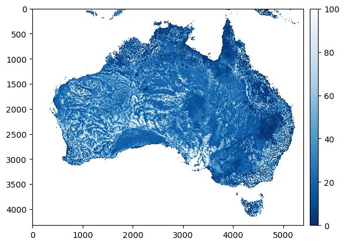
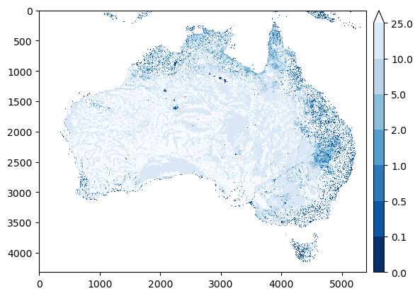
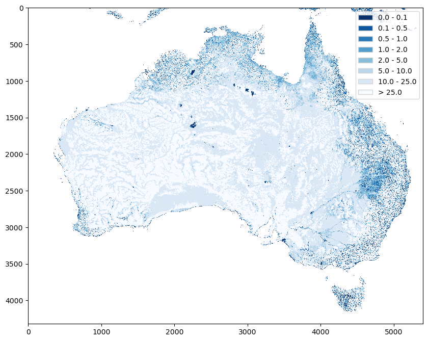

.. currentmodule:: geomappy
.. note:: This tutorial was generated from an IPython notebook that can be
          downloaded `here <../../../source/notebooks/plotting_raster.ipynb>`_.

.. _plotting_raster:

Plotting choropleth rasters
===========================

.. code:: python

    import rioxarray as rxr
    import matplotlib.pyplot as plt
    import geomappy as mp
    import numpy as np
    import os
    os.chdir("../../../")

.. code:: python

    r = rxr.open_rasterio("data/wtd.tif")
    a = r.values[0]
    a[a == -999.9] = np.nan

A contains a 2D raster of water table depth (Fan et al., 2017). To
visualise this one can simply use matplotlib directly.

.. code:: python

    plt.imshow(a, cmap="Blues_r", vmax=100)
    plt.colorbar()
    plt.show()

At its simplests, ``geomappy`` does exactly this (although some esthetic
differences can be seen):

.. code:: python

    mp.plot_raster(a, cmap="Blues_r", vmax=100)
    plt.show()

The biggest difference in workflow comes with the binning of the data.
This gets handled internally instead of having to specify this with
numpy outisde the plotting interface.

.. code:: python

    mp.plot_raster(a, bins=[0,0.1,0.5,1,2,5,10,25], cmap="Blues_r")
    plt.show()

In this case, the colorbar can be converted into a true legend (figure
size is expanded with ``figsize`` to fit the legend):

.. code:: python

    mp.plot_raster(a, bins=[0,0.1,0.5,1,2,5,10,25], cmap="Blues_r", legend='legend', figsize=(10, 10))
    plt.show()

With a basemap
--------------

The functionality described above and in the section on basemaps can be
applied here. First the bounds need to be extracted from the raster.

.. code:: python

    bounds = r.rio.bounds()
    bounds

.. parsed-literal::

    (109.999999342, -44.999998545, 155.000000419, -8.999999499)

Then a basemap needs to be created

.. code:: python

    ax = mp.basemap(bounds, resolution='10m', xticks=10, yticks=10)

.. image:: plotting_raster_files/plotting_raster_15_0.png

Then this GeoAxes object needs to be passed to the plotting function.

.. code:: python

    ax = mp.basemap(bounds, resolution='10m', xticks=10, yticks=10)
    mp.plot_raster(a, ax=ax, cmap="Blues_r", bins=[0,0.1,0.5,1,2,5,10,25])
    plt.show()

This workflow (and some other handy features) are encapsulated entirely
within an addition to the rioxarray object. The first thing that one
might do when opening a raster, is to check where this exactly falls on
the globe.

