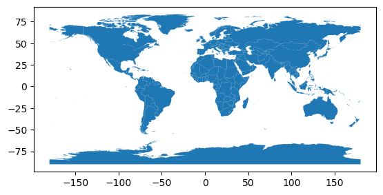
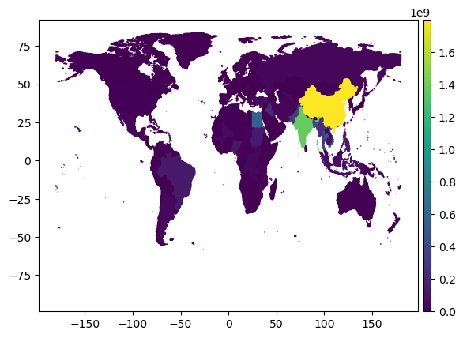
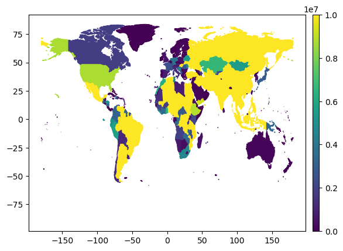
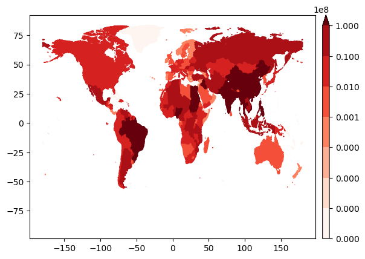
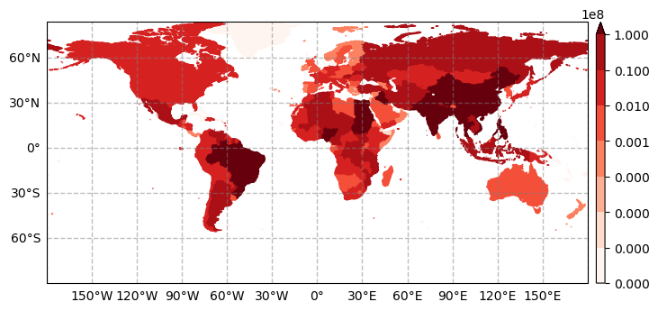
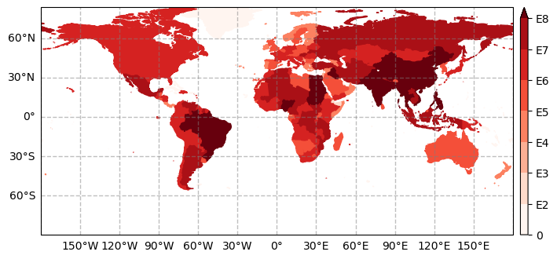

.. currentmodule:: geomappy
.. note:: This tutorial was generated from an IPython notebook that can be
          downloaded `here <../../../source/notebooks/plotting_shapes.ipynb>`_.

.. _plotting_shapes:

Plotting choropleth shapes
==========================

.. code:: python

    import geopandas as gpd
    import matplotlib.pyplot as plt
    import geomappy as mp
    import numpy as np
    import os
    os.chdir("../../../")

Loading data on river plastic mobilisation when flood events happen
(Roebroek et al., 2021).

.. code:: python

    df = gpd.read_file("data/countries/plastic_mobilisation.shp")
    df.columns

.. parsed-literal::

    Index(['featurecla', 'scalerank', 'LABELRANK', 'SOVEREIGNT', 'SOV_A3',
           'ADM0_DIF', 'LEVEL', 'TYPE', 'ADMIN', 'ADM0_A3',
           ...
           'NAME_ZH', 'e_1', 'e_10', 'e_20', 'e_50', 'e_100', 'e_200', 'e_500',
           'jump', 'geometry'],
          dtype='object', length=103)

The data shows like this when plotted within the geopandas dataframe.

.. code:: python

    df.plot()
    plt.show()

In its most simple form, the ``plot_shapes`` function does exactly the
same (with some minor esthetic changes)

.. code:: python

    mp.plot_shapes(df=df)
    plt.show()

.. image:: plotting_shapes_files/plotting_shapes_7_0.png

Choropleth capabilities are available when selecting a column to express
the values. In this case ``e_10`` expresses plastic mobilisation when
relatively low-impact floods occur.

.. code:: python

    mp.plot_shapes(df=df, values='e_10')
    plt.show()

Similarly to ``plot_raster`` it provides ``vmin``, ``vmax`` and ``bins``
to enhance visibility.

.. code:: python

    mp.plot_shapes(df=df, values='e_10', vmax=10000000, legend_kw=dict(pad_fraction=1, aspect=20))
    plt.show()

.. code:: python

    mp.plot_shapes(df=df, values='e_10', cmap="Reds", bins=[0,100,1000,10000,100000,1000000, 10000000, 100000000], legend_kw=dict(pad_fraction=1, aspect=20))
    plt.show()

Again a basemap is easily provided

.. code:: python

    ax = mp.basemap()
    bounds = df.total_bounds
    extent = bounds[0], bounds[2], bounds[1], bounds[3]
    ax.set_extent(extent)
    mp.add_gridlines(ax, 30)
    mp.add_ticks(ax, 30)
    
    mp.plot_shapes(df=df, values='e_10', cmap="Reds", bins=[0,100,1000,10000,100000,1000000, 10000000, 100000000], legend_kw=dict(pad_fraction=1, aspect=30), ax=ax)
    plt.show()

The legend is hard to interpret this way. To solve this, the legend
items can be overloaded with their E notation. In addition, a customised
label can be placed next to the colorbar.

.. code:: python

    ax = mp.basemap()
    bounds = df.total_bounds
    extent = bounds[0], bounds[2], bounds[1], bounds[3]
    ax.set_extent(extent)
    mp.add_gridlines(ax, 30)
    mp.add_ticks(ax, 30)
    
    ax, l = mp.plot_shapes(df=df, values='e_10', cmap="Reds", bins=[0,100,1000,10000,100000,1000000, 10000000, 100000000], legend_kw=dict(pad_fraction=1, aspect=30), ax=ax)
    l.ax.set_yticks(l.ax.get_yticks(), [0, "E2", "E3", "E4", "E5", "E6", "E7", "E8"])
    plt.show()

