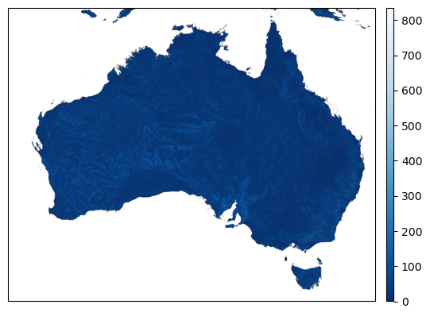

.. currentmodule:: geomappy
.. note:: This tutorial was generated from an IPython notebook that can be
          downloaded `here <../../../source/notebooks/rioxarray_integration.ipynb>`_.

.. _rioxarray_integration:

Integration of Geomappy into Rioxarray
======================================

.. code:: python

    import cartopy.crs as ccrs
    import matplotlib.pyplot as plt
    import pyproj
    import rioxarray as rxr
    
    import os
    
    import geomappy as mp
    import geomappy.plot_utils

.. code:: python

    os.chdir("../../../")

A 2D raster of water table depth (Fan et al., 2017).

.. code:: python

    wtd = rxr.open_rasterio("data/wtd.tif", masked=True)

Monthly mean discharges from 2019 from GloFAS

.. code:: python

    proj_to_3035 = pyproj.Transformer.from_crs('EPSG:4326', 'EPSG:3035', always_xy=True)
    
    r2 = rxr.open_rasterio(
        'data/dis_2019_monthlymeans_cropped_complete.nc',
        mask_and_scale=True,
        decode_times=False,
        parse_coordinates=True,
    )
    
    x, y = proj_to_3035.transform(r2.longitude.values[0], r2.latitude.values[0])
    
    dis = r2.dis24[0].assign_coords(x=x[0, :], y=y[:, 0])
    dis = dis.rio.set_spatial_dims(x_dim='x', y_dim='y')
    dis = dis.rio.write_crs('EPSG:3035')

Outline on a world map
----------------------

The first file covers Australia, while the second file covers Europe.
Both have different projections. Geomappy allows for easy inspection:

.. code:: python

    wtd.plot_world()
    plt.show()

.. image:: rioxarray_integration_files/rioxarray_integration_9_0.png

.. code:: python

    dis.plot_world()
    plt.show()

.. parsed-literal::

    /usr/local/Caskroom/mambaforge/base/envs/geomappy/lib/python3.12/site-packages/shapely/creation.py:730: RuntimeWarning: invalid value encountered in create_collection
      return lib.create_collection(geometries, np.intc(typ), out=out, **kwargs)

Here you can see that different data projections cause different shapes.

Plotting the data
-----------------

The geomappy plotting functionality (``plot_raster``) is directly
integrated into rioxarray by loading geomappy. This results in the same
figure as seen before:

.. code:: python

    wtd.plot_raster(cmap="Blues_r")
    plt.show()

Including legends, bins and a cmap:

.. code:: python

    wtd.plot_raster(bins=[0, 0.1, 0.5, 1, 2, 5, 10, 25], legend="legend", cmap="Blues_r")
    plt.show()

.. image:: rioxarray_integration_files/rioxarray_integration_16_0.png

Plotting the same image on a basemap from within the DataArray is much
easier though, by taking advantage of the internal projection
representation.

.. code:: python

    f, ax = plt.subplots(subplot_kw={'projection': ccrs.PlateCarree()})
    wtd.plot_raster(bins=[0, 0.1, 0.5, 1, 2, 5, 10, 25], cmap="Blues_r", ax=ax)
    mp.add_gridlines(ax, 10)
    mp.add_ticks(ax, 10)
    ax.coastlines()
    plt.show()

.. image:: rioxarray_integration_files/rioxarray_integration_18_0.png

