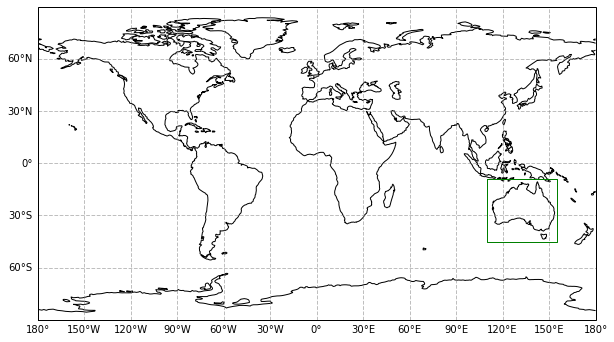
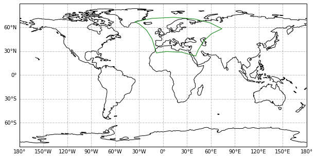
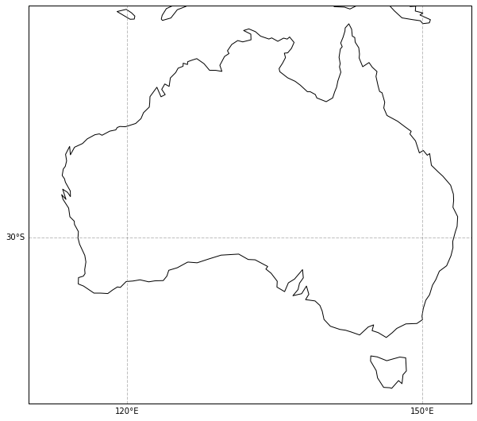
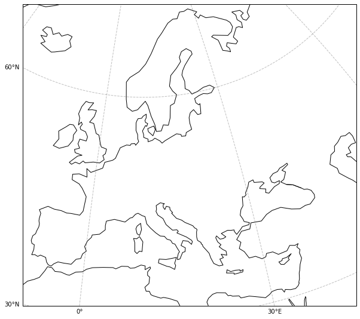
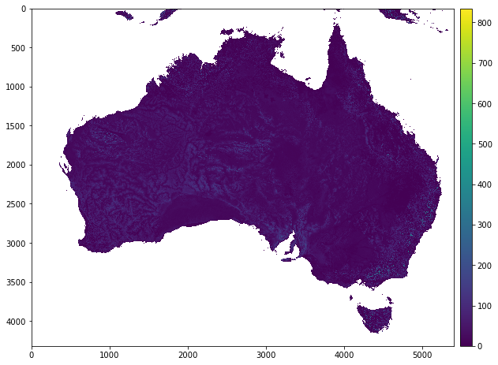
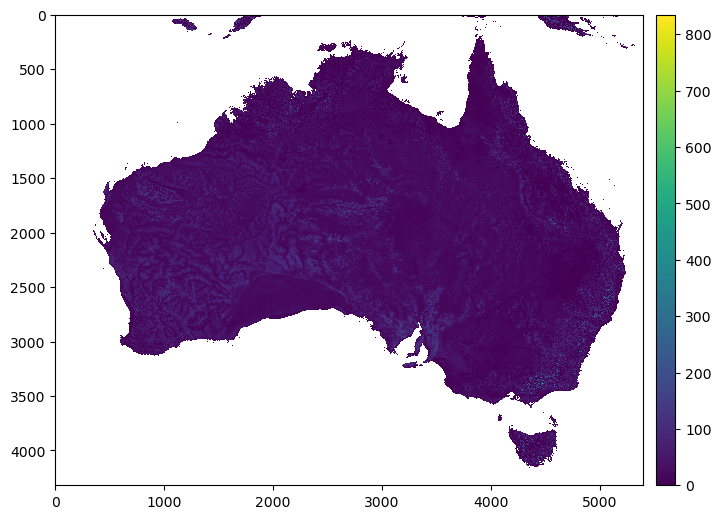
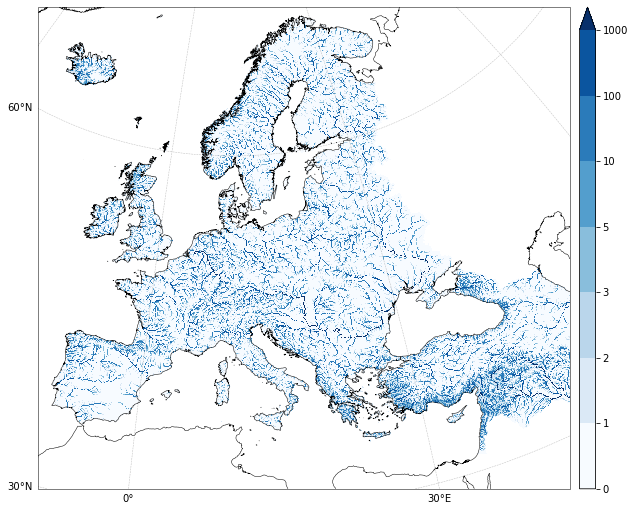
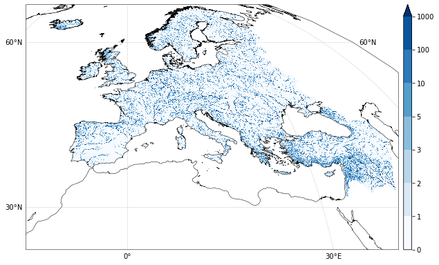
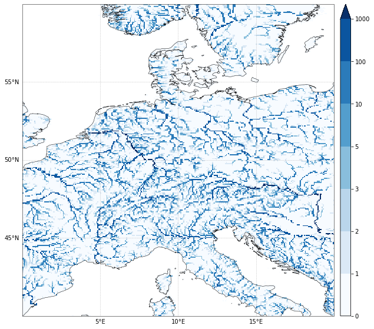

.. currentmodule:: geomappy
.. note:: This tutorial was generated from an IPython notebook that can be
          downloaded `here <../../../source/notebooks/rioxarray_integration.ipynb>`_.

.. _rioxarray_integration:

Integration of Geomappy into Rioxarray
======================================

.. code:: python

    import rioxarray as rxr
    import matplotlib.pyplot as plt
    import geomappy as mp
    import numpy as np
    import os
    import pyproj
    import cartopy.crs as ccrs
    os.chdir("../../../")

A 2D raster of water table depth (Fan et al., 2017).

.. code:: python

    r1 = rxr.open_rasterio("data/wtd.tif", masked=True)

Monthly mean discharges from 2019 from GloFAS

.. code:: python

    r2 = rxr.open_rasterio("data/dis_2019_monthlymeans_cropped_complete.nc", masked=True, decode_times=False).dis24[0]
    r2 = r2.rio.write_crs(ccrs.epsg(3035))

Outline on a world map
----------------------

The first file covers Australia, while the second file covers Europe.
Both have different projections. To see this at work, geomappy
integrates two functions to explore the data: ``plot_world`` and
``plot_file``.

.. code:: python

    r1.plot_world()
    r2.plot_world()
    plt.show()

Here you can see that different data projections cause different shapes.

To focus specifically on the area of the file itself geomappy integrates
the ``plot_file`` function, using the projection of the data.

.. code:: python

    r1.plot_file()
    r2.plot_file()
    plt.show()

Plotting the data
-----------------

The geomappy plotting functionality (``plot_raster``) is directly
integrated into rioxarray by loading geomappy. This results in the same
figure as seen before:

.. code:: python

    r1.plot_raster()
    plt.show()

Including legends, bins and a cmap:

.. code:: python

    r1.plot_raster(bins=[0, 0.1, 0.5, 1, 2, 5, 10, 25], legend="legend", cmap="Blues_r")
    plt.show()

Plotting the same image on a basemap from within the DataArray is much
easier though, by taking advantage of the internal projection
representation.

.. code:: python

    r1.plot_raster(bins=[0, 0.1, 0.5, 1, 2, 5, 10, 25], legend="legend", cmap="Blues_r", basemap=True, basemap_kwargs=dict(xticks=10, yticks=10, linewidth=0.5))
    plt.show()

Plotting on different projections
---------------------------------

plotting on different projections is done with the projection keyword
(if basemap is activated)

.. code:: python

    r2.plot_raster(basemap=True, basemap_kwargs=dict(resolution='10m', linewidth=0.5), bins=[0,1,2,3,5,10,100,1000], cmap="Blues")
    r2.plot_raster(projection=ccrs.PlateCarree(), basemap=True, basemap_kwargs=dict(resolution='10m', linewidth=0.5), bins=[0,1,2,3,5,10,100,1000], cmap="Blues")
    plt.show()

.. image:: rioxarray_integration_files/rioxarray_integration_21_1.png

.. code:: python

    r2.plot_raster(projection=ccrs.Orthographic(), basemap=True, basemap_kwargs=dict(resolution='10m', linewidth=0.5), bins=[0,1,2,3,5,10,100,1000], cmap="Blues")
    plt.show()

This introduces areas with nodata, which can be clipped by providing an
extent:

.. code:: python

    r2.plot_raster(extent=(0, 40, 20, 60), projection=ccrs.PlateCarree(), basemap=True, basemap_kwargs=dict(resolution='10m', linewidth=0.5, xticks=5, yticks=5), bins=[0,1,2,3,5,10,100,1000], cmap="Blues")
    plt.show()

This step requires resampling, which can be an extremely costly
operation if the array is big. Make sure that resolution and spatial
dimensions are roughly matching the output requirements before doing
this operation. Different resampling options might yield better results,
depending on the situation. This can be done through the ``resampling``
parameter, which accepts ``rasterio`` resampling enums.

